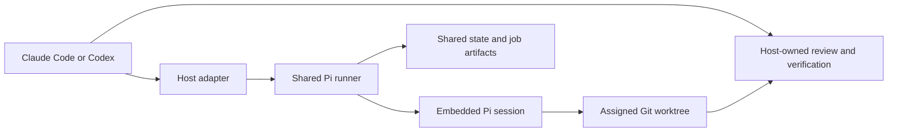
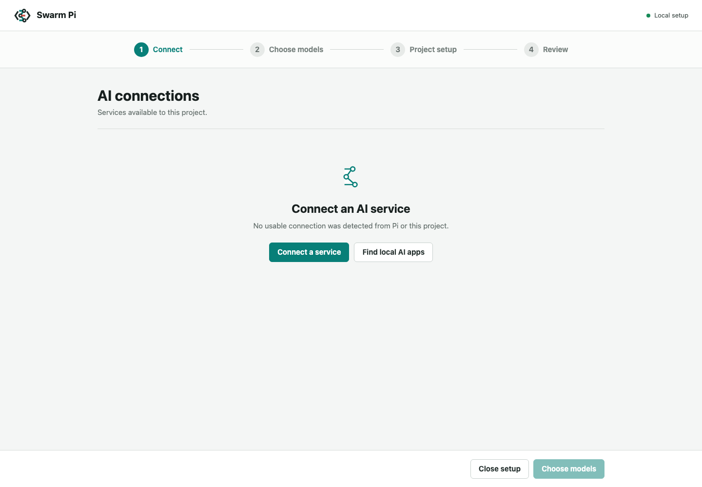
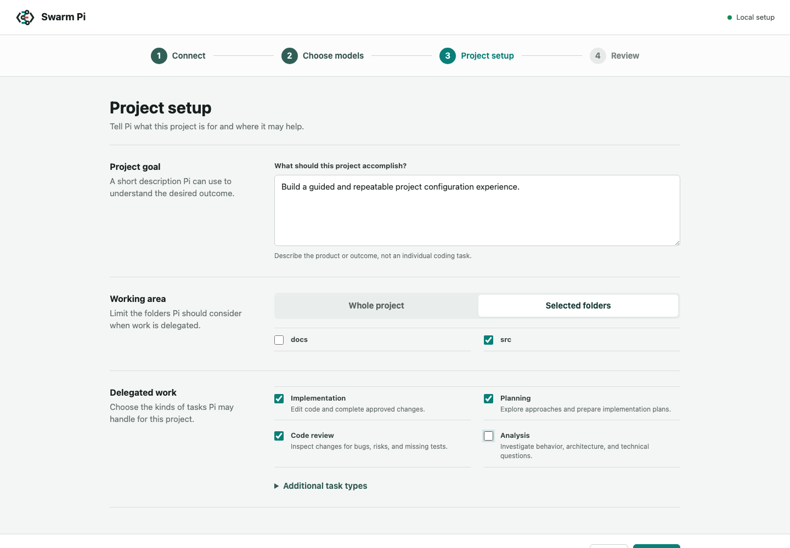
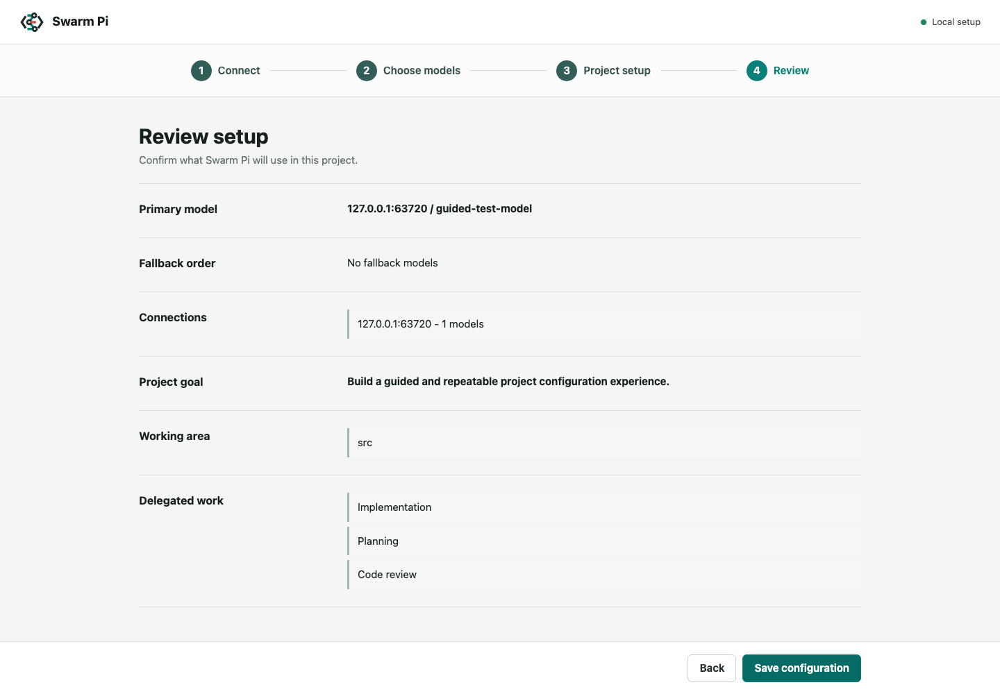

# swarm-pi-code-plugin

`swarm-pi-code-plugin` connects Claude Code and Codex to a bounded Pi coding
worker for repository-grounded analysis, planning, review, and implementation.
It is designed for teams that want a second coding-agent perspective without
giving that worker unrestricted shell access or ownership of Git delivery.

The host remains in control of intent, approvals, verification, commits, and
pushes. Pi receives only the tools and worktree that the current task allows.

## Architecture



Claude Code and Codex are host surfaces, not worker engines. Both invoke the
same runner and share model configuration, project profile, job history, and
worktree-aware state.

Read-only jobs use Pi sessions with repository inspection tools. Explicit
implementation jobs add scoped write and edit tools, require a clean worktree,
and return the changed-file list and diff summary. Pi never receives a generic
shell tool and never commits, pushes, changes branches, or runs host-owned
verification commands.

Provider configuration is stored in `.swarm-pi-code-plugin/model.json`. Project
profile, migration metadata, and job history are stored in
`.swarm-pi-code-plugin/state.json`; credentials stay in Pi's user credential
store and never enter project artifacts.

See the [architecture reference](docs/architecture.md) and
[configuration reference](docs/configuration.md) for implementation details.

## Install

### Requirements

- Node.js 22.19.0 or newer for installed plugins.
- A supported Claude Code or Codex installation.
- A Git repository for worktree-aware implementation jobs.

### Claude Code

Add the GitHub repository as a marketplace and install the plugin:

```bash
claude plugin marketplace add https://github.com/JiaWeiXie/swarm-pi-code-plugin
claude plugin install swarm-pi-code-plugin@swarm-pi-code-plugin
```

Restart Claude Code or run `/reload`. For local development:

```bash
claude --plugin-dir /absolute/path/to/swarm-pi-code-plugin/plugins/swarm-pi-code-plugin
```

### Codex

This repository contains a local marketplace:

```bash
codex plugin marketplace add /absolute/path/to/swarm-pi-code-plugin
codex plugin add swarm-pi-code-plugin@swarm-pi-code-plugin-local
```

Start a new Codex task so skills are reloaded. The available skills are:

```text
$swarm-pi-code-plugin-configure
$swarm-pi-code-plugin-project
$swarm-pi-code-plugin-ask
$swarm-pi-code-plugin-review
$swarm-pi-code-plugin-plan
$swarm-pi-code-plugin-implement
$swarm-pi-code-plugin-orchestrate
```

## Usage

### Choose the right workflow

| Situation | Claude Code | Codex |
| --- | --- | --- |
| First provider, model, and project setup | `/swarm-pi-code-plugin:init` | `$swarm-pi-code-plugin-configure` |
| Change Provider or model priority | `/swarm-pi-code-plugin:init --reconfigure` | `$swarm-pi-code-plugin-configure` |
| Repeatedly change project goal, folders, or task types | `/swarm-pi-code-plugin:project` | `$swarm-pi-code-plugin-project` |
| Ask a repository question or request analysis | Ask Claude Code to use the Pi worker | `$swarm-pi-code-plugin-ask` |
| Create a read-only implementation plan | Ask Claude Code for a Pi plan | `$swarm-pi-code-plugin-plan` |
| Review working-tree or branch changes | Ask Claude Code to review with Pi | `$swarm-pi-code-plugin-review` |
| Make an explicit scoped code change | Ask Claude Code to implement the requested change | `$swarm-pi-code-plugin-implement` |
| Run multiple read-only perspectives | Use the runner orchestrate command | `$swarm-pi-code-plugin-orchestrate` |

### First setup

Run the host-specific setup entry point. The browser walks through four steps:

1. Connect usable cloud or local AI services.
2. Choose a primary model and ordered fallbacks.
3. Describe the project goal, working area, and delegated task types.
4. Review and save the complete setup.

The connection list is intentionally empty when no usable service is detected.
Custom endpoints can be tested before the provider ID, API protocol, model
limits, or model IDs are shown.

### Setup preview







### Reconfigure

Provider and model settings can be reopened with `--reconfigure` or the Codex
configure skill. Project settings have a separate repeatable flow:

```text
/swarm-pi-code-plugin:project
$swarm-pi-code-plugin-project
```

The project flow reads the current profile, lets the user change the goal,
scope, or task types, and updates only `state.json`. It does not rewrite model
configuration, credentials, or job history.

### Non-interactive runner

The shared runner is useful for automation and host integration:

```bash
node scripts/pi-runner.mjs models --json
node scripts/pi-runner.mjs providers --json
node scripts/pi-runner.mjs configure --host codex --section project --no-open
node scripts/pi-runner.mjs init --json
node scripts/pi-runner.mjs ask --host codex --prompt-file /path/to/question.md --json
node scripts/pi-runner.mjs review --host codex --scope working-tree --json
node scripts/pi-runner.mjs plan --host codex --prompt-file /path/to/plan.md --json
node scripts/pi-runner.mjs implement --host codex --prompt-file /path/to/task.md --json
node scripts/pi-runner.mjs orchestrate --host codex --prompt-file /path/to/task.md --json
```

`implement` is guarded by a clean-worktree preflight. The host must inspect the
result and run verification before delivery.

## Troubleshooting

### The command or skill is not visible

Restart the host or run `/reload` in Claude Code. In Codex, start a new task so
the installed skill cache is refreshed. For local plugin development, use the
`--plugin-dir` path for Claude Code or reinstall the local Codex marketplace
plugin after changing the manifest or skills.

### The browser does not open

The runner prints a one-time loopback URL. Open that URL manually, or run the
runner with `--no-open` when launching it from a terminal.

### No provider is detected

Pi only displays services that it can use. Check Pi's credential store or the
documented provider environment variables, then reopen setup. For local AI
applications, use **Find local AI apps**. The plugin does not scan `.env` files
or copy private Claude Code or Codex credentials.

### Endpoint discovery fails

Confirm the URL is an HTTP(S) model server endpoint, not a browser dashboard
URL. Check the optional API key, then use **Test and find models** again. The
server reports whether the failure is authentication, timeout, unreachable
server, malformed response, redirect, or unsupported endpoint.

### A selected model is unavailable

Reopen Provider and model setup and choose a model that Pi currently reports as
available. Keep a fallback model configured when the primary provider may be
temporarily unavailable.

### Setup was canceled or timed out

No changes are saved. Run the same setup command again. The project-only flow
is safe to repeat when only the goal, folders, or delegated task types need to
change.

### Implementation is rejected because the worktree is dirty

Pi implementation requires a clean assigned worktree so unrelated user changes
cannot be confused with worker edits. Review or safely commit the existing
changes first, then retry in the intended worktree.

### A linked worktree cannot see the configuration

State is resolved through Git's common directory, so linked worktrees normally
share `.swarm-pi-code-plugin/`. Check that the worktree belongs to the expected
repository and that `SWARM_PI_CODE_PLUGIN_DATA_DIR` is not pointing elsewhere.

## Development

The repository uses mise to provide the pinned Node.js environment:

```bash
mise install
mise run install
mise run check
```

Development uses Node.js `24.15.0` from mise. Installed plugin packages support
Node.js `22.19.0` or newer to match the Pi SDK engine requirement.

Useful individual checks are:

```bash
mise run typecheck
mise run test
mise run build
```

Follow the [documentation update SOP](docs/documentation-sop.md) when changing
user-facing guides, technical references, or committed screenshots. It defines
the product-evidence, screenshot-safety, cross-link, and validation steps for
documentation work.

`npm test` runs the built Node test suite, including mocked Pi sessions,
state migration, manifest validation, endpoint discovery, and loopback web
server tests. `npm run build` compiles the source and copies the production
runtime into the self-contained plugin package. Local host testing uses:

```bash
claude --plugin-dir /absolute/path/to/swarm-pi-code-plugin/plugins/swarm-pi-code-plugin
codex plugin marketplace add /absolute/path/to/swarm-pi-code-plugin
codex plugin add swarm-pi-code-plugin@swarm-pi-code-plugin-local
```

Validate packaged JavaScript with `node --check` on the two plugin scripts and
validate the Codex manifest and skills with the Codex plugin validation tool
when it is available in the local development environment.

After changing Codex skills or the plugin manifest, update the Codex plugin
cachebuster and start a new task. Keep runtime changes in `src/` and rebuild
before validating the packaged plugin.

## Built With and References

- [Claude Code](https://docs.anthropic.com/en/docs/claude-code/overview)
- [Codex](https://developers.openai.com/codex/)
- [Pi Coding Agent SDK](https://github.com/earendil-works/pi), pinned at `0.80.6`
- [Node.js](https://nodejs.org/)
- [TypeScript](https://www.typescriptlang.org/)
- [mise](https://mise.jdx.dev/)
- [Git worktrees](https://git-scm.com/docs/git-worktree)

The original plugin concept and host workflow were informed by
[apoapps/swarm-code-plugin](https://github.com/apoapps/swarm-code-plugin).
That project is a reference for architecture and delegation ideas; this
repository is an independent rewrite and does not reuse its source code.

## License

This project is released under the [MIT License](LICENSE). Copyright (c) 2026
Jason Hsieh.
