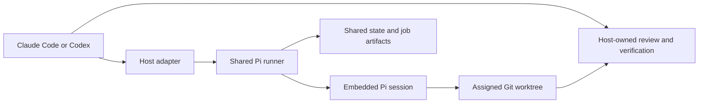

# swarm-pi-code-plugin

[繁體中文](README.zh-TW.md)

`swarm-pi-code-plugin` connects Claude Code and Codex to a bounded Pi coding
worker for repository-grounded analysis, planning, review, and implementation.
It is designed for teams that want a second coding-agent perspective without
giving that worker unrestricted shell access or ownership of Git delivery.

The host remains in control of intent, approvals, verification, commits, and
pushes. Pi receives only the tools and worktree that the current task allows.

## Architecture



Claude Code and Codex are host surfaces, not worker engines. Both invoke the
same runner and share model configuration, project profile, job history, and
worktree-aware state.

Delegated tasks resolve to role-specific model chains and thinking levels.
Implementation jobs add scoped mutation tools, require a clean assigned
worktree, and receive a fresh read-only verifier. Strict exposes no shell,
Adaptive authorizes bounded shell and network actions through policy and
durable approval, and Lenient retains broad outbound access inside the OS
sandbox. Git delivery remains host-owned.

Runtime configuration and jobs stay outside the checked-out worktree. Git
repositories use `.git/swarm-pi-code-plugin/` through the common Git directory;
non-Git folders use an OS user-state namespace. Credentials stay in Pi's user
credential store and never enter project artifacts or browser drafts.

See the [architecture reference](docs/architecture.md) and
[configuration reference](docs/configuration.md) for implementation details.

## Install

### Requirements

- Node.js 22.19.0 or newer for installed plugins.
- A supported Claude Code or Codex installation.
- A Git repository for worktree-aware implementation jobs.
- macOS, or Linux with `bubblewrap`, `socat`, and `ripgrep`, to enable lenient
  sandbox mode.

### Claude Code

Add the GitHub repository as a marketplace and install the plugin:

```bash
claude plugin marketplace add https://github.com/JiaWeiXie/swarm-pi-code-plugin
claude plugin install swarm-pi-code-plugin@swarm-pi-code-plugin
```

Restart Claude Code or run `/reload`. For local development:

```bash
claude --plugin-dir /absolute/path/to/swarm-pi-code-plugin/plugins/swarm-pi-code-plugin
```

### Codex

This repository contains a local marketplace:

```bash
codex plugin marketplace add /absolute/path/to/swarm-pi-code-plugin
codex plugin add swarm-pi-code-plugin@swarm-pi-code-plugin-local
```

Start a new Codex task so skills are reloaded. The available skills are:

```text
$swarm-pi-code-plugin-configure
$swarm-pi-code-plugin-project
$swarm-pi-code-plugin-ask
$swarm-pi-code-plugin-review
$swarm-pi-code-plugin-plan
$swarm-pi-code-plugin-implement
$swarm-pi-code-plugin-orchestrate
$swarm-pi-code-plugin-scaffold
$swarm-pi-code-plugin-setup
```

## Usage

### Choose the right workflow

| Situation | Claude Code | Codex |
| --- | --- | --- |
| First provider, model, and project setup | `/swarm-pi-code-plugin:init` | `$swarm-pi-code-plugin-configure` |
| Change Provider or model priority | `/swarm-pi-code-plugin:init --reconfigure` | `$swarm-pi-code-plugin-configure` |
| Repeatedly change project goal, folders, or task types | `/swarm-pi-code-plugin:project` | `$swarm-pi-code-plugin-project` |
| Ask a repository question or request analysis | `/swarm-pi-code-plugin:ask` | `$swarm-pi-code-plugin-ask` |
| Create a read-only implementation plan | `/swarm-pi-code-plugin:plan` | `$swarm-pi-code-plugin-plan` |
| Review working-tree or branch changes | `/swarm-pi-code-plugin:review` | `$swarm-pi-code-plugin-review` |
| Make an explicit scoped code change | `/swarm-pi-code-plugin:implement` | `$swarm-pi-code-plugin-implement` |
| Run multiple read-only perspectives | `/swarm-pi-code-plugin:orchestrate` | `$swarm-pi-code-plugin-orchestrate` |
| Design and create a new project | `/swarm-pi-code-plugin:scaffold` | `$swarm-pi-code-plugin-scaffold` |
| Configure project-local development tools | `/swarm-pi-code-plugin:setup` | `$swarm-pi-code-plugin-setup` |

Claude Code commands and Codex skills use the same runner protocol: they check
readiness and pending notifications first, preserve original requests across
configuration, default to supervised execution, and require explicit user
decisions for approvals, adoption, artifact materialization, and delivery.

### First setup

Run the host-specific setup entry point. The browser walks through six steps:

1. Connect usable cloud or local AI services.
2. Choose a project primary model and ordered fallbacks.
3. Assign model chains and thinking levels to worker roles.
4. Choose sandbox, classifier, approval, and background policies.
5. Review the detected Git, empty-folder, or adoption workspace state.
6. Test the primary and required classifier models, then save atomically.

If setup was opened by a delegated request, the Host retains that request and
resumes it after configuration. Cancellation or idle timeout does not require
the user to restate the task. Unsaved browser drafts retain only non-sensitive
role, safety, and workspace fields.

Readiness is task-specific. A workspace may be ready for research while
mutation or delivery is blocked. In particular, a Git repository without an
initial commit reports `git-unborn`; implementation fails before model startup
and returns scaffold or adoption actions plus a resumable continuation.

The connection list is intentionally empty when no usable service is detected.
Custom endpoints can be tested before the provider ID, API protocol, model
limits, or model IDs are shown.

### Setup preview


### Reconfigure

Provider and model settings can be reopened with `--reconfigure` or the Codex
configure skill. Project settings have a separate repeatable flow:

```text
/swarm-pi-code-plugin:project
$swarm-pi-code-plugin-project
```

The project flow reads current role, safety, and profile settings, then updates
only `state.json`. It does not
rewrite model configuration, credentials, or job history.

### Execution safety and roles

Projects default to **Strict**, which keeps scoped Pi tools and exposes no
Bash. **Adaptive** adds policy-classified Bash and network access with bounded
capability leases and optional supervisor approval. **Lenient** adds broad
outbound access through macOS Seatbelt or Linux Bubblewrap. All shell modes use
an isolated environment without model tokens, SSH sockets, or host secrets.

Adaptive classifier prompts expose only the proposed action and limited policy
context to the configured provider. Lenient source visible to the worker can be
sent to external services. Unsupported platforms and missing dependencies fail
closed and never fall back to an unsandboxed shell.

### Non-interactive runner

The shared runner is useful for automation and host integration:

```bash
node scripts/pi-runner.mjs models --json
node scripts/pi-runner.mjs providers --json
node scripts/pi-runner.mjs configure --host codex --section project --no-open
node scripts/pi-runner.mjs init --json
node scripts/pi-runner.mjs status --json
node scripts/pi-runner.mjs doctor --smoke-test --json
node scripts/pi-runner.mjs ask --host codex --prompt-file /path/to/question.md --json
node scripts/pi-runner.mjs review --host codex --scope working-tree --json
node scripts/pi-runner.mjs plan --host codex --prompt-file /path/to/plan.md --json
node scripts/pi-runner.mjs implement --host codex --prompt-file /path/to/task.md --json
node scripts/pi-runner.mjs orchestrate --host codex --prompt-file /path/to/task.md --json
node scripts/pi-runner.mjs scaffold --host codex --spec-file /path/to/scaffold.json --target /path/to/new-project --json
node scripts/pi-runner.mjs setup --host codex --prompt-file /path/to/setup.md --json
node scripts/pi-runner.mjs roles list --json
```

`implement` is guarded by a clean-worktree preflight and an exclusive worktree
lease. The host must inspect the result and run verification before delivery.
Timeouts, cancellation, and failures may leave partial changes; they are
reported and are never silently rolled back.

Delegated commands default to supervised execution. The host relay owns the Pi
process until a terminal result is recorded, while the main session can keep
working. Read-only commands also accept durable background execution:

```bash
node scripts/pi-runner.mjs ask --host codex --prompt-file /path/to/question.md \
  --execution-mode background --json
node scripts/pi-runner.mjs jobs wait --job <job-id> --json
```

The host relay uses bounded waits and reports the durable job phase, elapsed
time, and cancel action. A detached host shell is not the same as Pi background
execution.

Background mode is supported by scout, planner, reviewer, and analyst roles.
Mechanical implementation may run in background only when explicitly enabled;
the control plane creates a job-owned branch and worktree. Executor and
security-executor implementation remain supervised.

Worker commands use a 30-minute default timeout for `ask`, `plan`, and `review`,
and a 60-minute default for `orchestrate` and `implement`. Override the job
deadline with `--timeout-ms` from 1000 through 86400000 milliseconds.

Durable job inspection and control are available through:

```bash
node scripts/pi-runner.mjs jobs list --json
node scripts/pi-runner.mjs jobs list --pending-notifications --json
node scripts/pi-runner.mjs jobs status --job <job-id> --json
node scripts/pi-runner.mjs jobs wait --job <job-id> --wait-timeout-ms 5000 --json
node scripts/pi-runner.mjs jobs cancel --job <job-id> --json
node scripts/pi-runner.mjs jobs acknowledge --job <job-id> --json
node scripts/pi-runner.mjs jobs approvals --job <job-id> --json
node scripts/pi-runner.mjs jobs approve --job <job-id> --approval <approval-id> --json
node scripts/pi-runner.mjs jobs deny --job <job-id> --approval <approval-id> --json
node scripts/pi-runner.mjs jobs cleanup --job <job-id> [--discard] --json
node scripts/pi-runner.mjs jobs materialize --job <job-id> --target /path/to/new-project --json
```

For a verified isolated implementation artifact, omit `--target` to apply its
patch to the original workspace. Materialization validates the original HEAD
and preserved paths, does not create a commit, and rolls back a failed apply.

`jobs wait` does not change the worker deadline. Wait timeout exits with 3;
`awaiting-approval` exits with 4 and leaves the live worker waiting. Approval
and terminal notifications are acknowledged independently. A lease is bound to
the job generation, policy hash, action fingerprint, and expiry.

### New projects and development setup

New-project requests first use the read-only `project-architect` role to create
a reviewed scaffold specification. `scaffolder` writes a job-owned staging Git
repository, and `environment-engineer` handles supervised project-local
dependencies and tooling. Verified scaffold jobs produce a deliverable artifact
but do not touch the target until `jobs materialize` is explicitly approved.

Package lifecycle scripts and native builds require adaptive approval. Global
package installation, host provisioning, deployment, merge, and push remain
immutable denials.

## Troubleshooting

### The command or skill is not visible

Restart the host or run `/reload` in Claude Code. In Codex, start a new task so
the installed skill cache is refreshed. For local plugin development, use the
`--plugin-dir` path for Claude Code or reinstall the local Codex marketplace
plugin after changing the manifest or skills.

### The browser does not open

The runner prints a one-time loopback URL. Open that URL manually, or run the
runner with `--no-open` when launching it from a terminal.

### No provider is detected

Pi only displays services that it can use. Check Pi's credential store or the
documented provider environment variables, then reopen setup. For local AI
applications, use **Find local AI apps**. The plugin does not scan `.env` files
or copy private Claude Code or Codex credentials.

### Endpoint discovery fails

Confirm the URL is an HTTP(S) model server endpoint, not a browser dashboard
URL. Check the optional API key, then use **Test and find models** again. The
server reports whether the failure is authentication, timeout, unreachable
server, malformed response, redirect, or unsupported endpoint.

### A selected model is unavailable

Reopen Provider and model setup and choose a model that Pi currently reports as
available. Keep a fallback model configured when the primary provider may be
temporarily unavailable.

### Setup was canceled or timed out

No changes are saved. Non-sensitive role, safety, and workspace draft fields
are restored when setup is reopened, and a delegated continuation remains
available for 24 hours. Credentials are never stored in the browser draft.

### Implementation is rejected because the worktree is dirty

Runtime state, untracked `.DS_Store`, `__pycache__`, `.pyc`, and `.pyo` artifacts
are preserved as safe-dirty and do not block implementation. Mutation runs in
an isolated HEAD worktree so those files are not exposed to the worker; a
verified artifact requires explicit materialization. Tracked, staged,
conflicted, secret-like, or unknown files require an explicit isolated HEAD or
isolated snapshot strategy. Swarm Pi never deletes, stashes, hides, or commits
the user's existing changes.

### Git is initialized but has no commit

Research remains available, but implementation and delivery are blocked before
a model starts. Use scaffold for an empty project or inspect/adopt for existing
content, then run `resume --continuation <id>` to continue the preserved task.

### A delegated job stopped without a notification

Run `jobs list --pending-notifications --json`. Terminal results are durable and
remain pending until acknowledged. A stale job whose process disappeared is
reconciled to `orphaned`; a worker stopped after cancellation is reconciled to
`cancelled`. Host adapters check this pending queue before starting another
delegation.

### A linked worktree cannot see the configuration

State is stored inside Git's common directory, so linked worktrees normally
share `swarm-pi-code-plugin/`. Check that the worktree belongs to the expected
repository and that `SWARM_PI_CODE_PLUGIN_DATA_DIR` is not pointing elsewhere.

### Configuration could not be recovered

Run `doctor --json`. A failed multi-store save restores credentials, model
configuration, and project state. If rollback itself fails, a redacted recovery
journal blocks delegation until the conflicting state is inspected; it never
contains API keys.

## Development

The repository uses mise to provide the pinned Node.js environment:

```bash
mise install
mise run install
mise run check
```

Development uses Node.js `24.15.0` from mise. Installed plugin packages support
Node.js `22.19.0` or newer to match the Pi SDK engine requirement.

Useful individual checks are:

```bash
mise run typecheck
mise run test
mise run build
```

Follow the [documentation update SOP](docs/documentation-sop.md) when changing
user-facing guides, technical references, or committed screenshots. It defines
the product-evidence, screenshot-safety, cross-link, and validation steps for
documentation work.

`npm test` runs the built Node test suite, including mocked Pi sessions,
state migration, manifest validation, endpoint discovery, and loopback web
server tests. `npm run build` compiles the source and copies the production
runtime into the self-contained plugin package. Local host testing uses:

```bash
claude --plugin-dir /absolute/path/to/swarm-pi-code-plugin/plugins/swarm-pi-code-plugin
codex plugin marketplace add /absolute/path/to/swarm-pi-code-plugin
codex plugin add swarm-pi-code-plugin@swarm-pi-code-plugin-local
```

Validate packaged JavaScript with `node --check` on the two plugin scripts and
validate the Codex manifest and skills with the Codex plugin validation tool
when it is available in the local development environment.

After changing Codex skills or the plugin manifest, update the Codex plugin
cachebuster and start a new task. Keep runtime changes in `src/` and rebuild
before validating the packaged plugin.

## Built With and References

- [Claude Code](https://docs.anthropic.com/en/docs/claude-code/overview)
- [Codex](https://developers.openai.com/codex/)
- [Pi Coding Agent SDK](https://github.com/earendil-works/pi), pinned at `0.80.6`
- [Node.js](https://nodejs.org/)
- [TypeScript](https://www.typescriptlang.org/)
- [mise](https://mise.jdx.dev/)
- [Git worktrees](https://git-scm.com/docs/git-worktree)

The original plugin concept and host workflow were informed by
[apoapps/swarm-code-plugin](https://github.com/apoapps/swarm-code-plugin).
That project is a reference for architecture and delegation ideas; this
repository is an independent rewrite and does not reuse its source code.

The role orchestration and execution-safety design also draws on the following
open-source projects and documentation:

- [Nanako0129/pilotfish](https://github.com/Nanako0129/pilotfish) informed the
  Machine, Role, and Policy separation used for role-specific model routing.
- [Pi containerization guidance](https://github.com/earendil-works/pi/blob/main/packages/coding-agent/docs/containerization.md)
  informed the isolation boundaries and the future whole-process `isolated`
  mode direction.
- [carderne/pi-sandbox](https://github.com/carderne/pi-sandbox) informed the
  macOS Seatbelt and Linux Bubblewrap approach used by sandboxed shell tools.
- [r4vi/pi-auto-mode](https://github.com/r4vi/pi-auto-mode) and
  [czottmann/pi-automode](https://github.com/czottmann/pi-automode) informed
  the adaptive permission classifier, policy decisions, and approval flow.

These projects are design references. The plugin implements its own trusted,
non-interactive policy and enforcement runtime and does not load their complete
extensions or copy their source code.

## License

This project is released under the [MIT License](LICENSE). Copyright (c) 2026
Jason Hsieh.
