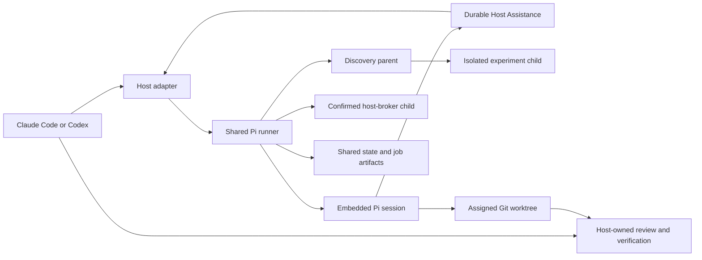

# swarm-pi-code-plugin

[繁體中文](README.zh-TW.md)

`swarm-pi-code-plugin` connects Claude Code and Codex to a bounded Pi coding
worker for repository-grounded analysis, planning, review, and implementation.
It is designed for teams that want a second coding-agent perspective without
giving that worker unrestricted shell access or ownership of Git delivery.

The host remains in control of intent, approvals, verification, commits, and
pushes. Pi receives only the tools and worktree that the current task allows.

## Architecture



Claude Code and Codex are host surfaces, not worker engines. Both invoke the
same runner and share model configuration, project profile, job history, and
worktree-aware state.

Delegated tasks resolve to role-specific model chains and thinking levels.
Implementation jobs add scoped mutation tools, require a clean assigned
worktree, and receive a fresh read-only semantic verifier. Strict exposes no shell,
Adaptive authorizes bounded shell and network actions through policy and
durable approval, and Lenient retains broad outbound access inside the OS
sandbox. Autopilot keeps that same OS-sandbox isolation as Lenient but runs
routine shell unattended, without stopping for supervisor approval. Full-access
is an explicit opt-out that removes the plugin's own OS sandbox, so the worker's
reach then depends entirely on the host's own sandbox. Git delivery remains
host-owned.

Adaptive recognizes a deliberately narrow shell inspection grammar. Bounded
`sha256sum`/`shasum` commands, `rustc`/`cargo` version probes, and two-file
`cmp`/`diff` comparisons are treated as read-only so reproducibility checks can
receive an exact Host-first lease; traversal, out-of-workspace absolute paths,
redirection, expansion, command substitution, compilation, and test execution
still fail closed.

An isolated Experiment may read only the linked worktree's Git administrative
paths so it can establish and verify a clean baseline. Those paths remain
deny-write, cannot be leased for mutation, and do not make commit or delivery a
Worker capability. On macOS, the Sandbox invokes the Command Line Tools Git
binary directly when available so the `xcrun` shim does not need to write its
host cache.

Filesystem boundaries canonicalize paths before checking the execution workspace
and configured operation roots. This makes macOS `/var/...` and
`/private/var/...` worktree aliases equivalent without widening scope; traversal,
escaping symlinks, protected paths, and paths outside the canonical root remain
denied.

Runtime configuration and jobs stay outside the checked-out worktree. Git
repositories use `.git/swarm-pi-code-plugin/` through the common Git directory;
non-Git folders use an OS user-state namespace. Credentials stay in the
user-scoped, Pi-compatible `CredentialStore` backed by the configured auth file.
Browser input becomes an opaque, session-local draft and never enters project
artifacts or localStorage.

See the [architecture reference](docs/architecture.md) and
[configuration reference](docs/configuration.md), plus the
[configuration field guide](docs/configuration-field-guide.md) for field
defaults, plain-language keyword definitions, worked examples, safety tradeoffs,
and setup-page Tips.
See [Host Assistance and Discovery](docs/host-assistance-discovery.md) for the
live worker-to-host context loop, schema-gated experiment micro-SDLC, Advisor
boundaries, discover-to-plan handoff, and isolated Host Actions.

## Install

### Requirements

- Node.js 22.19.0 or newer for installed plugins.
- A supported Claude Code or Codex installation.
- A Git repository for worktree-aware implementation jobs.
- macOS, or Linux with `bubblewrap`, `socat`, and `ripgrep`, to enable the
  lenient and autopilot sandbox modes. Strict and full-access need no sandbox
  backend and stay selectable everywhere; full-access removes the plugin's own
  OS sandbox.

### Claude Code

Add the GitHub repository as a marketplace and install the plugin:

```bash
claude plugin marketplace add https://github.com/JiaWeiXie/swarm-pi-code-plugin
claude plugin install swarm-pi-code-plugin@swarm-pi-code-plugin
```

Restart Claude Code or run `/reload`. For local development:

```bash
claude --plugin-dir /absolute/path/to/swarm-pi-code-plugin/plugins/swarm-pi-code-plugin
```

### Codex

This repository contains a local marketplace:

```bash
codex plugin marketplace add /absolute/path/to/swarm-pi-code-plugin
codex plugin add swarm-pi-code-plugin@swarm-pi-code-plugin-local
```

Start a new Codex task so skills are reloaded. The available skills are:

```text
$swarm-pi-configure
$swarm-pi-project
$swarm-pi-ask
$swarm-pi-review
$swarm-pi-plan
$swarm-pi-implement
$swarm-pi-orchestrate
$swarm-pi-discover
$swarm-pi-scaffold
$swarm-pi-setup
```

## Usage

### Choose the right workflow

| Situation | Claude Code | Codex |
| --- | --- | --- |
| First provider, model, and project setup | `/swarm-pi-code-plugin:swarm-pi-configure` | `$swarm-pi-configure` |
| Change Provider or model priority | `/swarm-pi-code-plugin:swarm-pi-configure --reconfigure` | `$swarm-pi-configure` |
| Repeatedly change project goal, folders, or task types | `/swarm-pi-code-plugin:swarm-pi-project` | `$swarm-pi-project` |
| Ask a repository question or request analysis | `/swarm-pi-code-plugin:swarm-pi-ask` | `$swarm-pi-ask` |
| Create a read-only implementation plan | `/swarm-pi-code-plugin:swarm-pi-plan` | `$swarm-pi-plan` |
| Review working-tree or branch changes | `/swarm-pi-code-plugin:swarm-pi-review` | `$swarm-pi-review` |
| Make an explicit scoped code change | `/swarm-pi-code-plugin:swarm-pi-implement` | `$swarm-pi-implement` |
| Run multiple read-only perspectives | `/swarm-pi-code-plugin:swarm-pi-orchestrate` | `$swarm-pi-orchestrate` |
| Investigate unknown requirements with gated evidence and experiments | `/swarm-pi-code-plugin:swarm-pi-discover` | `$swarm-pi-discover` |
| Design and create a new project | `/swarm-pi-code-plugin:swarm-pi-scaffold` | `$swarm-pi-scaffold` |
| Configure project-local development tools | `/swarm-pi-code-plugin:swarm-pi-setup` | `$swarm-pi-setup` |

### Skill usage and limits

Claude Code commands and Codex skills are two Host entry points for the same
workflows. Use the name shown above for your Host and describe the request in
plain language; the Host prepares the runner inputs, validates Pi's evidence,
and keeps user decisions at the Host boundary.

#### Configuration workflows

| Skill | Use it for and provide | Limits and authorization boundaries |
| --- | --- | --- |
| `swarm-pi-configure` | First setup, recovery, provider or model changes, or full reconfiguration. Provide the workspace and whether existing settings should be edited, reset, or only reported as JSON. | Opens the guided local setup and may ask permission to run only `git init` for a non-Git workspace. API keys and OAuth codes belong in the local setup flow, never the Host conversation. If a Host sandbox denies writes below `.git/swarm-pi-code-plugin`, preserve the request or draft and relaunch the same local runner outside that outer sandbox with Host approval; for setup, use its new loopback URL. Never edit state or recovery files manually. Reset does not delete Pi user credentials, reconfiguration does not delete Job history, and active Jobs keep immutable policy snapshots. Use `swarm-pi-project` when provider connections must remain untouched. |
| `swarm-pi-project` | Repeatable changes to role routing, Sandbox and approval policy, project scope, Decision Mode, Host Assistance, Advisor, doctrine metadata, or Host Actions. Provide the intended policy or workspace-scope change. | Changes project routing, safety, and profile state only. It does not alter provider credentials, model authentication, model configuration, Job history, or active Job snapshots. A non-Git workspace can be initialized only after explicit approval, and the workflow never adds files, commits, or configures Git identity. |

#### Read-only analysis workflows

| Skill | Use it for and provide | Limits and authorization boundaries |
| --- | --- | --- |
| `swarm-pi-ask` | One focused repository question, explanation, or evidence check. Provide the exact question, repository scope, required evidence, freshness needs, and uncertainty to resolve. | Read-only and single-focus. It does not produce a change plan, review a diff, or edit files; route those requests to `plan`, `review`, or `implement`. The Host validates the answer and reports unsupported claims or remaining uncertainty. |
| `swarm-pi-review` | Actionable bug, security, regression, and missing-test findings for a Git working tree or branch. Provide the intended diff scope and a base ref for branch review. | Read-only. Pi findings are evidence, not authoritative review; the Host confirms every finding against the actual diff and reports tight file and line references. It never fixes findings or modifies files; use `implement` after explicit mutation authorization. |
| `swarm-pi-plan` | A decision-ready implementation, migration, or architecture plan when requirements and evidence are already sufficient. Provide scope, alternatives, constraints, acceptance criteria, and known decisions. | Read-only and cannot invoke implementation. Unresolved requirements or claims go to `discover`; diff findings go to `review`; an approved code change goes to `implement`. Citations, unknowns, risks, and assumptions remain visible in the final plan. |
| `swarm-pi-orchestrate` | A bounded panel for architecture, migration, tradeoff, or risk decisions where independent perspectives materially help. Provide one shared decision brief, EvidencePack, constraints, and evidence acceptance criteria. | Read-only. Decision Mode selects one to three base perspectives, with optional quota-bounded Advisor input; the Host owns the final synthesis. Perspectives do not independently repeat expensive builds or test suites, and inline code is not presented as working code without validation. |
| `swarm-pi-discover` | Unknown requirements or unresolved technical claims that need reproducible research, an experiment, and convergence. Provide the unknowns, constraints, evidence criteria, freshness needs, user gates, and a resource-aware experiment plan. | Research and convergence are read-only; the experiment runs in an isolated child worktree under the immutable Job policy. Research, experiment, and definition gates require review. Experiment artifacts are always `deliverable: false`, cannot be materialized, and conclude only `supported`, `refuted`, or `inconclusive`; a final gated result can be handed to `plan`. |

#### Controlled mutation workflows

| Skill | Use it for and provide | Limits and authorization boundaries |
| --- | --- | --- |
| `swarm-pi-implement` | An explicitly authorized, scoped change, fix, or refactor in an existing Git repository. Provide allowed files or folders, acceptance criteria, prohibited actions, and a resource-aware verification plan. | Preserves user changes and never stashes, discards, commits, merges, pushes, or hides them. Pi normally works in a Job-owned isolated worktree; the Host inspects the diff and verification before any materialization. Applying a deliverable artifact to the user's worktree requires explicit approval, and Git delivery remains a separate user decision. Use `scaffold` for a new or non-Git project. |
| `swarm-pi-scaffold` | Design and create a new project in an empty target, or adopt an inventoried non-Git target. Provide the project goal, target, runtime, package manager, structure, dependency and lifecycle-script policy, done criteria, and verification plan. | Planning is read-only; creation occurs only after approval of the complete `ScaffoldSpec` and uses isolated staging. Adoption requires separate approval of the target inventory. Pi never delivers directly: only a verified `deliverable: true` artifact can be materialized after explicit approval. Use `implement` for an existing Git repository and `setup` for tooling-only work. |
| `swarm-pi-setup` | Reproducible project-local dependency, build, test, lint, or development-tool configuration. Provide the exact setup request, allowed package manager, lifecycle-script policy, prohibited global actions, and verification plan. | Uses supervised execution and may isolate work according to workspace readiness. Unknown lifecycle scripts, uncertain network targets, native builds, and partially reversible actions require user review. Global installs, Host provisioning, deployment, commits, pushes, and other Git delivery are denied; use `implement` for product code. |

#### Request template

Use this template with the Claude Code command or Codex skill that matches the
workflow:

```text
Goal:
Workspace and allowed scope:
Evidence or inputs to use:
Constraints and prohibited actions:
Done criteria:
Verification required:
```

#### Shared boundaries

Claude Code commands and Codex skills use the same runner protocol: they check
readiness and pending notifications first, preserve original requests across
configuration, and default to supervised execution. Only the model handling an
active Host turn may adjudicate an eligible Host-first request from the full
durable context; hooks, watchers, timeouts, and replay only notify. Adoption,
artifact materialization, delivery, and requests outside the automatic ceiling
still require an explicit user decision.

No skill expands the original user intent, configured workspace roots, allowed
task types, Sandbox capabilities, or immutable Job policy. Pi output remains
untrusted evidence until the Host checks it against the repository, actual diff,
runtime side effects, and fresh verification. Secrets must not be collected in
the Host conversation. Deletion, private data or connectors, Git metadata and
delivery, deployment, messages, transactions, and irreversible or uncertain
external effects are never implied by invoking a skill and require user review
or remain denied by policy.

### Telemetry, reports, and dashboard

The local collector records bounded terminal Job attempts in the existing state
directory as privacy-validated JSONL. It keeps safe labels, role/task, outcome,
duration, provider-reported input/output/cache-read counters, and Pi automatic
retry counts; it never
stores prompts, completions, reasoning, paths, credentials, endpoints, Git
metadata, or arbitrary text. It does not upload data, start a sidecar, or claim
billing accuracy. Local models remain usage-only and cost is explicitly unknown
without authoritative pricing.

Use `mise exec -- node scripts/pi-runner.mjs telemetry report --json` for the
versioned detailed report, or add `--from`, `--to`, and `--limit` (maximum 500).
Use `mise exec -- node scripts/pi-runner.mjs dashboard` for the loopback,
token-protected dashboard with summary cards, model/role breakdowns, and recent
attempts. See the [telemetry contract and dashboard reference](docs/telemetry.md).

### First setup

Run the host-specific setup entry point. The browser walks through six steps:

1. Connect cloud, subscription, ambient-identity, or local AI services with
   provider-specific fields.
2. Choose a project primary model and ordered fallbacks.
3. Assign model chains and thinking levels to worker roles.
4. Choose sandbox, classifier, approval, background, Decision Mode, Host
   Assistance, Advisor, doctrine metadata, and Host Action policies.
5. Review the detected Git, empty-folder, or adoption workspace state.
6. Test new or changed primary/classifier routes, then save atomically.

If setup was opened by a delegated request, the Host retains that request and
resumes it after configuration. Cancellation or idle timeout does not require
the user to restate the task. Unsaved browser drafts retain only non-sensitive
role, safety, and workspace fields.

Readiness is task-specific. A workspace may be ready for research while
mutation or delivery is blocked. In particular, a Git repository without an
initial commit reports `git-unborn`; implementation fails before model startup
and returns scaffold or adoption actions plus a resumable continuation.

Git initialization is a Host preflight, not a Web UI setting. When Configuration
opens in a non-Git folder, the Host asks whether to run `git init` at the
reported workspace root. Accepting runs only that command; declining leaves the
configuration in the OS user-state namespace. If the folder is later initialized
as Git, the next interactive Configuration migrates the complete durable state
directory to the Git common directory before loading the form. `status` and
`doctor` only report a pending migration. The result includes the actual
`configurationStorage.directory`, `modelConfigurationFile`, `stateFile`, and
`migrationStatus`; `--reset` and exact `--json` flows remain non-interactive.

The connection list is intentionally empty when no usable service is detected.
Custom endpoints select their API protocol before model discovery. Provider
IDs remain internal, and model limits stay automatic when the endpoint and Pi
catalog do not establish them.

Saving distinguishes configuration structure from live model health. An unchanged
saved route that is temporarily unavailable is retained and reported as degraded,
so unrelated project settings can still save; a new or changed route must pass
availability and required verification. Removing a provider or custom model shows
its routing impact, removes affected fallback/role/classifier references, promotes
an existing fallback when possible, and never silently deletes the stored
credential. A replacement primary is required when no fallback survives.

### Provider connections

The setup form is driven by the Pi v0.81.1 provider catalog. OpenAI uses the
Responses adapter, Anthropic uses Messages, and mixed providers retain Pi's
per-model adapter. Cloud providers show only their required project, region,
resource, account, or deployment fields. The catalog includes Qwen Token Plan
and Qwen Token Plan China as OpenAI-compatible API-key providers.

Normal plugin startup uses the local catalog snapshot and does not refresh
remote model metadata or credentials implicitly. Run `models --refresh` when a
fresh catalog is explicitly required:

```bash
mise exec -- node scripts/pi-runner.mjs models --refresh --json
```

ChatGPT Plus/Pro is a separate **ChatGPT subscription** connection backed by
Pi's `openai-codex` browser or device-code OAuth. It is not loaded through an
OpenAI API-key field. GitHub Copilot, Anthropic, and Radius subscription sign-in
use the same bounded OAuth flow. Radius also accepts an API key and maintains a
dynamic gateway catalog that can be refreshed explicitly.

Custom endpoints choose one protocol: OpenAI Chat Completions, OpenAI
Responses, or Anthropic Messages. Model discovery and **Verify API** are
separate actions; loading `/models` does not prove that generation, tools, or
reasoning work. If a server has no model-list endpoint, model IDs can be entered
manually without being marked verified.

After a connection is staged, configuration, credential replacement, API
verification, sign-out, and project removal remain separate actions. Leaving a
secret field blank keeps the saved credential; no existing secret is returned
to the browser.

### Reconfigure

Provider and model settings can be reopened with `--reconfigure` or the Codex
configure skill. Project settings have a separate repeatable flow:

```text
/swarm-pi-code-plugin:swarm-pi-project
$swarm-pi-project
```

The project flow reads current role, safety, and profile settings, then updates
only `state.json`. It does not
rewrite model configuration, credentials, or job history.

### Execution safety and roles

New projects default to **Adaptive**, which adds policy-classified Bash and
network access with bounded capability leases while keeping writes inside the
configured roots. **Strict** remains the opt-in mode that keeps scoped Pi tools
and exposes no Bash. **Lenient** adds broad outbound access through macOS
Seatbelt or Linux Bubblewrap. **Autopilot** is a selectable mode that keeps
Lenient's OS-sandbox isolation — it needs the same Seatbelt or Bubblewrap
backend — but runs routine shell unattended, without stopping for supervisor
approval. **Full-access** is a fourth, explicitly opt-in
mode that removes the plugin's own OS sandbox entirely: the worker's Bash runs
un-wrapped, deliberately inverting the previous "never fall back to an
unsandboxed shell" invariant. Like Strict, it needs no sandbox backend, so it is
always selectable even when Seatbelt or Bubblewrap is unavailable; for policy
decisions it behaves like Lenient (allow-all).

Because Full-access removes the plugin's own boundary, the worker's actual reach
depends **entirely on the host's own sandbox, which this plugin cannot control
or detect**. On a default Claude Code session with no `/sandbox`, the worker has
unrestricted access to the machine. Codex CLI defaults to workspace-write
confinement, and its `danger-full-access` removes that confinement. Adaptive,
Lenient, Autopilot, and Strict use an isolated environment without model tokens,
SSH sockets, or host secrets. Full-access instead uses the real environment minus
only the plugin's own injected `SWARM_PI_CODE_PLUGIN_*` variables (provider API
keys, auth-file path, and worker token); the user's own credentials remain
present.

Existing projects keep their explicitly saved mode; a legacy configuration with
no mode remains Strict, and Full-access is never a migration default. Jobs keep
the mode and policy snapshot captured at start, so a later settings change
affects only new Jobs.

Repository deny rules keep their internal `repo:` identity across new and child
snapshots only when they exactly match the immutable effective project policy;
ordinary configuration cannot claim that reserved namespace. Partial legacy
Host Assistance records also clamp default fan-out to their normalized request
limit, so loading an older zero/one-request policy remains valid and fail-closed.

Discovery Experiment children derive their stage-specific `experimenter`
capability view from that frozen parent snapshot. Because different policy
content must never reuse the same hash, the child has its own stage hash and
includes the parent's hash as `parentPolicyHash` in its canonical snapshot.
Receipts bind to the child stage hash while audits can verify the immutable
parent lineage. Discovery Experiment children and Host Action delivery children
never inherit Full-access or Autopilot: they downgrade to Lenient so they always
keep an OS sandbox.

Adaptive classifier prompts expose only the proposed action and limited policy
context to the configured provider. Lenient source visible to the worker can be
sent to external services. For Adaptive, Lenient, Autopilot, and Strict,
unsupported platforms and missing dependencies fail closed and never fall back
to an unsandboxed shell. Full-access is the single explicit, opt-in exception to that
guarantee: choosing it is a deliberate opt-out of the plugin's own OS sandbox.

Decision Mode controls bounded orchestration depth: Cost runs one base
perspective, Balance two, and Power three. Host Assistance context allowance
(Off, Compact, Standard, or Extended) and Advisor quotas are configured
separately. Standard caps one returned context answer at 32,768 characters.
Advisor is off by default and adds
read-only, non-recursive consultations when enabled. The
`first-principles-qds-v1` toggle is currently persisted metadata; the runtime does
not yet execute an automatic Question/Delete/Simplify convergence pass.

Host Assistance is on by default. A new project uses Host-first review with a
Reversible automatic ceiling and Discovery gate review. The Worker supplies a
detailed purpose, minimum access, exact targets, failure modes, reversibility,
rollback, verification, risk, and fallback. The active Codex or Claude model
independently compares that untrusted Worker assessment with the original
intent, immutable policy, and a trusted runtime `effectAssessment`. It may
auto-resolve bounded public/read-only context or one exact
in-scope reversible action by writing an auditable receipt; insufficient or
high-risk evidence falls back to the user. Legacy policies missing these fields
remain User-only until resaved. Strict never gains a capability through a Host
receipt, and secrets, private connectors, Git metadata, deletion, delivery,
deployment, messaging, and transactions are never auto-approved.

**Autopilot** is a selectable Sandbox mode — the fifth mode, sitting after
Lenient. Selecting it gives the same OS-sandbox isolation as Lenient (it needs
the Seatbelt or Bubblewrap backend, unlike Strict and Full-access) plus
intrinsic unattended autonomy: routine shell that would otherwise stop for
supervisor approval — build/test, `rm`/`mv`/`cp`, `curl`/`wget`, interpreters
such as `node`/`python`, redirection, and workspace-external paths — runs
without stopping, still inside the OS sandbox; this is what lets Autopilot
"never stop". That routine-shell autonomy is intrinsic to Autopilot (and to
Full-access); plain Lenient is unchanged and still gates those actions behind
supervisor approval. The outward, irreversible boundary is unchanged and still
applies under Autopilot and Full-access: `autoGitWrites` and `autoDelivery` let
the worker shell run `git commit`/`push`/`merge` and deployment commands
(`kubectl`/`helm`/`terraform`) that are otherwise immutable hard-denials; these
always pass through a human approval gate and are never auto-approved by the
host model. The `outwardApprovalGranularity` setting governs those git/deploy
approvals: `each-time` confirms every action once, while `first-then-auto`
approves the first and then auto-repeats through a job-scoped lease. That lease
is fingerprint-exact, so `first-then-auto` only auto-repeats identical
commands — a different commit message re-prompts; full cross-command auto-repeat
is a documented future item. sudo/su privilege escalation, plugin control paths
(`.git`, `.env`, `.swarm-pi-policy.json`), secrets, forbidden/loopback domains,
and direct Git-metadata writes are always enforced, even under Full-access or
Autopilot.

In Adaptive mode, a structure-aware, fail-closed Bash analyzer now provides a
real deterministic read-only fast path before the model classifier. It accepts
only allowlisted inspection executables and proves every `&&`, `||`, pipeline,
semicolon, or newline segment independently. Quoted patterns and heredoc data
are not interpreted as executable commands by hard-deny checks. Expansion,
redirection, backgrounding, loops, interpreters, build/test execution, path
escape, and write/exec flags remain supervisor-gated. Remaining classifier
capability claims are normalized to the runtime-derived action capabilities and
retained as audit evidence instead of turning a harmless mismatch into a
denial; a claimed unproven write or network effect still requires approval. If
an approval is still required, the runner persists both the legacy
`trustedReadOnly` marker and authoritative `effectAssessment`; unknown effects
fall back to the user rather than broadening a lease.

Role routing keeps each responsibility's primary model, Thinking level, retry
limit, and supported execution modes visible. Adaptive mode separately selects
the classifier chain and approval fallback inside the sandbox capability
ceiling.

### Workspace and review

Workspace setup records the product goal, allowed folder scope, and delegated
task kinds after reporting Git readiness. Review then shows the effective
provider protocol, authentication source, model source, verification state,
role routing, and safety policy before the transaction is committed.

Successful save replaces credentials and configuration transactionally, clears
the in-memory drafts, and closes the temporary local server. Any published
setup example must use an isolated demo workspace and contain no real
credentials.

### Enforced project policy

Configured allowed task kinds are an admission gate: a disallowed kind is rejected
before the job runs, rather than being a prompt suggestion. Configured allowed
folders constrain the scoped filesystem tools, and implementation writes are
enforced at three layers: the tool boundary, the sandbox write allowlist in
adaptive and lenient Bash modes, and a postflight changed-path check. Full-access
has no OS sandbox, so its raw Bash is not covered by the write allowlist layer;
only the tool boundary and the postflight changed-path check remain. Because that
postflight check inspects only the final tracked Git diff, out-of-scope writes
made during a full-access run are unobserved. Omitting these restrictions
preserves whole-workspace behavior for backward compatibility. Reads and writes
differ: while the scoped Pi filesystem tools enforce read scope and the layers
above enforce implementation writes, raw Bash reads in adaptive, lenient, and
full-access modes are not folder-scoped and can read within the workspace subject
to the sensitive deny paths; use Strict mode when folder-level read
confidentiality is required. See [Enforced Project Policy](docs/orchestration-and-policy.md#enforced-project-policy)
for the technical contract.

### Non-interactive runner

The shared runner is useful for automation and host integration:

```bash
mise exec -- node scripts/pi-runner.mjs models --json
mise exec -- node scripts/pi-runner.mjs models --refresh --json
mise exec -- node scripts/pi-runner.mjs providers --json
mise exec -- node scripts/pi-runner.mjs configure --host codex --section project --no-open
mise exec -- node scripts/pi-runner.mjs init --json
mise exec -- node scripts/pi-runner.mjs status --json
mise exec -- node scripts/pi-runner.mjs doctor --smoke-test --json
mise exec -- node scripts/pi-runner.mjs ask --host codex --prompt-file /path/to/question.md --json
mise exec -- node scripts/pi-runner.mjs review --host codex --scope working-tree --json
mise exec -- node scripts/pi-runner.mjs plan --host codex --prompt-file /path/to/plan.md --json
mise exec -- node scripts/pi-runner.mjs implement --host codex --prompt-file /path/to/task.md --json
mise exec -- node scripts/pi-runner.mjs orchestrate --host codex --prompt-file /path/to/task.md --json
mise exec -- node scripts/pi-runner.mjs discover --host codex --prompt-file /path/to/discovery.md --json
mise exec -- node scripts/pi-runner.mjs plan --host codex --prompt-file /path/to/plan.md --discovery-from <job-id> --json
mise exec -- node scripts/pi-runner.mjs scaffold --host codex --spec-file /path/to/scaffold.json --target /path/to/new-project --json
mise exec -- node scripts/pi-runner.mjs setup --host codex --prompt-file /path/to/setup.md --json
mise exec -- node scripts/pi-runner.mjs roles list --json
```

Delegated task commands also accept `--decision-mode cost|balance|power`,
`--host-assistance inherit|on|off`, and `--host-context-file <file>`. These
overrides are snapshotted into the new Job and never mutate workspace defaults.

`implement` is guarded by a clean-worktree preflight and an exclusive worktree
lease. The host must inspect the result and run verification before delivery.
Timeouts, cancellation, and failures may leave partial changes; they are
reported and are never silently rolled back.

Delegated commands default to supervised execution. With
`--approval-mode wait`, the managed host relay starts a durable worker and
returns within 15 seconds with a terminal result, `approval-required`, or
`wait-timed-out`; the Host then keeps control with bounded `jobs wait` calls.
This keeps approval decisions visible instead of leaving one blocked shell
command. Read-only commands also accept durable background execution:

```bash
mise exec -- node scripts/pi-runner.mjs ask --host codex --prompt-file /path/to/question.md \
  --execution-mode background --json
mise exec -- node scripts/pi-runner.mjs jobs wait --job <job-id> --wait-timeout-ms 15000 --json
```

The host relay uses bounded waits and reports the durable job phase, elapsed
time, and cancel action. A detached host shell is not the same as Pi background
execution.

Background mode is supported by scout, planner, reviewer, and analyst roles.
Mechanical implementation may run in background only when explicitly enabled;
the control plane creates a job-owned branch and worktree. Executor and
security-executor implementation remain supervised.

Each new durable job stores a non-secret provider/model snapshot and integrity
hash, along with the effective project policy and project goal. Later profile
edits apply only to newly submitted jobs; queued, running, and resumed jobs
keep their original snapshot. Credentials are resolved at execution time, so
sign-out or rotation still takes effect for queued work.

Worker commands use a 30-minute default timeout for `ask`, `plan`, and `review`,
and a 60-minute default for `orchestrate` and `implement`. Override the job
deadline with `--timeout-ms` from 1000 through 86400000 milliseconds.

Durable job inspection and control are available through:

```bash
mise exec -- node scripts/pi-runner.mjs jobs list --json
mise exec -- node scripts/pi-runner.mjs jobs list --pending-notifications --json
mise exec -- node scripts/pi-runner.mjs jobs status --job <job-id> --json
mise exec -- node scripts/pi-runner.mjs jobs wait --job <job-id> --wait-timeout-ms 15000 --json
mise exec -- node scripts/pi-runner.mjs jobs watch --emit ndjson --once
mise exec -- node scripts/pi-runner.mjs jobs watch --emit ndjson --job <job-id>
mise exec -- node scripts/pi-runner.mjs jobs cancel --job <job-id> --json
mise exec -- node scripts/pi-runner.mjs jobs acknowledge --job <job-id> --json
mise exec -- node scripts/pi-runner.mjs jobs approvals --job <job-id> --json
mise exec -- node scripts/pi-runner.mjs jobs approve --job <job-id> --approval <approval-id> --json
mise exec -- node scripts/pi-runner.mjs jobs deny --job <job-id> --approval <approval-id> --json
mise exec -- node scripts/pi-runner.mjs jobs host-requests --job <job-id> --json
mise exec -- node scripts/pi-runner.mjs jobs host-respond --job <job-id> --request <request-id> --response-file <bundle.json> --json
mise exec -- node scripts/pi-runner.mjs jobs host-decline --job <job-id> --request <request-id> --reason <reason> --json
mise exec -- node scripts/pi-runner.mjs jobs decisions --job <job-id> --json
mise exec -- node scripts/pi-runner.mjs jobs decide --job <job-id> --request <request-id> --response-file <decision.json> --json
mise exec -- node scripts/pi-runner.mjs jobs action-start --job <parent-job-id> --request <recommendation-id> --json
mise exec -- node scripts/pi-runner.mjs jobs cleanup --job <job-id> [--discard] --json
mise exec -- node scripts/pi-runner.mjs jobs prune --older-than 30d --json
mise exec -- node scripts/pi-runner.mjs jobs prune --older-than 30d --apply --json
mise exec -- node scripts/pi-runner.mjs jobs materialize --job <job-id> --target /path/to/new-project --json
```

For a verified isolated implementation artifact, omit `--target` to apply its
patch to the original workspace. Materialization validates the original HEAD
and preserved paths, does not create a commit, and rolls back a failed apply.

`jobs prune` is retention cleanup for durable runtime data, not a replacement
for the single-Job `jobs cleanup` worktree command. `--older-than` is required
and accepts positive `m`, `h`, `d`, or `w` durations. Without `--apply`, prune
is strictly read-only: it reports eligible terminal Jobs, retention reasons,
estimated logical bytes, safe worktree/branch actions, and orphan directories.
Apply excludes Jobs with pending notifications, approvals, Host Assistance,
Human Decisions, live heartbeats, or recoverable artifacts. It removes only a
clean, uniquely owned, already materialized or integrated worktree/branch,
quarantines artifacts before deletion, and leaves a compact tombstone in
`state.json`. A durable operation phase makes an interrupted apply resumable;
one Job failure does not stop later candidates, but returns `success: false`.
Orphan directories remain report-only in this release. Preview and destructive
acceptance tests should use an isolated Git/state copy; never add `--apply`
automatically after normal Job completion.

Job status and `jobs wait` exit codes describe different things. Status is the
durable job lifecycle; an exit code may instead tell the Host that user action
is required while the job remains live.

| Job status | Terminal | Meaning | Host action |
| --- | --- | --- | --- |
| `queued` | No | The job is durably recorded and waiting for a worker. | Continue bounded polling. |
| `running` | No | The worker is active. Inspect `phase` and progress timestamps. | Continue bounded polling; offer cancellation for long-running work. |
| `awaiting-approval` | No | The worker is paused on a policy approval request. | Present the approval and obtain an explicit approve or deny decision. |
| `awaiting-host` | No | The worker requested bounded Host context or recorded an action recommendation. | Inspect the matching request; respond, decline, or explicitly start a recorded action. |
| `awaiting-decision` | No | The worker needs a human decision. | Present the exact question and record the user's decision; do not synthesize one. |
| `succeeded` | Yes | Execution completed successfully. | Inspect verification and any deliverable artifact. |
| `failed` | Yes | Execution or verification failed. | Read `errorCode`, `error`, and verification details. |
| `cancelled` | Yes | Cancellation completed. | Preserve any reported side effects or recovery instructions. |
| `timed-out` | Yes | The worker deadline expired. | Inspect the result; submit a new job only if retry is appropriate. |
| `orphaned` | Yes | The worker or its lease disappeared before completion. | Inspect heartbeat and lease diagnostics; do not reuse stale approvals. |

| Exit code | Result/event | Meaning |
| --- | --- | --- |
| `0` | Successful command/result | The command completed successfully. |
| `1` | Result with `success: false` | The job or requested operation reached a real failure result. |
| `2` | `system-error` or argument error | The CLI could not execute the request. |
| `3` | `wait-timed-out` | Only this bounded wait ended; the worker deadline and job are unchanged. |
| `4` | `approval-required` | Not a terminal failure. The live worker is waiting for explicit approval or denial. |
| `5` | `setup-required` or `workspace-action-required` | Setup or a workspace decision is required before execution can continue. |

Approval and terminal notifications are acknowledged independently. A lease is
bound to the job generation, policy hash, action fingerprint, and expiry. The
policy hash includes the project scope, so changing allowed folders prevents an
old lease from being reused. After approval, the suspended action is evaluated
again: an exact live lease may satisfy a `require-approval` gate once, but it is
checked only after immutable denials. The explicit Autopilot/Full-access outward
options reclassify Git delivery and deployment as approval gates, so a matching
user lease may authorize only that exact opted-in command; protected paths and
other hard-denied actions remain non-authorizable. An approve or deny
operation atomically resolves that approval and acknowledges only its matching
approval notification. Terminal notifications remain pending until the Host has
shown and explicitly acknowledged the terminal result.

`jobs watch --emit ndjson` observes canonical state and replays pending events so a
Host can recover after a restart. A process-local state-file watcher provides
low-latency hints; canonical state reads remain authoritative. Healthy watchers
retain a 5-second safety reconciliation, while unavailable or exhausted watchers
fall back to the original 500 ms interval. Bounded `jobs wait` uses the same
shared observer but always retains its 500 ms fallback. Events are allowlisted and exclude worker
tokens, provider credentials, raw prompts, complete agent output, and logs.
The stream includes approval, Host Assistance, Human Decision, progress, and
terminal required/resolved events. Resolved events may include a safe Host/user
principal, assessed risk, and auto-resolution flag.
`--once` is used by the optional SessionStart recovery hook; it does not make
approval decisions, write receipts, issue leases, respond, or acknowledge
notifications. Hosts must deduplicate replayed events by `eventId`; only the
model handling an active Host turn may perform Host-first adjudication.

### Assistance, Discovery, and Host Actions

A live worker can request bounded Host context without knowing which Host tool
will satisfy it. The Host inspects the full `jobs host-requests` record and its
adjudication context, chooses the narrowest allowed
workspace/Web/docs/paper/connector/skill mechanism, and returns a typed bundle.
`jobs approvals`, `jobs host-requests`, and `jobs decisions` include the
original intent and immutable policy snapshot for active Host review. Host
receipts are passed with `--adjudication-file`; without that option the existing
manual user-principal behavior is unchanged. Responses and leases match the
Job, generation, session, attempt, perspective, request ID, exact action
fingerprint, and policy hash. A saved response survives a crash, but the old
model call stack does not.

`discover` is a fixed research → isolated experiment → convergence workflow
that inherits one immutable Job policy. Research disposes its read-only
Sandbox before gate waiting; Experiment creates its own Sandbox in the isolated
child worktree and shares the Adaptive network authorizer; Convergence and
Advisor tool use create fresh read-only stage Sandboxes. No two runtime
managers overlap. Successful Host-first and fallback user gates are recorded as
`review-gate:approved`; legacy `user-gate:approved` handoffs remain accepted.
The Experiment Sandbox grants read-only access to the linked
worktree's Git administrative linkage for baseline and clean-replay checks,
while retaining deny-write protection for all Git metadata.
The experiment report must include reproducibility, test, evidence, metric,
tolerance, and reported clean-replay fields and concludes only `supported`,
`refuted`, or `inconclusive`. Its artifact is permanently non-deliverable. The
control plane accepts `cleanReplayPassed: false` only for an explicitly
unexecuted `inconclusive` result with no commands or tests, or for an
`inconclusive` parser-preflight failure that records exactly the declared setup
command followed by the declared `node --check <file>` test, with the same test
recorded in `testsRun` and explicit blocking evidence. That exception requires
six pairwise-distinct lifecycle commands and a setup command with no shell
composition, redirection, expansion, substitution, assignment, control flow,
or here-document. Every workload-executed, `supported`, or `refuted` result
still requires recorded commands, tests, evidence, and
`cleanReplayPassed: true`. These checks validate worker-reported command shape;
the control plane does not inspect setup-script semantics or independently
execute every recorded experiment command.

An `ActionRecommendation` is inert. Only a successful `implement` or `setup`
parent plus explicit user confirmation can start an isolated `host-broker`
child. Local mutation/draft classes are enabled by default; remote write,
message, deploy, and transaction are off. Unknown external outcomes are never
retried automatically.

Implementation delivery includes deterministic path, policy, hash, and
materialization checks plus a separate strict read-only model verifier. It does
not yet include a general trusted command-running build/test pipeline, so the
Host must run the relevant project checks before delivery.

### New projects and development setup

New-project requests first use the read-only `project-architect` role to create
a reviewed scaffold specification. `scaffolder` writes a job-owned staging Git
repository, and `environment-engineer` handles supervised project-local
dependencies and tooling. Verified scaffold jobs produce a deliverable artifact
but do not touch the target until `jobs materialize` is explicitly approved.

Package lifecycle scripts and native builds require adaptive approval. Global
package installation, host provisioning, deployment, merge, and push remain
immutable denials.

## Troubleshooting

### The command or skill is not visible

Restart the host or run `/reload` in Claude Code. In Codex, start a new task so
the installed skill cache is refreshed. For local plugin development, use the
`--plugin-dir` path for Claude Code or reinstall the local Codex marketplace
plugin after changing the manifest or skills.

### Claude reports a duplicate `hooks/hooks.json`

Claude Code loads the standard plugin `hooks/hooks.json` automatically. The
plugin manifest must not also point `hooks` at that same file. Confirm
`plugins/swarm-pi-code-plugin/.claude-plugin/plugin.json` has no `hooks` field,
reinstall or reload the local marketplace plugin, and start a new Claude Code
session so an old in-memory manifest is not reused. The Codex manifest also
omits `hooks`; the standard SessionStart hook is a Claude Code integration.

### The browser does not open

The runner prints a one-time loopback URL. Open that URL manually, or run the
runner with `--no-open` when launching it from a terminal.

### No provider is detected

Pi only displays services that it can use. Check Pi's credential store or the
documented provider environment variables, then reopen setup. For local AI
applications, use **Find local AI apps**. The plugin does not scan `.env` files
or copy private Claude Code or Codex credentials.

### Endpoint discovery fails

Confirm the URL is an HTTP(S) API root, not a browser dashboard or full
generation URL. Confirm the selected protocol and credential, then use
**Load models** again. The
server reports whether the failure is authentication, timeout, unreachable
server, malformed response, redirect, or unsupported endpoint.

### A selected model is unavailable

Reopen Provider and model setup and choose a model that Pi currently reports as
available. Keep a fallback model configured when the primary provider may be
temporarily unavailable.

### Setup was canceled or timed out

No changes are saved. Non-sensitive role, safety, and workspace draft fields
are restored when setup is reopened, and a delegated continuation remains
available for 24 hours. Credentials are never stored in the browser draft.

### Implementation is rejected because the worktree is dirty

Runtime state, untracked `.DS_Store`, `__pycache__`, `.pyc`, and `.pyo` artifacts
are preserved as safe-dirty and do not block implementation. Mutation runs in
an isolated HEAD worktree so those files are not exposed to the worker; a
verified artifact requires explicit materialization. Tracked, staged,
conflicted, secret-like, or unknown files require an explicit isolated HEAD or
isolated snapshot strategy. Swarm Pi never deletes, stashes, hides, or commits
the user's existing changes.

### A job failed with `project-scope-violation`

The job changed or tried to touch a path outside the configured allowed folders.
Review the project's configured allowed folders. A postflight scope violation
prevents checkpointing, verification, and delivery, so nothing is applied. To
widen the scope, edit the profile and submit a **new** job; a queued, running,
or resumed job keeps its original snapshot and will not adopt the edit. Policy
decisions and scoped-tool denials appear in the job audit trail.

### Git is initialized but has no commit

Research remains available, but implementation and delivery are blocked before
a model starts. Use scaffold for an empty project or inspect/adopt for existing
content, then run `resume --continuation <id>` to continue the preserved task.

### A delegated job stopped without a notification

Run `jobs watch --emit ndjson --once` (or
`jobs list --pending-notifications --json`). Terminal results are durable and
remain pending until acknowledged. A stale job whose process disappeared is
reconciled to `orphaned`; a worker stopped after cancellation is reconciled to
`cancelled`. Host adapters check this pending queue before starting another
delegation. A recovered approval still requires the user to see the risk and
choose approve or deny; replay is never consent.

### A linked worktree cannot see the configuration

State is stored inside Git's common directory, so linked worktrees normally
share `swarm-pi-code-plugin/`. Check that the worktree belongs to the expected
repository and that `SWARM_PI_CODE_PLUGIN_DATA_DIR` is not pointing elsewhere.

### Configuration could not be recovered

Run `doctor --json`. A failed multi-store save restores credentials, model
configuration, and project state. If rollback itself fails, a redacted recovery
journal blocks delegation until the conflicting state is inspected; it never
contains API keys.

## Development

Documentation is part of every product change. After modifying functional
code, run `mise run docs-check`; Configuration changes must also update the Web
guidance and current setup screenshots. The repository hook is advisory for
human commits, while AI agents must treat a failed report as unfinished work.

The pinned screenshot fixture can be refreshed with:

```bash
mise run docs-screenshots-install
mise run docs-screenshots
mise run docs-screenshots-validate
```

Before delivery, stage the intended files and run `mise run docs-check-staged`.
The complete policy is in [CLAUDE.md](CLAUDE.md) and the
[documentation SOP](docs/documentation-sop.md).

The repository uses mise to provide the pinned Node.js environment:

```bash
mise install
mise run install
npm run test:state
mise run check
```

`npm run test:state` is an additive fast path for state, Job observation, and
locking changes; it does not replace the full `mise run check` delivery gate.
`mise run check` runs type checking, oxlint, oxfmt's formatting check, the test
suite, and runtime-parity verification. Development uses Node.js `24.15.0` from mise. Installed plugin packages support
Node.js `22.19.0` or newer to match the Pi SDK engine requirement.

Useful individual checks are:

```bash
mise run typecheck
mise run lint
mise run fmt-check
mise run test
mise run build
```

### Plugin versions

Version 0.15.0 updates the pinned Pi SDK to 0.81.1, adds Qwen Token Plan provider
capabilities, records cumulative Pi session usage, and captures automatic retry
counts. Version 0.14.0 adds local lifecycle telemetry persistence, bounded detailed
reports, and a token-protected loopback dashboard while keeping cost attribution
explicitly unavailable without authoritative pricing. Version 0.11.0 added
versioned local telemetry, pricing, and cost contracts without enabling
collection by default, canonicalized scoped filesystem aliases, and hardened
Discovery parser-preflight evidence. Version 0.10.0 makes Adaptive
authorization and Host-first assistance evaluate
bounded read-only inspections by side-effect risk and reversibility, while
preserving fail-closed handling for mutation, egress, expansion, and scope
escape. Version 0.9.0 adds safe retention-based Job pruning with read-only preview,
resumable quarantine/tombstone cleanup, conservative worktree ownership checks,
and sharper trigger boundaries across the ten Swarm Pi skills. Version 0.8.0
adds guided configuration terminology, strict structured-policy
validation, named Host context allowances, and clearer Host Action trigger
boundaries. Existing projects keep readable legacy values and do not gain new
authority until explicitly resaved. Version 0.7.0 introduced stage-scoped
Discover Sandboxes and Host-first adjudication.

The root `package.json` is the canonical plugin version. Check that the runtime
package, lockfiles, Claude manifests and marketplace, and the Codex manifest all
agree with it:

```bash
mise run version-check
mise run version-check-installed
```

Use the version tool for a stable SemVer release. It updates every version
source and replaces the Codex cachebuster with one UTC timestamp. The public
version-bump task first reinstalls the local Codex plugin from the configured
marketplace, applies the synchronized versions, then reinstalls it again so
the new Codex manifest value is actually loaded:

```bash
mise run version-bump -- patch
mise run version-bump -- minor
mise run version-bump -- major
mise run version-bump -- 1.2.3
mise run version-bump -- patch --dry-run
```

The command rejects prereleases, downgrades, unchanged versions, and existing
version drift before writing. `mise run version-check-installed` checks both
Claude Code and Codex installed records, including stale versions, disabled
plugins, wrong local sources, and a Claude manifest that declares duplicate
`hooks/hooks.json`. After a real bump, update Claude Code if it is installed,
then run `mise run check`, review the diff, and verify both installations:

```bash
mise run version-check-installed
```

The Claude Code manifest intentionally has no `hooks` field: Claude Code loads
the standard `hooks/hooks.json` path automatically. After upgrading, validate
and reload the Claude installation so an old cached manifest is not reused:

```bash
claude plugin validate plugins/swarm-pi-code-plugin
claude plugin update swarm-pi-code-plugin@swarm-pi-code-plugin
```

When the SemVer must remain unchanged and only the Codex skill cache needs a
refresh, use the plugin-creator `update_plugin_cachebuster.py` workflow instead
of `version:bump`, reinstall the local Codex plugin, run
`mise run version-check-installed`, then start a new Codex task. The UTC suffix
is a development cache identity only; it does not change the base SemVer. A
same-version reinstall may commit a refreshed suffix so the installed local
Codex source can be identified without treating it as a new release.

Claude Code compares the marketplace SemVer during `plugin update`. For
same-version local development, validate the source first with `--plugin-dir`.
When the installed cache must also be verified, uninstall with `--keep-data`
and immediately reinstall from the configured local directory marketplace;
this preserves plugin data while forcing a fresh package copy.

Follow the [documentation update SOP](docs/documentation-sop.md) when changing
user-facing guides, technical references, or committed screenshots. It defines
the product-evidence, screenshot-safety, cross-link, and validation steps for
documentation work.

`mise run test` runs the built Node test suite, including mocked Pi sessions,
state migration, manifest validation, endpoint discovery, and loopback web
server tests. `mise run build` compiles the source and copies the production
runtime into the self-contained plugin package. Local host testing uses:

```bash
claude --plugin-dir /absolute/path/to/swarm-pi-code-plugin/plugins/swarm-pi-code-plugin
codex plugin marketplace add /absolute/path/to/swarm-pi-code-plugin
codex plugin add swarm-pi-code-plugin@swarm-pi-code-plugin-local
```

Validate packaged JavaScript with `mise exec -- node --check` on every plugin script and
validate the Codex manifest and skills with the Codex plugin validation tool
when it is available in the local development environment.

After changing Codex skills or the plugin manifest, use `mise run version-check`
and start a new task. Keep runtime changes in `src/` and rebuild before
validating the packaged plugin.

## Built With and References

- [Claude Code](https://docs.anthropic.com/en/docs/claude-code/overview)
- [Codex](https://developers.openai.com/codex/)
- [Pi Coding Agent SDK](https://github.com/earendil-works/pi), pinned at `0.81.1`
- [Node.js](https://nodejs.org/)
- [TypeScript](https://www.typescriptlang.org/)
- [mise](https://mise.jdx.dev/)
- [Git worktrees](https://git-scm.com/docs/git-worktree)

The original plugin concept and host workflow were informed by
[apoapps/swarm-code-plugin](https://github.com/apoapps/swarm-code-plugin).
That project is a reference for architecture and delegation ideas; this
repository is an independent rewrite and does not reuse its source code.

The role orchestration and execution-safety design also draws on the following
open-source projects and documentation:

- [Nanako0129/pilotfish](https://github.com/Nanako0129/pilotfish) informed the
  Machine, Role, and Policy separation used for role-specific model routing.
- [Pi containerization guidance](https://github.com/earendil-works/pi/blob/main/packages/coding-agent/docs/containerization.md)
  informed the isolation boundaries and the future whole-process `isolated`
  mode direction.
- [carderne/pi-sandbox](https://github.com/carderne/pi-sandbox) informed the
  macOS Seatbelt and Linux Bubblewrap approach used by sandboxed shell tools.
- [r4vi/pi-auto-mode](https://github.com/r4vi/pi-auto-mode) and
  [czottmann/pi-automode](https://github.com/czottmann/pi-automode) informed
  the adaptive permission classifier, policy decisions, and approval flow.
- [farion1231/cc-switch](https://github.com/farion1231/cc-switch) informed the
  provider-form and protocol-selection research. This plugin uses Pi's native
  adapters rather than CC-Switch's protocol translation proxy.

These projects are design references. The plugin implements its own trusted,
non-interactive policy and enforcement runtime and does not load their complete
extensions or copy their source code.

## License

This project is released under the [MIT License](LICENSE). Copyright (c) 2026
Jason Hsieh.
