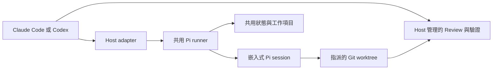

# swarm-pi-code-plugin

[English](README.md)

`swarm-pi-code-plugin` 將 Claude Code 與 OpenAI Codex 連接到受控的 Pi coding worker，提供以專案內容為依據的調查、規劃、Review 與實作能力。

Plugin 的設計目標是讓複雜工作可以委派給另一個 coding agent，同時保留 Host 對意圖、核准、驗證、提交與推送的控制權。Pi 只會取得目前任務允許的工具與工作樹。

## 架構



Claude Code 與 Codex 是 Host 介面，不是 worker 引擎。兩者使用相同的 runner，並共用模型設定、專案設定、工作歷程與工作樹狀態。

委派任務會依角色使用對應的模型鏈與 Thinking 等級。實作任務會加入受限的修改工具、要求乾淨的指定 worktree，並在完成後執行唯讀 verifier。三種沙盒模式如下：

- **Strict**：不提供 Bash，只提供受限的 Pi 工具。
- **Adaptive**：透過政策與可追蹤的核准機制，動態授權受限的 shell 與網路操作。
- **Lenient**：在 macOS Seatbelt 或 Linux Bubblewrap 內提供較寬鬆的 shell 與對外網路。

Git delivery 永遠由 Host 管理。執行期設定與工作資料不放在 checkout 裡：Git repository 使用 Git common directory 的 `.git/swarm-pi-code-plugin/`，非 Git 資料夾則使用作業系統的使用者狀態目錄。憑證留在 Pi 的使用者憑證儲存區，不會進入專案檔案或瀏覽器草稿。

詳細內容請參考[架構文件](docs/architecture.md)與[設定文件](docs/configuration.md)。

## 安裝

### 系統需求

- 已安裝 Node.js 22.19.0 或更新版本。
- 已安裝 Claude Code 或 Codex。
- 需要執行 worktree 型實作任務時，目標必須是 Git repository。
- macOS，或安裝 `bubblewrap`、`socat` 與 `ripgrep` 的 Linux，才能使用 Lenient 沙盒模式。

### Claude Code

將 GitHub repository 加入 marketplace 並安裝 Plugin：

```bash
claude plugin marketplace add https://github.com/JiaWeiXie/swarm-pi-code-plugin
claude plugin install swarm-pi-code-plugin@swarm-pi-code-plugin
```

重新啟動 Claude Code，或執行 `/reload`。本機開發時可以直接指定 Plugin 目錄：

```bash
claude --plugin-dir /absolute/path/to/swarm-pi-code-plugin/plugins/swarm-pi-code-plugin
```

### Codex

此 repository 包含本機 marketplace：

```bash
codex plugin marketplace add /absolute/path/to/swarm-pi-code-plugin
codex plugin add swarm-pi-code-plugin@swarm-pi-code-plugin-local
```

請開啟新的 Codex task，讓 skill 重新載入。可用的 skills 如下：

```text
$swarm-pi-code-plugin-configure
$swarm-pi-code-plugin-project
$swarm-pi-code-plugin-ask
$swarm-pi-code-plugin-review
$swarm-pi-code-plugin-plan
$swarm-pi-code-plugin-implement
$swarm-pi-code-plugin-orchestrate
$swarm-pi-code-plugin-scaffold
$swarm-pi-code-plugin-setup
```

## 使用方式

### 選擇合適的工作流程

| 情境 | Claude Code | Codex |
| --- | --- | --- |
| 第一次設定 Provider、模型與專案 | `/swarm-pi-code-plugin:init` | `$swarm-pi-code-plugin-configure` |
| 重新設定 Provider 或模型優先順序 | `/swarm-pi-code-plugin:init --reconfigure` | `$swarm-pi-code-plugin-configure` |
| 修改專案目標、資料夾或任務類型 | `/swarm-pi-code-plugin:project` | `$swarm-pi-code-plugin-project` |
| 詢問 repository 問題或要求分析 | `/swarm-pi-code-plugin:ask` | `$swarm-pi-code-plugin-ask` |
| 建立唯讀實作計畫 | `/swarm-pi-code-plugin:plan` | `$swarm-pi-code-plugin-plan` |
| Review 工作樹或 branch 變更 | `/swarm-pi-code-plugin:review` | `$swarm-pi-code-plugin-review` |
| 執行明確且受限的程式修改 | `/swarm-pi-code-plugin:implement` | `$swarm-pi-code-plugin-implement` |
| 執行多個唯讀觀點 | `/swarm-pi-code-plugin:orchestrate` | `$swarm-pi-code-plugin-orchestrate` |
| 設計並建立新專案 | `/swarm-pi-code-plugin:scaffold` | `$swarm-pi-code-plugin-scaffold` |
| 設定專案內的開發工具 | `/swarm-pi-code-plugin:setup` | `$swarm-pi-code-plugin-setup` |

Claude Code commands 與 Codex skills 使用相同的 Host protocol：委派前檢查 readiness 與待通知事項、在設定失敗時保留原始請求、預設使用 supervised 執行，並要求使用者明確決定核准、adoption、artifact materialization 與 Git delivery。

### 第一次設定

使用對應 Host 的設定入口。瀏覽器設定頁會依序處理六個步驟：

1. 連接可用的雲端或本機 AI 服務。
2. 選擇專案主要模型與 fallback 順序。
3. 為 worker 角色指定模型鏈與 Thinking 等級。
4. 選擇沙盒、classifier、核准與背景執行政策。
5. 檢查 Git repository、空的資料夾或既有資料夾的狀態。
6. 測試主要模型與必要的 classifier，完成驗證後再原子儲存。

如果設定是由委派任務啟動，Host 會保留原始請求，設定完成後自動恢復。取消或閒置逾時不需要使用者重新描述任務。瀏覽器草稿只保留非敏感的角色、安全性與 workspace 欄位，不會保留憑證。

沒有偵測到可用服務時，連線清單會維持空白。自訂 endpoint 可以先測試，再顯示 provider ID、API protocol、模型限制與模型 ID。

### 設定頁預覽


### 重新設定

Provider 與模型設定可以使用 `--reconfigure` 或 Codex configure skill 重新開啟。專案設定則有獨立且可重複執行的流程：

```text
/swarm-pi-code-plugin:project
$swarm-pi-code-plugin-project
```

專案流程會讀取目前的角色、安全性與 profile 設定，並只更新 `state.json`，不會改寫模型設定、憑證或工作歷程。

### 執行安全性與角色

專案預設使用 **Strict**，提供受限的 Pi 工具但不暴露 Bash。**Adaptive** 會透過政策分類器、受限 capability lease 與可選的 Supervisor 核准，加入受控的 Bash 與網路操作。**Lenient** 則透過 macOS Seatbelt 或 Linux Bubblewrap 提供較寬鬆的對外網路。

所有 shell 模式都使用隔離的執行環境，不會傳遞模型 token、SSH socket 或其他 Host secret。Adaptive classifier 只會取得提議中的 action 與有限的政策內容。Lenient 模式下，worker 可見的來源內容可能會傳送給外部服務。平台不支援或缺少必要依賴時會 fail closed，絕不退回未沙盒化的 shell。

### 非互動 runner

共用 runner 適合自動化與 Host 整合：

```bash
node scripts/pi-runner.mjs models --json
node scripts/pi-runner.mjs providers --json
node scripts/pi-runner.mjs configure --host codex --section project --no-open
node scripts/pi-runner.mjs init --json
node scripts/pi-runner.mjs status --json
node scripts/pi-runner.mjs doctor --smoke-test --json
node scripts/pi-runner.mjs ask --host codex --prompt-file /path/to/question.md --json
node scripts/pi-runner.mjs review --host codex --scope working-tree --json
node scripts/pi-runner.mjs plan --host codex --prompt-file /path/to/plan.md --json
node scripts/pi-runner.mjs implement --host codex --prompt-file /path/to/task.md --json
node scripts/pi-runner.mjs orchestrate --host codex --prompt-file /path/to/task.md --json
node scripts/pi-runner.mjs scaffold --host codex --spec-file /path/to/scaffold.json --target /path/to/new-project --json
node scripts/pi-runner.mjs setup --host codex --prompt-file /path/to/setup.md --json
node scripts/pi-runner.mjs roles list --json
```

`implement` 會先檢查工作樹是否乾淨，並取得獨佔的 worktree lease。Host 必須檢查結果並執行驗證後才能交付。逾時、取消或失敗可能留下部分修改；系統會明確回報，不會靜默回復。

委派命令預設使用 supervised 執行。Host relay 會管理 Pi process，直到記錄 terminal result；主 session 可以繼續處理其他工作。唯讀命令也支援 durable background 執行：

```bash
node scripts/pi-runner.mjs ask --host codex --prompt-file /path/to/question.md \
  --execution-mode background --json
node scripts/pi-runner.mjs jobs wait --job <job-id> --json
```

Background 模式支援 scout、planner、reviewer 與 analyst。Mechanical implementation 只有在明確啟用後才能背景執行，且 control plane 會建立專屬 branch 與 worktree。Executor 與 security-executor 的實作仍維持 supervised。

Worker 預設 timeout 為：`ask`、`plan`、`review` 30 分鐘；`orchestrate`、`implement` 60 分鐘。可使用 `--timeout-ms` 設定 1000 至 86400000 毫秒的期限。

工作項目的查詢與控制：

```bash
node scripts/pi-runner.mjs jobs list --json
node scripts/pi-runner.mjs jobs list --pending-notifications --json
node scripts/pi-runner.mjs jobs status --job <job-id> --json
node scripts/pi-runner.mjs jobs wait --job <job-id> --wait-timeout-ms 5000 --json
node scripts/pi-runner.mjs jobs cancel --job <job-id> --json
node scripts/pi-runner.mjs jobs acknowledge --job <job-id> --json
node scripts/pi-runner.mjs jobs approvals --job <job-id> --json
node scripts/pi-runner.mjs jobs approve --job <job-id> --approval <approval-id> --json
node scripts/pi-runner.mjs jobs deny --job <job-id> --approval <approval-id> --json
node scripts/pi-runner.mjs jobs cleanup --job <job-id> [--discard] --json
node scripts/pi-runner.mjs jobs materialize --job <job-id> --target /path/to/new-project --json
```

`jobs wait` 不會改變 worker 的 deadline。等待逾時會以 exit code `3` 結束；遇到 `awaiting-approval` 會以 `4` 結束，並讓仍在執行的 worker 等待核准。核准通知與 terminal notification 分開確認。Capability lease 會綁定 job generation、policy hash、action fingerprint 與有效期限。

### 建立新專案與開發環境

建立新專案時，會先由唯讀的 `project-architect` 角色產生可 Review 的 scaffold specification。接著由 `scaffolder` 寫入 job 專屬的 staging Git repository，再由 `environment-engineer` 在 supervised 模式下處理專案內的依賴與工具設定。驗證通過的 scaffold 會產生可交付 artifact，但在明確執行 `jobs materialize` 前，不會碰觸目標資料夾。

Package lifecycle scripts 與 native build 需要 Adaptive 核准。全域套件安裝、Host provisioning、部署、merge 與 push 都是固定拒絕的操作。

## 疑難排解

### 看不到 command 或 skill

重新啟動 Host，或在 Claude Code 執行 `/reload`。Codex 請開啟新的 task，讓已安裝的 skill cache 重新整理。本機開發時，Claude Code 使用 `--plugin-dir`；Codex marketplace 的 manifest 或 skill 變更後，請重新安裝本機 Plugin。

### 瀏覽器沒有開啟

Runner 會輸出一次性的 loopback URL。可以手動開啟該網址，或使用 `--no-open` 從 terminal 啟動。

### 沒有偵測到 Provider

Pi 只會顯示它能使用的服務。請檢查 Pi credential store 或文件所列的 provider 環境變數，再重新開啟設定。使用本機 AI 應用程式時，請使用 **Find local AI apps**。Plugin 不會掃描 `.env`，也不會複製 Claude Code 或 Codex 的私有憑證。

### Endpoint discovery 失敗

確認 URL 是 HTTP(S) model server endpoint，而不是瀏覽器 dashboard URL。檢查 API key 後，再執行 **Test and find models**。系統會區分驗證失敗、逾時、伺服器無法連線、格式錯誤、重新導向與不支援的 endpoint。

### 選取的模型無法使用

重新開啟 Provider 與模型設定，選擇 Pi 目前回報可用的模型。當主要 Provider 可能暫時無法使用時，建議設定 fallback model。

### 設定被取消或逾時

尚未儲存的變更不會寫入。非敏感的角色、安全性與 workspace 草稿會在重新開啟設定時恢復；委派 continuation 會保留 24 小時。憑證永遠不會寫入瀏覽器草稿。

### 實作因工作樹不乾淨而被拒絕

runtime state、未追蹤的 `.DS_Store`、`__pycache__`、`.pyc` 與 `.pyo` 會被視為 safe-dirty，不會阻擋實作。已追蹤、已 staged、衝突、疑似 secret 或未知檔案則需要明確選擇 isolated HEAD 或 isolated snapshot。Swarm Pi 不會自動刪除、stash、隱藏或提交使用者原有的變更。

### 委派工作停止但沒有收到通知

執行 `jobs list --pending-notifications --json`。Terminal result 會持久保存，直到明確 acknowledge 才會清除待通知狀態。若工作 process 已消失，reconciliation 會標記為 `orphaned`；取消後停止的 worker 會標記為 `cancelled`。Host adapter 每次開始新的委派前都會檢查待通知佇列。

### Linked worktree 看不到設定

設定存放在 Git common directory，因此 linked worktree 通常會共用 `swarm-pi-code-plugin/`。請確認 worktree 屬於預期的 repository，並檢查 `SWARM_PI_CODE_PLUGIN_DATA_DIR` 是否指向其他位置。

### 設定無法復原

執行 `doctor --json`。多個儲存區的設定失敗時，系統會嘗試復原憑證、模型設定與專案狀態。若 rollback 本身失敗，系統會建立不含 API key 的遮罩 recovery journal，並在檢查衝突前阻擋委派。

## 開發

Repository 使用 mise 提供固定版本的 Node.js 環境：

```bash
mise install
mise run install
mise run check
```

開發環境使用 mise 的 Node.js `24.15.0`；已安裝的 Plugin 支援 Node.js `22.19.0` 以上版本，以符合 Pi SDK 的 engine requirement。

常用檢查：

```bash
mise run typecheck
mise run test
mise run build
```

修改使用者文件、技術參考或已提交的 screenshot 時，請遵循[文件更新 SOP](docs/documentation-sop.md)。其中包含產品證據、screenshot 安全性、交叉連結與驗證流程。

`npm test` 會執行編譯後的 Node 測試，包含 mock Pi session、state migration、manifest validation、endpoint discovery 與 loopback web server 測試。Host 本機測試：

```bash
claude --plugin-dir /absolute/path/to/swarm-pi-code-plugin/plugins/swarm-pi-code-plugin
codex plugin marketplace add /absolute/path/to/swarm-pi-code-plugin
codex plugin add swarm-pi-code-plugin@swarm-pi-code-plugin-local
```

請使用 `node --check` 驗證兩個 Plugin JavaScript，並在本機環境有提供時，使用 Codex plugin validation tool 驗證 Codex manifest 與 skills。

修改 Codex skill 或 Plugin manifest 後，請更新 Codex plugin cachebuster 並開啟新的 task。Runtime 修改放在 `src/`，完成後先重新 build，再驗證 packaged Plugin。

## 使用的技術與參考專案

- [Claude Code](https://docs.anthropic.com/en/docs/claude-code/overview)
- [OpenAI Codex](https://developers.openai.com/codex/)
- [Pi Coding Agent SDK](https://github.com/earendil-works/pi)，固定使用 `0.80.6`
- [Node.js](https://nodejs.org/)
- [TypeScript](https://www.typescriptlang.org/)
- [mise](https://mise.jdx.dev/)
- [Git worktrees](https://git-scm.com/docs/git-worktree)

本 Plugin 的原始概念與 Host workflow 參考了 [apoapps/swarm-code-plugin](https://github.com/apoapps/swarm-code-plugin)。該專案僅作為架構與委派概念的參考；本 repository 是獨立重寫，不重用其原始碼。

角色調度與執行安全設計也參考下列開源專案與文件：

- [Nanako0129/pilotfish](https://github.com/Nanako0129/pilotfish)：參考 Machine、Role 與 Policy 分離，以及依角色進行模型調度的概念。
- [Pi containerization guidance](https://github.com/earendil-works/pi/blob/main/packages/coding-agent/docs/containerization.md)：參考隔離邊界與未來 whole-process `isolated` 模式方向。
- [carderne/pi-sandbox](https://github.com/carderne/pi-sandbox)：參考 macOS Seatbelt 與 Linux Bubblewrap 的沙盒 shell 作法。
- [r4vi/pi-auto-mode](https://github.com/r4vi/pi-auto-mode) 與 [czottmann/pi-automode](https://github.com/czottmann/pi-automode)：參考自適應權限 classifier、政策決策與核准流程。

以上專案都是設計參考。本 Plugin 實作自己的 trusted、非互動式政策與 enforcement runtime，不會載入它們的完整 extension，也不複製其原始碼。

## 授權

本專案採用 [MIT License](LICENSE)。Copyright (c) 2026 Jason Hsieh。
