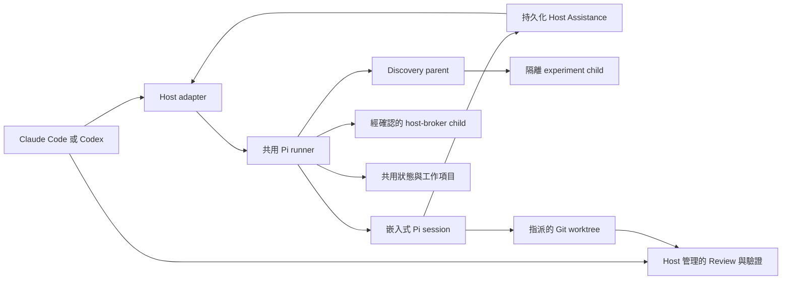

# swarm-pi-code-plugin

[English](README.md)

`swarm-pi-code-plugin` 將 Claude Code 與 OpenAI Codex 連接到受控的 Pi coding worker，提供以專案內容為依據的調查、規劃、Review 與實作能力。

Plugin 的設計目標是讓複雜工作可以委派給另一個 coding agent，同時保留 Host 對意圖、核准、驗證、提交與推送的控制權。Pi 只會取得目前任務允許的工具與工作樹。

## 架構



Claude Code 與 Codex 是 Host 介面，不是 worker 引擎。兩者使用相同的 runner，並共用模型設定、專案設定、工作歷程與工作樹狀態。

委派任務會依角色使用對應的模型鏈與 Thinking 等級。實作任務會加入受限的修改工具、要求乾淨的指定 worktree，並在完成後執行唯讀語意 verifier。五種沙盒模式如下：

- **Strict**：不提供 Bash，只提供受限的 Pi 工具。
- **Adaptive**：透過政策與可追蹤的核准機制，動態授權受限的 shell 與網路操作。
- **Lenient**：在 macOS Seatbelt 或 Linux Bubblewrap 內提供較寬鬆的 shell 與對外網路。
- **Autopilot**：可選模式，維持與 Lenient 相同的 OS 沙盒隔離（同樣需要 Seatbelt／Bubblewrap 後端），但例行 shell（build／test、`rm`／`mv`／`cp`、`curl`／`wget`、`node`／`python` 等 interpreter、redirection 與 workspace 外路徑）會在無人監督下自動執行，不會停下等待 supervisor 核准。
- **Full-access**：必須明確 opt-in，會移除 Plugin 自己的 OS 沙盒，讓 worker 的 Bash 不再被包裹；此時 worker 的實際觸及範圍完全取決於 Host 自己的沙盒。

Adaptive 只辨識刻意縮小的 shell inspection grammar。範圍內的 `sha256sum`／`shasum`、受限的 `rustc`／`cargo` 版本探測，以及兩個檔案間的 `cmp`／`diff` 比較會視為 read-only，讓重現性檢查取得精確的 Host-first lease；路徑跳脫、workspace 外絕對路徑、redirect、expansion、command substitution、編譯與測試執行仍會 fail-closed。

Git delivery 永遠由 Host 管理。執行期設定與工作資料不放在 checkout 裡：Git repository 使用 Git common directory 的 `.git/swarm-pi-code-plugin/`，非 Git 資料夾則使用作業系統的使用者狀態目錄。憑證留在 Pi 的使用者憑證儲存區；瀏覽器輸入只會成為當次設定工作階段的不透明草稿，不會進入專案檔案或 localStorage。

isolated Experiment 可以唯讀 linked worktree 的 Git 管理路徑，用來建立與驗證乾淨 baseline。這些路徑仍然禁止寫入、不能取得修改 lease，也不會讓 Worker 擁有 commit 或交付能力。在 macOS 上，Sandbox 會在可用時直接使用 Command Line Tools 的 Git binary，避免 `xcrun` shim 嘗試寫入 Host cache。

檔案系統邊界會先將路徑 canonicalize，再檢查 execution workspace 與設定的 operation roots。因此 macOS 的 `/var/...` 與 `/private/var/...` worktree alias 會被視為同一個位置，但不會擴大範圍；traversal、逃逸的 symlink、protected path，以及 canonical root 外的路徑仍會被拒絕。

詳細內容請參考[架構文件](docs/architecture.md)、[設定文件](docs/configuration.md)，以及
[設定欄位指南](docs/configuration-field-guide.zh-TW.md)；指南從 Host、Worker、Job、
capability、fan-out 與 lease 等關鍵詞開始，再提供欄位預設、完整例子、安全取捨
與頁面 Tips 的實際選擇方法；
[Host Assistance 與 Discovery](docs/host-assistance-discovery.md)，包含即時
Worker↔Host 協作、schema-gated experiment micro-SDLC、Advisor、
discover-to-plan handoff，以及隔離的 Host Actions。

## 安裝

### 系統需求

- 已安裝 Node.js 22.19.0 或更新版本。
- 已安裝 Claude Code 或 Codex。
- 需要執行 worktree 型實作任務時，目標必須是 Git repository。
- macOS，或安裝 `bubblewrap`、`socat` 與 `ripgrep` 的 Linux，才能使用 Lenient 與 Autopilot 沙盒模式。Strict 與 Full-access 不需要沙盒後端，因此在任何平台都可選用；Full-access 會移除 Plugin 自己的 OS 沙盒。

### Claude Code

將 GitHub repository 加入 marketplace 並安裝 Plugin：

```bash
claude plugin marketplace add https://github.com/JiaWeiXie/swarm-pi-code-plugin
claude plugin install swarm-pi-code-plugin@swarm-pi-code-plugin
```

重新啟動 Claude Code，或執行 `/reload`。本機開發時可以直接指定 Plugin 目錄：

```bash
claude --plugin-dir /absolute/path/to/swarm-pi-code-plugin/plugins/swarm-pi-code-plugin
```

### Codex

此 repository 包含本機 marketplace：

```bash
codex plugin marketplace add /absolute/path/to/swarm-pi-code-plugin
codex plugin add swarm-pi-code-plugin@swarm-pi-code-plugin-local
```

請開啟新的 Codex task，讓 skill 重新載入。可用的 skills 如下：

```text
$swarm-pi-configure
$swarm-pi-project
$swarm-pi-ask
$swarm-pi-review
$swarm-pi-plan
$swarm-pi-implement
$swarm-pi-orchestrate
$swarm-pi-discover
$swarm-pi-scaffold
$swarm-pi-setup
```

## 使用方式

### 選擇合適的工作流程

| 情境 | Claude Code | Codex |
| --- | --- | --- |
| 第一次設定 Provider、模型與專案 | `/swarm-pi-code-plugin:swarm-pi-configure` | `$swarm-pi-configure` |
| 重新設定 Provider 或模型優先順序 | `/swarm-pi-code-plugin:swarm-pi-configure --reconfigure` | `$swarm-pi-configure` |
| 修改專案目標、資料夾或任務類型 | `/swarm-pi-code-plugin:swarm-pi-project` | `$swarm-pi-project` |
| 詢問 repository 問題或要求分析 | `/swarm-pi-code-plugin:swarm-pi-ask` | `$swarm-pi-ask` |
| 建立唯讀實作計畫 | `/swarm-pi-code-plugin:swarm-pi-plan` | `$swarm-pi-plan` |
| Review 工作樹或 branch 變更 | `/swarm-pi-code-plugin:swarm-pi-review` | `$swarm-pi-review` |
| 執行明確且受限的程式修改 | `/swarm-pi-code-plugin:swarm-pi-implement` | `$swarm-pi-implement` |
| 執行多個唯讀觀點 | `/swarm-pi-code-plugin:swarm-pi-orchestrate` | `$swarm-pi-orchestrate` |
| 以證據、實驗與閘門收斂未知需求 | `/swarm-pi-code-plugin:swarm-pi-discover` | `$swarm-pi-discover` |
| 設計並建立新專案 | `/swarm-pi-code-plugin:swarm-pi-scaffold` | `$swarm-pi-scaffold` |
| 設定專案內的開發工具 | `/swarm-pi-code-plugin:swarm-pi-setup` | `$swarm-pi-setup` |

### Skills 使用方式與限制

Claude Code commands 與 Codex skills 是相同 workflows 的兩種 Host 入口。請使用上表中對應 Host 的名稱，並以自然語言描述請求；Host 會準備 runner 輸入、驗證 Pi 證據，並把需要使用者決定的事項保留在 Host 邊界。

#### 設定 Workflows

| Skill | 適用情境與應提供資訊 | 限制與授權邊界 |
| --- | --- | --- |
| `swarm-pi-configure` | 第一次設定、復原、變更 Provider 或模型，或完整重新設定。請提供 workspace，以及要編輯既有設定、重設，或只以 JSON 回報狀態。 | 開啟本機引導式設定；非 Git workspace 時只能在取得同意後詢問並執行 `git init`。API key 與 OAuth code 只能輸入本機設定流程，不得放在 Host 對話。若 Host sandbox 拒絕寫入 `.git/swarm-pi-code-plugin`，保留請求或草稿，並在取得 Host 同意後於該外層 sandbox 外重新啟動相同本機 runner；設定流程改用新的 loopback URL。不得手動編輯 state 或 recovery 檔案。Reset 不會刪除 Pi 使用者憑證，reconfigure 不會刪除 Job 歷史，執行中的 Job 仍保留 immutable policy snapshot。不變更 Provider 連線時改用 `swarm-pi-project`。 |
| `swarm-pi-project` | 重複調整角色路由、Sandbox 與核准政策、專案範圍、Decision Mode、Host Assistance、Advisor、doctrine metadata 或 Host Actions。請提供預期政策或 workspace scope 變更。 | 只變更專案路由、安全性與 profile state，不會改動 Provider 憑證、模型驗證、模型設定、Job 歷史或執行中 Job 的 snapshot。非 Git workspace 只能在明確同意後初始化；流程不會 add 檔案、commit 或設定 Git identity。 |

#### 唯讀分析 Workflows

| Skill | 適用情境與應提供資訊 | 限制與授權邊界 |
| --- | --- | --- |
| `swarm-pi-ask` | 一個聚焦的 repository 問題、解釋或證據檢查。請提供精確問題、repository scope、所需證據、時效要求與待釐清的不確定性。 | 唯讀且一次只處理一個焦點。不會產生變更計畫、review diff 或修改檔案；這些請求應分別改用 `plan`、`review` 或 `implement`。Host 會驗證答案，並回報未受支持的主張或剩餘不確定性。 |
| `swarm-pi-review` | 對 Git working tree 或 branch 提出可採取行動的 bug、安全性、regression 與缺少測試 findings。請提供預期 diff scope；branch review 另提供 base ref。 | 唯讀。Pi findings 是待驗證證據，不是權威 review；Host 會對照實際 diff 確認每項 finding，並提供精確 file 與 line reference。不會修正 finding 或修改檔案；明確授權修改後改用 `implement`。 |
| `swarm-pi-plan` | 在需求與證據已足夠時，建立可直接決策的實作、migration 或 architecture 計畫。請提供 scope、替代方案、限制、驗收條件與已知決策。 | 唯讀且不能觸發實作。未解需求或主張改用 `discover`，diff findings 改用 `review`，已核准的程式修改改用 `implement`。最終計畫會保留 citation、unknown、risk 與 assumption。 |
| `swarm-pi-orchestrate` | Architecture、migration、tradeoff 或 risk 決策需要多個獨立觀點時，執行有界 panel。請提供一份共用 decision brief、EvidencePack、限制與證據驗收條件。 | 唯讀。Decision Mode 會選擇一至三個基本觀點，並可加入受 quota 限制的 Advisor；最終整合由 Host 負責。各觀點不會各自重複昂貴的 build 或 test suite，未經驗證的 inline code 不會被描述為可運作程式碼。 |
| `swarm-pi-discover` | 未知需求或未解技術主張需要可重現的研究、實驗與收斂時使用。請提供 unknown、限制、證據條件、時效要求、使用者 gate 與考量資源的 experiment plan。 | Research 與 convergence 唯讀；experiment 會在 immutable Job policy 下的隔離 child worktree 執行。Research、experiment 與 definition gate 都需要 review。Experiment artifact 一律為 `deliverable: false`、不能 materialize，結論只能是 `supported`、`refuted` 或 `inconclusive`；通過最終 gate 的結果可交給 `plan`。 |

#### 受控修改 Workflows

| Skill | 適用情境與應提供資訊 | 限制與授權邊界 |
| --- | --- | --- |
| `swarm-pi-implement` | 在既有 Git repository 中執行已明確授權、範圍受限的修改、修正或 refactor。請提供允許的檔案或資料夾、驗收條件、禁止動作與考量資源的驗證計畫。 | 保留使用者變更，絕不 stash、discard、commit、merge、push 或隱藏它們。Pi 通常在 Job 擁有的隔離 worktree 工作；任何 materialization 前都由 Host 檢查 diff 與驗證。將可交付 artifact 套用到使用者 worktree 需要明確同意，Git delivery 仍是另一個使用者決策。新專案或非 Git 專案改用 `scaffold`。 |
| `swarm-pi-scaffold` | 在空 target 設計並建立新專案，或採用已完成 inventory 的非 Git target。請提供專案目標、target、runtime、package manager、結構、dependency 與 lifecycle-script policy、完成條件及驗證計畫。 | Planning 唯讀；只有在完整 `ScaffoldSpec` 獲得同意後，才會在隔離 staging 建立專案。Adoption 需要另外核准 target inventory。Pi 不會直接交付；只有通過驗證且 `deliverable: true` 的 artifact 能在明確同意後 materialize。既有 Git repository 改用 `implement`，只有 tooling 變更則改用 `setup`。 |
| `swarm-pi-setup` | 設定可重現的專案內 dependency、build、test、lint 或開發工具。請提供精確 setup 請求、允許的 package manager、lifecycle-script policy、禁止的全域動作與驗證計畫。 | 使用 supervised execution，並可依 workspace readiness 隔離工作。未知 lifecycle script、不確定的 network target、native build 與部分可逆動作需要使用者 review。禁止 global install、Host provisioning、deployment、commit、push 與其他 Git delivery；product code 應改用 `implement`。 |

#### 請求範本

請搭配符合 workflow 的 Claude Code command 或 Codex skill 使用以下範本：

```text
目標：
Workspace 與允許範圍：
應使用的證據或輸入：
限制與禁止動作：
完成條件：
必要驗證：
```

#### 共通邊界

Claude Code commands 與 Codex skills 使用相同的 Host protocol：委派前檢查 readiness 與待通知事項、在設定失敗時保留原始請求，並預設使用 supervised 執行。只有正在處理 Host turn 的活躍模型可以根據完整 durable context 裁決符合 Host-first ceiling 的 request；hook、watcher、timeout 與 replay 只能通知。Adoption、artifact materialization、Git delivery，以及超出自動核准範圍的 request，仍需要使用者明確決定。

任何 skill 都不會擴張原始使用者意圖、設定的 workspace roots、允許的 task types、Sandbox capabilities 或 immutable Job policy。Pi 輸出在 Host 對照 repository、實際 diff、runtime side effects 與最新驗證前，仍是不受信任的證據。Secrets 不得在 Host 對話中收集。刪除、私人資料或 connector、Git metadata 與 delivery、deployment、訊息、交易，以及不可逆或結果不確定的外部作用，不會因呼叫 skill 而自動獲得授權，必須由使用者 review，或維持 policy denial。

### Telemetry、詳細報告與儀表板

本機 collector 會把終端 Job attempt 以 privacy 驗證過的 JSONL 儲存在既有 state
directory。只保留安全 label、role/task、outcome、duration，以及 provider 回報的
input/output/cache-read counters；不會儲存 prompt、completion、reasoning、路徑、
credential、endpoint、Git metadata 或任意文字。不會上傳資料、不會啟動 sidecar，
也不宣稱 billing accuracy。本機模型仍是 usage-only；沒有權威 pricing 時，cost
會明確標成 unknown。

使用 `mise exec -- node scripts/pi-runner.mjs telemetry report --json` 取得版本化的
詳細報告，也可加上 `--from`、`--to` 與 `--limit`（最多 500）。使用
`mise exec -- node scripts/pi-runner.mjs dashboard` 開啟 loopback、token 保護的儀表板，
查看 summary cards、model/role breakdown 與最近 attempts。詳見[telemetry 合約與儀表板參考](docs/telemetry.md)。

### 第一次設定

使用對應 Host 的設定入口。瀏覽器設定頁會依序處理六個步驟：

1. 以各供應商專屬欄位連接雲端、訂閱制、環境身分或本機 AI 服務。
2. 選擇專案主要模型與 fallback 順序。
3. 為 worker 角色指定模型鏈與 Thinking 等級。
4. 選擇沙盒、classifier、核准、背景執行、Decision Mode、Host
   Assistance、Advisor、doctrine metadata 與 Host Action 政策。
5. 檢查 Git repository、空的資料夾或既有資料夾的狀態。
6. 測試新增或變更的主要模型／必要 classifier route，完成驗證後再原子儲存。

如果設定是由委派任務啟動，Host 會保留原始請求，設定完成後自動恢復。取消或閒置逾時不需要使用者重新描述任務。瀏覽器草稿只保留非敏感的角色、安全性與 workspace 欄位，不會保留憑證。

Readiness 會依任務能力分開判斷，因此 workspace 可能可以研究，但不能修改或交付。Git repository 若尚未建立 initial commit，會回報 `git-unborn`；實作會在啟動模型前停止，並提供 scaffold 或 adoption 動作與可恢復的 continuation。

Git 初始化是 Host 的前置流程，不是 Web UI 的設定項目。Configuration 在非 Git 資料夾開啟時，Host 會詢問是否要在回報的 workspace root 執行 `git init`；同意時只執行這個指令，拒絕時則保留在作業系統的 user-state namespace。若資料夾之後才被初始化成 Git，下一次互動式 Configuration 會在載入表單前，把完整 durable state directory 遷移到 Git common directory。`status` 與 `doctor` 只會回報 pending migration，不會搬移資料。結果會包含實際的 `configurationStorage.directory`、`modelConfigurationFile`、`stateFile` 與 `migrationStatus`；`--reset` 與精確的 `--json` 流程維持非互動。

沒有偵測到可用服務時，連線清單會維持空白。自訂 endpoint 必須先選擇 API protocol，再載入模型。Provider ID 維持內部管理；endpoint 與 Pi catalog 都無法證實的模型限制會保持自動判斷。

儲存會區分設定結構與 model 的即時健康狀態。既有且未變更的 route 若暫時不可用，會保留並標示為 degraded，因此無關的專案設定仍可儲存；新增或變更的 route 則必須通過可用性與必要驗證。移除 provider 或 custom model 前會顯示對路由的影響，並清除受影響的 fallback／role／classifier 引用；有既有 fallback 時會提升它，但不會靜默刪除已儲存 credential。若沒有可存活的 fallback，必須先選擇替代的 primary。

### 模型供應商連線

設定表單由 Pi v0.81.1 provider catalog 驅動。OpenAI API 固定使用 Responses adapter，Anthropic 使用 Messages；混合型 provider 則保留 Pi 的 per-model adapter。Cloud provider 只會顯示實際需要的 project、region、resource、account 或 deployment 欄位。Catalog 包含 Qwen Token Plan 與 Qwen Token Plan China 的 OpenAI-compatible API Key provider。

Plugin 啟動時使用本機 catalog snapshot，不會隱含刷新遠端模型 metadata 或憑證。需要最新清單時，請明確執行：

```bash
mise exec -- node scripts/pi-runner.mjs models --refresh --json
```

ChatGPT Plus/Pro 是獨立的 **ChatGPT 訂閱**連線，透過 Pi 的 `openai-codex` 瀏覽器或 device-code OAuth 載入，不會混入 OpenAI API Key 表單。GitHub Copilot 與 Anthropic 訂閱登入也使用相同的有限時間 OAuth 流程。
Radius 也使用相同的有限時間 OAuth 流程，並支援 API Key；它的 gateway model catalog 是動態清單，需要時可明確刷新。

自訂 endpoint 可選 OpenAI Chat Completions、OpenAI Responses 或 Anthropic Messages，而且一個連線只使用一種協定。載入模型與 **Verify API** 是兩個不同動作；`/models` 成功不代表 generation、tools 或 reasoning 可以執行。沒有 model-list endpoint 時，可以手動輸入模型 ID，但不會因此標示為已驗證。

建立連線草稿後，編輯設定、替換憑證、驗證 API、登出與從專案移除會維持為不同操作。秘密欄位留白代表保留既有憑證；瀏覽器不會讀回已儲存的秘密。憑證會留在 user-scoped、Pi 相容的 `CredentialStore`，不會進入 project state。

### 重新設定

Provider 與模型設定可以使用 `--reconfigure` 或 Codex configure skill 重新開啟。專案設定則有獨立且可重複執行的流程：

```text
/swarm-pi-code-plugin:swarm-pi-project
$swarm-pi-project
```

專案流程會讀取目前的角色、安全性與 profile 設定，並只更新 `state.json`，不會改寫模型設定、憑證或工作歷程。

### 執行安全性與角色

新專案預設使用 **Adaptive**，透過政策分類器與受限 capability lease 加入受控的 Bash 與網路操作，寫入仍受設定 roots 限制。**Strict** 保留為選配，只提供受限 Pi 工具且不暴露 Bash。**Lenient** 則透過 macOS Seatbelt 或 Linux Bubblewrap 提供較寬鬆的對外網路。**Autopilot** 是可選模式，維持與 Lenient 相同的 OS 沙盒隔離（同樣需要 Seatbelt 或 Bubblewrap 後端），但會讓例行 shell 在無人監督下自動執行，不會停下等待 supervisor 核准。**Full-access** 是第四種、必須明確 opt-in 的模式：它完全移除 Plugin 自己的 OS 沙盒，讓 worker 的 Bash 不再被包裹，刻意反轉先前「絕不退回未沙盒化的 shell」的不變式。與 Strict 相同，它不需要沙盒後端，即使沒有 Seatbelt 或 Bubblewrap 也一律可選；在政策判斷上則比照 Lenient（全部允許）。

由於 Full-access 移除了 Plugin 自己的邊界，worker 的實際觸及範圍**完全取決於 Host 自己的沙盒，而本 Plugin 無法控制或偵測它**。在沒有 `/sandbox` 的預設 Claude Code session 中，worker 可無限制存取整台機器；Codex CLI 預設為 workspace-write 限制，其 `danger-full-access` 會解除該限制。Adaptive、Lenient、Autopilot 與 Strict 都使用隔離的執行環境，不會傳遞模型 token、SSH socket 或其他 Host secret；Full-access 則使用真實環境，只移除 Plugin 自己注入的 `SWARM_PI_CODE_PLUGIN_*` 變數（provider API key、auth-file 路徑與 worker token），使用者自己的憑證仍會保留。

既有專案保留明確儲存的模式；缺少模式的 legacy 設定仍以 Strict 載入，且 Full-access 永遠不會成為 migration 預設。Job 啟動後使用 immutable policy snapshot，之後修改設定只影響新 Job。

Repository deny rule 只有在與 immutable effective project policy 完全相同時，才會讓新 snapshot 與 child snapshot 保留內部 `repo:` identity；一般設定無法冒用此保留 namespace。部分 legacy Host Assistance record 若缺少 fan-out，也會把預設 fan-out 限制在正規化後的 request limit 內，因此舊的 0／1 request policy 仍可安全載入並保持 fail-closed。

Discovery 的 Experiment child 會從這份凍結的 parent snapshot 派生 `experimenter` 階段能力。不同內容不能冒用同一個 hash，因此 child 保留自己的 stage hash，並把 parent hash 以 `parentPolicyHash` 納入 canonical snapshot。Receipt 綁定 child stage hash，audit 則可驗證不可變的 parent lineage。Discovery Experiment child 與 Host Action delivery child 永遠不會繼承 Full-access 或 Autopilot：它們會降級為 Lenient，因此一律保留 OS 沙盒。

Adaptive classifier 只會取得提議中的 action 與有限的政策內容。Lenient 模式下，worker 可見的來源內容可能會傳送給外部服務。對 Adaptive、Lenient、Autopilot 與 Strict 而言，平台不支援或缺少必要依賴時會 fail closed，絕不退回未沙盒化的 shell。Full-access 是這項保證唯一且必須明確 opt-in 的例外：選擇它就是刻意放棄 Plugin 自己的 OS 沙盒。

Decision Mode 控制有限的 orchestration 深度：Cost 使用 1 個基本視角、Balance 使用 2 個、Power 使用 3 個。Host Assistance context allowance 以 Off、Compact、Standard、Extended 顯示，Standard 將單次回傳限制在 32,768 個字元；它與 Advisor quota 都是獨立設定，不會隨模式自動改寫。Advisor 預設關閉；啟用後只加入有限、唯讀、不可遞迴的諮詢。`first-principles-qds-v1` 目前只會保存並進入 snapshot；runtime 尚未自動執行 Question/Delete/Simplify 收斂。

Host Assistance 預設開啟；新專案預設為 Host-first、Reversible ceiling 與 Discovery gate review。Worker 必須提供目的、最小權限、精確目標、失敗模式、可逆性、rollback、驗證、風險與替代方案。活躍的 Codex／Claude model 會獨立比對原始意圖與 immutable policy，只能透過 audit receipt 自動放行 public/read-only context 或一個精確、範圍內、完全可逆的動作；資料或信心不足時回問使用者。缺少新欄位的既有 policy 仍為 User-only，直到使用者重新儲存。Strict 不會因 Host receipt 增加能力；secret、private connector、Git metadata、刪除、交付、部署、訊息與交易永遠不會自動核准。

**Autopilot** 是可選的 Sandbox 模式，也就是第五種模式，位於 Lenient 之後。選擇它會取得與 Lenient 相同的 OS 沙盒隔離（需要 Seatbelt 或 Bubblewrap 後端，這點與 Strict、Full-access 不同），再加上內建的無人監督自動化：原本需要 supervisor 核准才會停下的例行 shell——build/test、`rm`／`mv`／`cp`、`curl`／`wget`、`node`／`python` 等 interpreter、redirection 與 workspace 外路徑——會直接執行、不會停下，且仍在 OS 沙盒內；這正是 Autopilot「不會停」的原因。這種例行 shell 自動化是 Autopilot（以及 Full-access）的內建特性；一般 Lenient 維持不變，仍會把這些動作 gate 在 supervisor 核准之後。對外且不可逆的邊界維持不變，在 Autopilot 與 Full-access 下同樣適用：`autoGitWrites` 與 `autoDelivery` 讓 worker shell 得以執行原本屬於不可變 hard-deny 的 `git commit`／`push`／`merge` 與部署指令（`kubectl`／`helm`／`terraform`）；這些一律通過人工核准 gate，永遠不會由 Host model 自動核准。`outwardApprovalGranularity` 設定用來控制這些 git／deploy 核准：`each-time` 每次都要確認一次，`first-then-auto` 則核准第一次後，透過 job-scoped lease 自動重複。該 lease 採 fingerprint-exact，因此 `first-then-auto` 只會自動重複完全相同的指令——不同的 commit message 會重新詢問；完整的跨指令自動重複是已記錄的未來項目。sudo/su 提權、Plugin 控制路徑（`.git`、`.env`、`.swarm-pi-policy.json`）、secret、forbidden／loopback 網域，以及直接寫入 Git metadata，即使在 Full-access 或 Autopilot 下也一律強制執行。

WorkerAssessment 仍是不受信任的建議；Host-first 會另外核對 runtime 產生的可信 `effectAssessment`。在 Adaptive 模式中，structure-aware、fail-closed 的 Bash analyzer 現在會在 model classifier 前提供真正的 deterministic read-only fast path。它只接受 allowlist 中的 inspection executable，並逐段證明 `&&`、`||`、pipeline、分號與換行；hard-deny 不再把 quoted pattern 或 heredoc data 當成待執行命令。Expansion、redirection、background、loop、interpreter、build/test、路徑越界與 write／exec flags 仍需 supervisor 核准。其餘 classifier capability claim 會正規化為 runtime 推導的 action capability，並保留為 audit evidence，不再因無害的 capability mismatch 直接拒絕；若 claim 顯示尚未證實的 write 或 network effect，仍會要求 approval。若仍需 approval，runner 會同時保存相容用的 `trustedReadOnly` 與權威 `effectAssessment`；未知 effect 仍回問使用者，不會擴張 lease。

角色調度會明確顯示每個職責的主要模型、Thinking 等級、重試上限與支援的執行模式。Adaptive 模式則會在沙盒能力上限內，另外設定 classifier chain 與無法判斷時的核准政策。

### Workspace 與儲存前 Review

Workspace 設定會先回報 Git readiness，再記錄產品目標、允許處理的資料夾範圍與可委派工作類型。Review 會在交易式儲存前，列出實際 provider protocol、驗證方式、模型來源、驗證狀態、角色調度與安全政策。

儲存成功後，系統會以交易方式更新憑證與設定、清除記憶體內草稿，並關閉暫時的本機 server。任何公開的設定範例都必須使用隔離的示範 workspace，且不得包含真實憑證。

### 強制執行的專案政策

設定的允許工作類型是 admission gate：不允許的類型會在工作執行前遭拒絕，而不是只作為 prompt 建議。設定的允許資料夾會限制受限的檔案系統工具；implementation 寫入會在三個層次強制執行：工具邊界、adaptive 與 lenient Bash 模式中的 sandbox write allowlist，以及 postflight changed-path check。Full-access 沒有 OS 沙盒，因此它的原始 Bash 不受 write allowlist 層保護，只剩工具邊界與 postflight changed-path check；由於 postflight 只檢查最終追蹤的 Git diff，full-access 執行期間的範圍外寫入無法被觀察到。省略這些限制時，會保留整個 workspace 的行為，以維持向後相容。讀取與寫入不同：受限的 Pi 檔案系統工具會強制執行讀取範圍，上述層次會強制執行 implementation 寫入，但 adaptive、lenient 與 full-access 模式中的原始 Bash 讀取並非資料夾範圍限制，且可在 workspace 內讀取（但仍受敏感路徑 deny 限制）；需要資料夾層級讀取機密性時，請使用 Strict 模式。技術合約請參閱 [Enforced Project Policy](docs/orchestration-and-policy.md#enforced-project-policy)。

### 非互動 runner

共用 runner 適合自動化與 Host 整合：

```bash
mise exec -- node scripts/pi-runner.mjs models --json
mise exec -- node scripts/pi-runner.mjs models --refresh --json
mise exec -- node scripts/pi-runner.mjs providers --json
mise exec -- node scripts/pi-runner.mjs configure --host codex --section project --no-open
mise exec -- node scripts/pi-runner.mjs init --json
mise exec -- node scripts/pi-runner.mjs status --json
mise exec -- node scripts/pi-runner.mjs doctor --smoke-test --json
mise exec -- node scripts/pi-runner.mjs ask --host codex --prompt-file /path/to/question.md --json
mise exec -- node scripts/pi-runner.mjs review --host codex --scope working-tree --json
mise exec -- node scripts/pi-runner.mjs plan --host codex --prompt-file /path/to/plan.md --json
mise exec -- node scripts/pi-runner.mjs implement --host codex --prompt-file /path/to/task.md --json
mise exec -- node scripts/pi-runner.mjs orchestrate --host codex --prompt-file /path/to/task.md --json
mise exec -- node scripts/pi-runner.mjs discover --host codex --prompt-file /path/to/discovery.md --json
mise exec -- node scripts/pi-runner.mjs plan --host codex --prompt-file /path/to/plan.md --discovery-from <job-id> --json
mise exec -- node scripts/pi-runner.mjs scaffold --host codex --spec-file /path/to/scaffold.json --target /path/to/new-project --json
mise exec -- node scripts/pi-runner.mjs setup --host codex --prompt-file /path/to/setup.md --json
mise exec -- node scripts/pi-runner.mjs roles list --json
```

所有委派命令也支援 `--decision-mode cost|balance|power`、
`--host-assistance inherit|on|off` 與 `--host-context-file <file>`。
這些 override 只會進入新 Job 的 snapshot，不會修改 workspace 預設。

`implement` 會先檢查工作樹是否乾淨，並取得獨佔的 worktree lease。Host 必須檢查結果並執行驗證後才能交付。逾時、取消或失敗可能留下部分修改；系統會明確回報，不會靜默回復。

委派命令預設使用 supervised 執行。使用 `--approval-mode wait` 時，managed
Host relay 會啟動 durable worker，並在 15 秒內回傳 terminal result、
`approval-required` 或 `wait-timed-out`；Host 接著以有限時間的 `jobs wait`
維持控制權。這可讓核准要求回到 Host，而不會留下無法回報的阻塞 shell。
唯讀命令也支援 durable background 執行：

```bash
mise exec -- node scripts/pi-runner.mjs ask --host codex --prompt-file /path/to/question.md \
  --execution-mode background --json
mise exec -- node scripts/pi-runner.mjs jobs wait --job <job-id> --wait-timeout-ms 15000 --json
```

Host relay 會使用有限時間的 wait，顯示 durable job phase、經過時間與取消動作。Host shell 在背景執行不等於 Pi background execution。

Background 模式支援 scout、planner、reviewer 與 analyst。Mechanical implementation 只有在明確啟用後才能背景執行，且 control plane 會建立專屬 branch 與 worktree。Executor 與 security-executor 的實作仍維持 supervised。

每個新 durable job 都會保存不含秘密的 provider/model snapshot 與完整性雜湊，以及 effective project policy 和 project goal。後續 profile edit 只會套用至新提交的 job；queued、running 與 resumed job 會保留原始 snapshot。憑證會在實際執行時重新解析，因此登出或輪替仍會對 queued job 生效。

Worker 預設 timeout 為：`ask`、`plan`、`review` 30 分鐘；`orchestrate`、`implement` 60 分鐘。可使用 `--timeout-ms` 設定 1000 至 86400000 毫秒的期限。

工作項目的查詢與控制：

```bash
mise exec -- node scripts/pi-runner.mjs jobs list --json
mise exec -- node scripts/pi-runner.mjs jobs list --pending-notifications --json
mise exec -- node scripts/pi-runner.mjs jobs status --job <job-id> --json
mise exec -- node scripts/pi-runner.mjs jobs wait --job <job-id> --wait-timeout-ms 15000 --json
mise exec -- node scripts/pi-runner.mjs jobs watch --emit ndjson --once
mise exec -- node scripts/pi-runner.mjs jobs watch --emit ndjson --job <job-id>
mise exec -- node scripts/pi-runner.mjs jobs cancel --job <job-id> --json
mise exec -- node scripts/pi-runner.mjs jobs acknowledge --job <job-id> --json
mise exec -- node scripts/pi-runner.mjs jobs approvals --job <job-id> --json
mise exec -- node scripts/pi-runner.mjs jobs approve --job <job-id> --approval <approval-id> --json
mise exec -- node scripts/pi-runner.mjs jobs deny --job <job-id> --approval <approval-id> --json
mise exec -- node scripts/pi-runner.mjs jobs host-requests --job <job-id> --json
mise exec -- node scripts/pi-runner.mjs jobs host-respond --job <job-id> --request <request-id> --response-file <bundle.json> --json
mise exec -- node scripts/pi-runner.mjs jobs host-decline --job <job-id> --request <request-id> --reason <reason> --json
mise exec -- node scripts/pi-runner.mjs jobs decisions --job <job-id> --json
mise exec -- node scripts/pi-runner.mjs jobs decide --job <job-id> --request <request-id> --response-file <decision.json> --json
mise exec -- node scripts/pi-runner.mjs jobs action-start --job <parent-job-id> --request <recommendation-id> --json
mise exec -- node scripts/pi-runner.mjs jobs cleanup --job <job-id> [--discard] --json
mise exec -- node scripts/pi-runner.mjs jobs prune --older-than 30d --json
mise exec -- node scripts/pi-runner.mjs jobs prune --older-than 30d --apply --json
mise exec -- node scripts/pi-runner.mjs jobs materialize --job <job-id> --target /path/to/new-project --json
```

已驗證的隔離 implementation artifact 可以省略 `--target`，將 patch 套用回原 workspace。Materialization 會驗證原始 HEAD 與 preserved paths、不建立 commit，套用失敗時會回復 patch。

`jobs prune` 用來整理 durable runtime 資料，不會取代單一 Job 的 `jobs cleanup`
worktree 操作。`--older-than` 必填，接受正整數加 `m`、`h`、`d` 或 `w`。
未加入 `--apply` 時完全唯讀，只會列出符合條件的 terminal Job、保留原因、
預估 logical bytes、安全的 worktree／branch 動作與孤兒目錄。Apply 會排除仍有
待確認通知、approval、Host Assistance、Human Decision、存活 heartbeat 或可復原
artifact 的 Job；只有乾淨、唯一歸屬，而且已 materialize 或已整合的
worktree／branch 才會自動移除。Artifact 會先移入 quarantine 再刪除，`state.json`
保留精簡 tombstone；持久化 phase 可讓中斷的 apply 繼續執行。單一 Job 失敗不會
阻止後續候選，但整體回傳 `success: false`。本版只回報孤兒目錄，不自動刪除。
Preview 與破壞性驗收應使用隔離 Git／state 副本；一般 Job 完成後不得自動加入
`--apply`。

Job status 與 `jobs wait` exit code 表達的是不同層次：status 是持久化的 Job 生命週期；exit code 也可能只是通知 Host 需要使用者介入，此時 Job 仍然存活。

| Job status | 終止狀態 | 意義 | Host 應採取的動作 |
| --- | --- | --- | --- |
| `queued` | 否 | Job 已持久化，正在等待 worker。 | 繼續有限時間輪詢。 |
| `running` | 否 | Worker 正在執行。可查看 `phase` 與 progress timestamp。 | 繼續有限時間輪詢；長時間執行時提供取消方式。 |
| `awaiting-approval` | 否 | Worker 因政策核准請求而暫停。 | 顯示核准內容，取得明確的 approve 或 deny 決定。 |
| `awaiting-host` | 否 | Worker 要求受限 Host context，或已記錄 action recommendation。 | 檢查對應 request，回覆、拒絕，或明確啟動已記錄的 action。 |
| `awaiting-decision` | 否 | Worker 需要真人決策。 | 顯示完整問題並記錄使用者決定，不得自行代答。 |
| `succeeded` | 是 | 執行成功完成。 | 檢查 verification 與可交付 artifact。 |
| `failed` | 是 | 執行或 verification 失敗。 | 查看 `errorCode`、`error` 與 verification 詳情。 |
| `cancelled` | 是 | 取消已完成。 | 保留回傳的 side effects 或復原指示。 |
| `timed-out` | 是 | Worker deadline 已到期。 | 檢查結果，確認適合重試後才建立新 Job。 |
| `orphaned` | 是 | Worker 或 lease 在完成前消失。 | 檢查 heartbeat 與 lease 診斷，不得重用過期核准。 |

| Exit code | Result/event | 意義 |
| --- | --- | --- |
| `0` | 成功的 command/result | 指令成功完成。 |
| `1` | `success: false` | Job 或要求的操作產生真正的失敗結果。 |
| `2` | `system-error` 或參數錯誤 | CLI 無法執行要求。 |
| `3` | `wait-timed-out` | 只有本次有限時間等待結束；worker deadline 與 Job 都不受影響。 |
| `4` | `approval-required` | 不是終止失敗；存活的 worker 正在等待明確核准或拒絕。 |
| `5` | `setup-required` 或 `workspace-action-required` | 繼續執行前需要完成設定或 workspace 決策。 |

核准通知與 terminal notification 分開確認。Capability lease 會綁定 job generation、policy hash、action fingerprint 與有效期限。policy hash 包含 project scope，因此變更允許資料夾會阻止重用舊 lease。核准後會重新評估原本暫停的 action：完全吻合且仍有效的 lease 可以一次通過 `require-approval` gate，但 immutable deny 會先行判斷。明確啟用 Autopilot/Full-access outward 選項後，Git 交付與部署會被重新分類為核准 gate，因此 matching user lease 只能授權該次完全吻合且已 opt-in 的指令；受保護路徑與其他 hard-denied action 仍不可授權。Approve 或 deny 會在同一個 state transaction 中解決該核准並只 acknowledge 對應的核准通知；terminal notification 必須在 Host 顯示結果後另外明確確認。

`jobs watch --emit ndjson` 會觀察 canonical state，並在 watcher 重啟時重播待處理事件，讓 Host 可以復原遺漏的通知。Process-local state-file watcher 只提供低延遲提示，canonical state read 仍是唯一權威來源；watcher 健康時保留 5 秒 safety reconciliation，無法建立或資源耗盡時則回到原本的 500 ms interval。有限時間的 `jobs wait` 共用同一個 observer，但一律保留 500 ms fallback。事件採 allowlist，不會輸出 worker token、provider credential、raw prompt、完整 WorkerAssessment、完整 agent output 或 logs；resolved event 只會額外顯示安全的 principal、風險與 auto-resolution flag。`--once` 供選用的 SessionStart recovery hook 使用；它不能建立 receipt、核准、拒絕、回覆、建立 lease 或 acknowledge。Host 必須依 `eventId` 去重；只有正在處理該 turn 的活躍 Host model 可以執行 Host-first adjudication。

### Assistance、Discovery 與 Host Actions

Live worker 可以請 Host 補足 context，而不需要知道 Host 會使用哪一個工具。Host 透過 `jobs host-requests` 讀取完整 request、WorkerAssessment 與 adjudication context，選擇最小的 workspace/Web/docs/paper/connector/skill 能力，再回傳 typed bundle。`jobs approvals`、`jobs host-requests` 與 `jobs decisions` 會提供原始意圖及 immutable policy snapshot；Host receipt 透過 `--adjudication-file` 傳入，省略時保留既有人工 user-principal 語意。所有回覆與 lease 都必須符合 Job、generation、session、attempt、perspective、request ID、action fingerprint 與 policy hash。已儲存的回覆可在 crash 後保留，但舊 model call stack 不會恢復。

`discover` 是固定的 research → isolated experiment → convergence workflow，所有 stage 沿用同一份 immutable Job policy。Research 的 read-only Sandbox 會在 gate 等待前 dispose；Experiment 在 isolated child worktree 建立自己的 Sandbox，並沿用 Adaptive network authorizer；Convergence 與 Advisor 需要工具時再建立新的 read-only stage Sandbox，runtime manager 不會重疊。成功的 Host-first 或使用者 fallback gate 都記錄為 `review-gate:approved`，舊有 `user-gate:approved` handoff 仍保持相容。Experiment Sandbox 只會唯讀 linked worktree 的 Git 管理連結來檢查 baseline 與 clean replay，所有 Git metadata 仍禁止寫入。Experiment report 必須記錄重現、測試、證據、metrics、tolerance 與 clean replay 欄位，結論只能是 `supported`、`refuted` 或 `inconclusive`；artifact 永遠不能交付。Control plane 只在兩種 `inconclusive` 結果接受 `cleanReplayPassed: false`：完全未執行、commands 與 tests 皆為空且有阻擋證據；或 parser preflight 只精確記錄宣告的 setup command、緊接宣告的 `node --check <file>` test，並在 `testsRun` 記錄同一測試及明確阻擋證據。後者要求六個 lifecycle commands 互不重複，且 setup command 不得含 shell composition、redirection、expansion、substitution、assignment、control flow 或 here-document。任何 workload-executed、`supported` 或 `refuted` 結果仍必須包含 commands、tests、evidence 與 `cleanReplayPassed: true`。這些檢查只驗證 Worker 回報的 command shape；control plane 不會檢查 setup script 的內部語意，也尚未獨立執行每一個記錄的 experiment command。

`ActionRecommendation` 本身不執行任何動作。只有成功的 `implement` 或 `setup` parent，加上使用者明確確認，才能建立隔離的 `host-broker` child。Local mutation/draft 預設啟用；remote write、message、deploy 與 transaction 預設關閉。外部結果為 `unknown` 時禁止自動重試。

Implementation delivery 目前包含 deterministic path、policy、hash、materialization checks，以及獨立的 Strict 唯讀模型 verifier；尚未包含通用的 trusted build/test command pipeline。因此交付前仍必須由 Host 執行專案實際檢查。

### 建立新專案與開發環境

建立新專案時，會先由唯讀的 `project-architect` 角色產生可 Review 的 scaffold specification。接著由 `scaffolder` 寫入 job 專屬的 staging Git repository，再由 `environment-engineer` 在 supervised 模式下處理專案內的依賴與工具設定。驗證通過的 scaffold 會產生可交付 artifact，但在明確執行 `jobs materialize` 前，不會碰觸目標資料夾。

Package lifecycle scripts 與 native build 需要 Adaptive 核准。全域套件安裝、Host provisioning、部署、merge 與 push 都是固定拒絕的操作。

## 疑難排解

### 看不到 command 或 skill

重新啟動 Host，或在 Claude Code 執行 `/reload`。Codex 請開啟新的 task，讓已安裝的 skill cache 重新整理。本機開發時，Claude Code 使用 `--plugin-dir`；Codex marketplace 的 manifest 或 skill 變更後，請重新安裝本機 Plugin。

### Claude 回報重複的 `hooks/hooks.json`

Claude Code 會自動載入標準 Plugin 路徑 `hooks/hooks.json`，因此 manifest 不得再用 `hooks` 指向同一個檔案。請確認 `plugins/swarm-pi-code-plugin/.claude-plugin/plugin.json` 沒有 `hooks` 欄位，重新安裝或 reload 本機 marketplace Plugin，並建立新的 Claude Code session，避免沿用記憶體中的舊 manifest。Codex manifest 同樣不宣告 `hooks`；標準 SessionStart hook 是 Claude Code 整合。

### 瀏覽器沒有開啟

Runner 會輸出一次性的 loopback URL。可以手動開啟該網址，或使用 `--no-open` 從 terminal 啟動。

### 沒有偵測到 Provider

Pi 只會顯示它能使用的服務。請檢查 Pi credential store 或文件所列的 provider 環境變數，再重新開啟設定。使用本機 AI 應用程式時，請使用 **Find local AI apps**。Plugin 不會掃描 `.env`，也不會複製 Claude Code 或 Codex 的私有憑證。

### Endpoint discovery 失敗

確認 URL 是 HTTP(S) API root，而不是瀏覽器 dashboard 或完整 generation URL。確認已選擇正確協定與憑證後，再執行 **Load models**。系統會區分驗證失敗、逾時、伺服器無法連線、格式錯誤、重新導向與不支援的 endpoint。

### 選取的模型無法使用

重新開啟 Provider 與模型設定，選擇 Pi 目前回報可用的模型。當主要 Provider 可能暫時無法使用時，建議設定 fallback model。

### 設定被取消或逾時

尚未儲存的變更不會寫入。非敏感的角色、安全性與 workspace 草稿會在重新開啟設定時恢復；委派 continuation 會保留 24 小時。憑證永遠不會寫入瀏覽器草稿。

### 實作因工作樹不乾淨而被拒絕

runtime state、未追蹤的 `.DS_Store`、`__pycache__`、`.pyc` 與 `.pyo` 會被視為 safe-dirty，不會阻擋實作。修改會在 isolated HEAD worktree 執行，因此 worker 不會接觸這些檔案；驗證通過的 artifact 仍需明確 materialize。已追蹤、已 staged、衝突、疑似 secret 或未知檔案則需要明確選擇 isolated HEAD 或 isolated snapshot。Swarm Pi 不會自動刪除、stash、隱藏或提交使用者原有的變更。

### Job 因 `project-scope-violation` 失敗

Job 已變更或嘗試觸及設定的允許資料夾以外的路徑。請檢查該專案設定的允許資料夾。postflight scope violation 會阻止 checkpoint、verification 與 delivery，因此不會套用任何內容。若要擴大範圍，請編輯 profile 並提交**新的** job；queued、running 或 resumed job 會保留原始 snapshot，不會採用這項編輯。Policy decision 與 scoped-tool denial 會顯示在 job audit trail 中。

### Git 已初始化但還沒有 commit

研究功能仍可使用，但實作與交付會在模型啟動前停止。空專案請使用 scaffold；已有內容請先 inspect/adopt，完成後執行 `resume --continuation <id>`，繼續原本保存的任務。

### 委派工作停止但沒有收到通知

執行 `jobs watch --emit ndjson --once`（或 `jobs list --pending-notifications --json`）。Terminal result 會持久保存，直到明確 acknowledge 才會清除待通知狀態。若工作 process 已消失，reconciliation 會標記為 `orphaned`；取消後停止的 worker 會標記為 `cancelled`。Host adapter 每次開始新的委派前都會檢查待通知佇列。復原的核准仍必須先向使用者顯示風險，再選擇 approve 或 deny；重播不等於同意。

### Linked worktree 看不到設定

設定存放在 Git common directory，因此 linked worktree 通常會共用 `swarm-pi-code-plugin/`。請確認 worktree 屬於預期的 repository，並檢查 `SWARM_PI_CODE_PLUGIN_DATA_DIR` 是否指向其他位置。

### 設定無法復原

執行 `doctor --json`。多個儲存區的設定失敗時，系統會嘗試復原憑證、模型設定與專案狀態。若 rollback 本身失敗，系統會建立不含 API key 的遮罩 recovery journal，並在檢查衝突前阻擋委派。

## 開發

文件是每次產品功能變更的一部分。修改功能程式碼後，請執行
`mise run docs-check`；如果涉及 Configuration，也必須同步檢查 Web 說明與目前的設定流程截圖。
Repository hook 對人類 commit 只會提醒，但 AI agent 必須把失敗報告視為尚未完成。

固定的截圖 fixture 可以使用以下指令更新與驗證：

```bash
mise run docs-screenshots-install
mise run docs-screenshots
mise run docs-screenshots-validate
```

交付前請先只 stage 預定檔案，再執行 `mise run docs-check-staged`。
完整規則請參閱 [CLAUDE.md](CLAUDE.md) 與[文件更新 SOP](docs/documentation-sop.md)。

Repository 使用 mise 提供固定版本的 Node.js 環境：

```bash
mise install
mise run install
npm run test:state
mise run check
```

`npm run test:state` 是 state、Job observation 與 locking 變更的 additive fast path；它不會取代完整的 `mise run check` 交付 gate。
開發環境使用 mise 的 Node.js `24.15.0`；已安裝的 Plugin 支援 Node.js `22.19.0` 以上版本，以符合 Pi SDK 的 engine requirement。

常用檢查：

```bash
mise run typecheck
mise run test
mise run build
```

### Plugin 版號

0.15.0 將固定的 Pi SDK 升級至 0.81.1，加入 Qwen Token Plan provider capability，
記錄累積的 Pi session usage，並保留自動重試次數。0.14.0 加入本機 lifecycle telemetry persistence、
有界詳細報告與 token 保護的
loopback 儀表板；沒有權威 pricing 時，cost attribution 仍明確不可用。0.11.0
加入版本化的本機 telemetry、pricing 與 cost contracts，但預設不啟用資料收集；同時
canonicalize 受限檔案系統 alias，並強化 Discovery parser-preflight evidence。0.10.0
讓 Adaptive authorization 與 Host-first assistance 依副作用風險及可逆性
判斷有界的唯讀檢查，同時對 mutation、egress、expansion 與 scope escape 維持
fail-closed。0.9.0 加入具唯讀預覽的 retention Job pruning、可恢復的 quarantine／tombstone
清理、保守的 worktree 歸屬檢查，以及 10 個 Swarm Pi Skill 更精確的觸發邊界。
0.8.0 加入設定頁術語指南、嚴格的 structured-policy validation、具名 Host
context allowance，以及更明確的 Host Action 觸發邊界。既有專案仍可讀取 legacy
值，而且在使用者明確重新儲存前不會取得新權限。0.7.0 則加入 stage-scoped
Discover Sandbox 與 Host-first adjudication。

根目錄 `package.json` 是 Plugin 版號的唯一來源。使用以下指令檢查 runtime
package、lockfile、Claude manifest／marketplace 與 Codex manifest 是否一致：

```bash
mise run version-check
mise run version-check-installed
```

正式穩定版使用升版工具同步所有版本來源，並以單一 UTC timestamp 替換
Codex cachebuster。公開的升版 task 會先從設定的 marketplace 重裝本機 Codex
Plugin，完成版本同步後再重裝一次，確保新的 Codex manifest value 實際載入：

```bash
mise run version-bump -- patch
mise run version-bump -- minor
mise run version-bump -- major
mise run version-bump -- 1.2.3
mise run version-bump -- patch --dry-run
```

若輸入 prerelease、降版、相同版本，或現有檔案已發生版本漂移，工具會在寫入前
停止。`mise run version-check-installed` 會檢查 Claude Code 與 Codex 的已安裝
版本、啟用狀態、本機 source，以及是否又宣告造成重複載入的 `hooks/hooks.json`。
正式升版後若本機有 Claude Code，先更新它，再執行 `mise run check`、檢查 diff，
最後驗證兩個安裝：

```bash
mise run version-check-installed
```

Claude Code manifest 刻意不包含 `hooks` 欄位；Claude Code 會自動載入標準的
`hooks/hooks.json`。升版後請驗證並 reload Claude，避免沿用舊 cache manifest：

```bash
claude plugin validate plugins/swarm-pi-code-plugin
claude plugin update swarm-pi-code-plugin@swarm-pi-code-plugin
```

若 SemVer 不變、只需要刷新 Codex skill cache，請改用 plugin-creator 的
`update_plugin_cachebuster.py` 流程，不要執行 `version:bump`；完成後重裝本機
Codex Plugin、執行 `mise run version-check-installed`，再開啟新的 Codex task。
這個 UTC suffix 只代表開發期 cache identity，不會改變基礎 SemVer。同版本重裝時可以
提交更新後的 suffix，讓本機 Codex 安裝來源可被辨識，但不會因此視為新的 release。

Claude Code 的 `plugin update` 會比較 marketplace SemVer。相同版本的本機開發應先以
`--plugin-dir` 驗證來源；若還要驗證實際安裝 cache，請使用 `--keep-data` 解除安裝後，
立刻從已設定的本機 directory marketplace 重新安裝。這會保留 plugin data，同時強制
重新複製 package。

修改使用者文件、技術參考或已提交的 screenshot 時，請遵循[文件更新 SOP](docs/documentation-sop.md)。其中包含產品證據、screenshot 安全性、交叉連結與驗證流程。

`mise run test` 會執行編譯後的 Node 測試，包含 mock Pi session、state migration、manifest validation、endpoint discovery 與 loopback web server 測試。Host 本機測試：

```bash
claude --plugin-dir /absolute/path/to/swarm-pi-code-plugin/plugins/swarm-pi-code-plugin
codex plugin marketplace add /absolute/path/to/swarm-pi-code-plugin
codex plugin add swarm-pi-code-plugin@swarm-pi-code-plugin-local
```

請使用 `mise exec -- node --check` 驗證所有 Plugin JavaScript，並在本機環境有提供時，使用 Codex plugin validation tool 驗證 Codex manifest 與 skills。

修改 Codex skill 或 Plugin manifest 後，請執行 `mise run version-check` 並開啟新的 task。Runtime 修改放在 `src/`，完成後先重新 build，再驗證 packaged Plugin。

## 使用的技術與參考專案

- [Claude Code](https://docs.anthropic.com/en/docs/claude-code/overview)
- [OpenAI Codex](https://developers.openai.com/codex/)
- [Pi Coding Agent SDK](https://github.com/earendil-works/pi)，固定使用 `0.81.1`
- [Node.js](https://nodejs.org/)
- [TypeScript](https://www.typescriptlang.org/)
- [mise](https://mise.jdx.dev/)
- [Git worktrees](https://git-scm.com/docs/git-worktree)

本 Plugin 的原始概念與 Host workflow 參考了 [apoapps/swarm-code-plugin](https://github.com/apoapps/swarm-code-plugin)。該專案僅作為架構與委派概念的參考；本 repository 是獨立重寫，不重用其原始碼。

角色調度與執行安全設計也參考下列開源專案與文件：

- [Nanako0129/pilotfish](https://github.com/Nanako0129/pilotfish)：參考 Machine、Role 與 Policy 分離，以及依角色進行模型調度的概念。
- [Pi containerization guidance](https://github.com/earendil-works/pi/blob/main/packages/coding-agent/docs/containerization.md)：參考隔離邊界與未來 whole-process `isolated` 模式方向。
- [carderne/pi-sandbox](https://github.com/carderne/pi-sandbox)：參考 macOS Seatbelt 與 Linux Bubblewrap 的沙盒 shell 作法。
- [r4vi/pi-auto-mode](https://github.com/r4vi/pi-auto-mode) 與 [czottmann/pi-automode](https://github.com/czottmann/pi-automode)：參考自適應權限 classifier、政策決策與核准流程。
- [farion1231/cc-switch](https://github.com/farion1231/cc-switch)：參考模型供應商表單與協定選擇的調查；本 Plugin 使用 Pi 原生 adapter，不使用 CC-Switch 的協定轉譯 proxy。

以上專案都是設計參考。本 Plugin 實作自己的 trusted、非互動式政策與 enforcement runtime，不會載入它們的完整 extension，也不複製其原始碼。

## 授權

本專案採用 [MIT License](LICENSE)。Copyright (c) 2026 Jason Hsieh。
