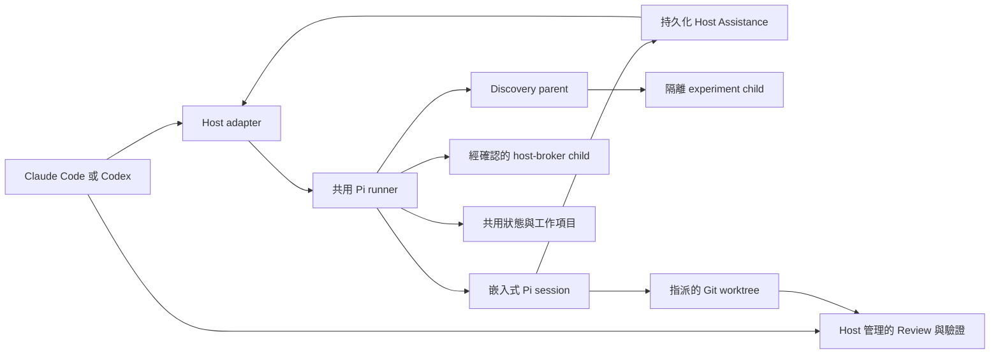

# swarm-pi-code-plugin

[English](README.md)

`swarm-pi-code-plugin` 將 Claude Code 與 OpenAI Codex 連接到受控的 Pi coding worker，提供以專案內容為依據的調查、規劃、Review 與實作能力。

Plugin 的設計目標是讓複雜工作可以委派給另一個 coding agent，同時保留 Host 對意圖、核准、驗證、提交與推送的控制權。Pi 只會取得目前任務允許的工具與工作樹。

## 架構



Claude Code 與 Codex 是 Host 介面，不是 worker 引擎。兩者使用相同的 runner，並共用模型設定、專案設定、工作歷程與工作樹狀態。

委派任務會依角色使用對應的模型鏈與 Thinking 等級。實作任務會加入受限的修改工具、要求乾淨的指定 worktree，並在完成後執行唯讀語意 verifier。三種沙盒模式如下：

- **Strict**：不提供 Bash，只提供受限的 Pi 工具。
- **Adaptive**：透過政策與可追蹤的核准機制，動態授權受限的 shell 與網路操作。
- **Lenient**：在 macOS Seatbelt 或 Linux Bubblewrap 內提供較寬鬆的 shell 與對外網路。

Git delivery 永遠由 Host 管理。執行期設定與工作資料不放在 checkout 裡：Git repository 使用 Git common directory 的 `.git/swarm-pi-code-plugin/`，非 Git 資料夾則使用作業系統的使用者狀態目錄。憑證留在 Pi 的使用者憑證儲存區；瀏覽器輸入只會成為當次設定工作階段的不透明草稿，不會進入專案檔案或 localStorage。

詳細內容請參考[架構文件](docs/architecture.md)、[設定文件](docs/configuration.md)，以及
[Host Assistance 與 Discovery](docs/host-assistance-discovery.md)，包含即時
Worker↔Host 協作、schema-gated experiment micro-SDLC、Advisor、
discover-to-plan handoff，以及隔離的 Host Actions 0.5。

## 安裝

### 系統需求

- 已安裝 Node.js 22.19.0 或更新版本。
- 已安裝 Claude Code 或 Codex。
- 需要執行 worktree 型實作任務時，目標必須是 Git repository。
- macOS，或安裝 `bubblewrap`、`socat` 與 `ripgrep` 的 Linux，才能使用 Lenient 沙盒模式。

### Claude Code

將 GitHub repository 加入 marketplace 並安裝 Plugin：

```bash
claude plugin marketplace add https://github.com/JiaWeiXie/swarm-pi-code-plugin
claude plugin install swarm-pi-code-plugin@swarm-pi-code-plugin
```

重新啟動 Claude Code，或執行 `/reload`。本機開發時可以直接指定 Plugin 目錄：

```bash
claude --plugin-dir /absolute/path/to/swarm-pi-code-plugin/plugins/swarm-pi-code-plugin
```

### Codex

此 repository 包含本機 marketplace：

```bash
codex plugin marketplace add /absolute/path/to/swarm-pi-code-plugin
codex plugin add swarm-pi-code-plugin@swarm-pi-code-plugin-local
```

請開啟新的 Codex task，讓 skill 重新載入。可用的 skills 如下：

```text
$swarm-pi-configure
$swarm-pi-project
$swarm-pi-ask
$swarm-pi-review
$swarm-pi-plan
$swarm-pi-implement
$swarm-pi-orchestrate
$swarm-pi-discover
$swarm-pi-scaffold
$swarm-pi-setup
```

## 使用方式

### 選擇合適的工作流程

| 情境 | Claude Code | Codex |
| --- | --- | --- |
| 第一次設定 Provider、模型與專案 | `/swarm-pi-code-plugin:swarm-pi-configure` | `$swarm-pi-configure` |
| 重新設定 Provider 或模型優先順序 | `/swarm-pi-code-plugin:swarm-pi-configure --reconfigure` | `$swarm-pi-configure` |
| 修改專案目標、資料夾或任務類型 | `/swarm-pi-code-plugin:swarm-pi-project` | `$swarm-pi-project` |
| 詢問 repository 問題或要求分析 | `/swarm-pi-code-plugin:swarm-pi-ask` | `$swarm-pi-ask` |
| 建立唯讀實作計畫 | `/swarm-pi-code-plugin:swarm-pi-plan` | `$swarm-pi-plan` |
| Review 工作樹或 branch 變更 | `/swarm-pi-code-plugin:swarm-pi-review` | `$swarm-pi-review` |
| 執行明確且受限的程式修改 | `/swarm-pi-code-plugin:swarm-pi-implement` | `$swarm-pi-implement` |
| 執行多個唯讀觀點 | `/swarm-pi-code-plugin:swarm-pi-orchestrate` | `$swarm-pi-orchestrate` |
| 以證據、實驗與閘門收斂未知需求 | `/swarm-pi-code-plugin:swarm-pi-discover` | `$swarm-pi-discover` |
| 設計並建立新專案 | `/swarm-pi-code-plugin:swarm-pi-scaffold` | `$swarm-pi-scaffold` |
| 設定專案內的開發工具 | `/swarm-pi-code-plugin:swarm-pi-setup` | `$swarm-pi-setup` |

Claude Code commands 與 Codex skills 使用相同的 Host protocol：委派前檢查 readiness 與待通知事項、在設定失敗時保留原始請求、預設使用 supervised 執行，並要求使用者明確決定核准、adoption、artifact materialization 與 Git delivery。

### 第一次設定

使用對應 Host 的設定入口。瀏覽器設定頁會依序處理六個步驟：

1. 以各供應商專屬欄位連接雲端、訂閱制、環境身分或本機 AI 服務。
2. 選擇專案主要模型與 fallback 順序。
3. 為 worker 角色指定模型鏈與 Thinking 等級。
4. 選擇沙盒、classifier、核准、背景執行、Decision Mode、Host
   Assistance、Advisor、doctrine metadata 與 Host Action 政策。
5. 檢查 Git repository、空的資料夾或既有資料夾的狀態。
6. 測試主要模型與必要的 classifier，完成驗證後再原子儲存。

如果設定是由委派任務啟動，Host 會保留原始請求，設定完成後自動恢復。取消或閒置逾時不需要使用者重新描述任務。瀏覽器草稿只保留非敏感的角色、安全性與 workspace 欄位，不會保留憑證。

Readiness 會依任務能力分開判斷，因此 workspace 可能可以研究，但不能修改或交付。Git repository 若尚未建立 initial commit，會回報 `git-unborn`；實作會在啟動模型前停止，並提供 scaffold 或 adoption 動作與可恢復的 continuation。

沒有偵測到可用服務時，連線清單會維持空白。自訂 endpoint 必須先選擇 API protocol，再載入模型。Provider ID 維持內部管理；endpoint 與 Pi catalog 都無法證實的模型限制會保持自動判斷。

### 模型供應商連線

設定表單由固定版本的 Pi provider catalog 驅動。OpenAI API 固定使用 Responses adapter，Anthropic 使用 Messages；混合型 provider 則保留 Pi 的 per-model adapter。Cloud provider 只會顯示實際需要的 project、region、resource、account 或 deployment 欄位。

ChatGPT Plus/Pro 是獨立的 **ChatGPT 訂閱**連線，透過 Pi 的 `openai-codex` 瀏覽器或 device-code OAuth 載入，不會混入 OpenAI API Key 表單。GitHub Copilot 與 Anthropic 訂閱登入也使用相同的有限時間 OAuth 流程。

自訂 endpoint 可選 OpenAI Chat Completions、OpenAI Responses 或 Anthropic Messages，而且一個連線只使用一種協定。載入模型與 **Verify API** 是兩個不同動作；`/models` 成功不代表 generation、tools 或 reasoning 可以執行。沒有 model-list endpoint 時，可以手動輸入模型 ID，但不會因此標示為已驗證。

建立連線草稿後，編輯設定、替換憑證、驗證 API、登出與從專案移除會維持為不同操作。秘密欄位留白代表保留既有憑證；瀏覽器不會讀回已儲存的秘密。

### 重新設定

Provider 與模型設定可以使用 `--reconfigure` 或 Codex configure skill 重新開啟。專案設定則有獨立且可重複執行的流程：

```text
/swarm-pi-code-plugin:swarm-pi-project
$swarm-pi-project
```

專案流程會讀取目前的角色、安全性與 profile 設定，並只更新 `state.json`，不會改寫模型設定、憑證或工作歷程。

### 執行安全性與角色

專案預設使用 **Strict**，提供受限的 Pi 工具但不暴露 Bash。**Adaptive** 會透過政策分類器、受限 capability lease 與可選的 Supervisor 核准，加入受控的 Bash 與網路操作。**Lenient** 則透過 macOS Seatbelt 或 Linux Bubblewrap 提供較寬鬆的對外網路。

所有 shell 模式都使用隔離的執行環境，不會傳遞模型 token、SSH socket 或其他 Host secret。Adaptive classifier 只會取得提議中的 action 與有限的政策內容。Lenient 模式下，worker 可見的來源內容可能會傳送給外部服務。平台不支援或缺少必要依賴時會 fail closed，絕不退回未沙盒化的 shell。

Decision Mode 控制有限的 orchestration 深度：Cost 使用 1 個基本視角、Balance 使用 2 個、Power 使用 3 個。Host Assistance context budget 與 Advisor quota 是獨立設定，不會隨模式自動改寫。Advisor 預設關閉；啟用後只加入有限、唯讀、不可遞迴的諮詢。`first-principles-qds-v1` 目前只會保存並進入 snapshot；0.5.0 尚未自動執行 Question/Delete/Simplify 收斂。

Host Assistance 預設開啟。Pi session 可以請 Host 取得受限的 workspace、Web、官方文件、論文、connector、已安裝 skill 或真人決策。Host 自行選擇實際能力，並回傳一份 typed、含引用、具完整 correlation、只能消費一次的 `[UNTRUSTED_HOST_CONTEXT]` bundle。Secret egress 永久拒絕；connector 與非公開資料外傳可要求核准。

角色調度會明確顯示每個職責的主要模型、Thinking 等級、重試上限與支援的執行模式。Adaptive 模式則會在沙盒能力上限內，另外設定 classifier chain 與無法判斷時的核准政策。

### Workspace 與儲存前 Review

Workspace 設定會先回報 Git readiness，再記錄產品目標、允許處理的資料夾範圍與可委派工作類型。Review 會在交易式儲存前，列出實際 provider protocol、驗證方式、模型來源、驗證狀態、角色調度與安全政策。

儲存成功後，系統會以交易方式更新憑證與設定、清除記憶體內草稿，並關閉暫時的本機 server。任何公開的設定範例都必須使用隔離的示範 workspace，且不得包含真實憑證。

### 強制執行的專案政策

設定的允許工作類型是 admission gate：不允許的類型會在工作執行前遭拒絕，而不是只作為 prompt 建議。設定的允許資料夾會限制受限的檔案系統工具；implementation 寫入會在三個層次強制執行：工具邊界、adaptive 與 lenient Bash 模式中的 sandbox write allowlist，以及 postflight changed-path check。省略這些限制時，會保留整個 workspace 的行為，以維持向後相容。讀取與寫入不同：受限的 Pi 檔案系統工具會強制執行讀取範圍，上述三個層次會強制執行 implementation 寫入，但 adaptive 與 lenient 模式中的原始 Bash 讀取並非資料夾範圍限制，且可在 workspace 內讀取（但仍受敏感路徑 deny 限制）；需要資料夾層級讀取機密性時，請使用 Strict 模式。技術合約請參閱 [Enforced Project Policy](docs/orchestration-and-policy.md#enforced-project-policy)。

### 非互動 runner

共用 runner 適合自動化與 Host 整合：

```bash
node scripts/pi-runner.mjs models --json
node scripts/pi-runner.mjs providers --json
node scripts/pi-runner.mjs configure --host codex --section project --no-open
node scripts/pi-runner.mjs init --json
node scripts/pi-runner.mjs status --json
node scripts/pi-runner.mjs doctor --smoke-test --json
node scripts/pi-runner.mjs ask --host codex --prompt-file /path/to/question.md --json
node scripts/pi-runner.mjs review --host codex --scope working-tree --json
node scripts/pi-runner.mjs plan --host codex --prompt-file /path/to/plan.md --json
node scripts/pi-runner.mjs implement --host codex --prompt-file /path/to/task.md --json
node scripts/pi-runner.mjs orchestrate --host codex --prompt-file /path/to/task.md --json
node scripts/pi-runner.mjs discover --host codex --prompt-file /path/to/discovery.md --json
node scripts/pi-runner.mjs plan --host codex --prompt-file /path/to/plan.md --discovery-from <job-id> --json
node scripts/pi-runner.mjs scaffold --host codex --spec-file /path/to/scaffold.json --target /path/to/new-project --json
node scripts/pi-runner.mjs setup --host codex --prompt-file /path/to/setup.md --json
node scripts/pi-runner.mjs roles list --json
```

所有委派命令也支援 `--decision-mode cost|balance|power`、
`--host-assistance inherit|on|off` 與 `--host-context-file <file>`。
這些 override 只會進入新 Job 的 snapshot，不會修改 workspace 預設。

`implement` 會先檢查工作樹是否乾淨，並取得獨佔的 worktree lease。Host 必須檢查結果並執行驗證後才能交付。逾時、取消或失敗可能留下部分修改；系統會明確回報，不會靜默回復。

委派命令預設使用 supervised 執行。使用 `--approval-mode wait` 時，managed
Host relay 會啟動 durable worker，並在 15 秒內回傳 terminal result、
`approval-required` 或 `wait-timed-out`；Host 接著以有限時間的 `jobs wait`
維持控制權。這可讓核准要求回到 Host，而不會留下無法回報的阻塞 shell。
唯讀命令也支援 durable background 執行：

```bash
node scripts/pi-runner.mjs ask --host codex --prompt-file /path/to/question.md \
  --execution-mode background --json
node scripts/pi-runner.mjs jobs wait --job <job-id> --wait-timeout-ms 15000 --json
```

Host relay 會使用有限時間的 wait，顯示 durable job phase、經過時間與取消動作。Host shell 在背景執行不等於 Pi background execution。

Background 模式支援 scout、planner、reviewer 與 analyst。Mechanical implementation 只有在明確啟用後才能背景執行，且 control plane 會建立專屬 branch 與 worktree。Executor 與 security-executor 的實作仍維持 supervised。

每個新 durable job 都會保存不含秘密的 provider/model snapshot 與完整性雜湊，以及 effective project policy 和 project goal。後續 profile edit 只會套用至新提交的 job；queued、running 與 resumed job 會保留原始 snapshot。憑證會在實際執行時重新解析，因此登出或輪替仍會對 queued job 生效。

Worker 預設 timeout 為：`ask`、`plan`、`review` 30 分鐘；`orchestrate`、`implement` 60 分鐘。可使用 `--timeout-ms` 設定 1000 至 86400000 毫秒的期限。

工作項目的查詢與控制：

```bash
node scripts/pi-runner.mjs jobs list --json
node scripts/pi-runner.mjs jobs list --pending-notifications --json
node scripts/pi-runner.mjs jobs status --job <job-id> --json
node scripts/pi-runner.mjs jobs wait --job <job-id> --wait-timeout-ms 15000 --json
node scripts/pi-runner.mjs jobs watch --emit ndjson --once
node scripts/pi-runner.mjs jobs watch --emit ndjson --job <job-id>
node scripts/pi-runner.mjs jobs cancel --job <job-id> --json
node scripts/pi-runner.mjs jobs acknowledge --job <job-id> --json
node scripts/pi-runner.mjs jobs approvals --job <job-id> --json
node scripts/pi-runner.mjs jobs approve --job <job-id> --approval <approval-id> --json
node scripts/pi-runner.mjs jobs deny --job <job-id> --approval <approval-id> --json
node scripts/pi-runner.mjs jobs host-requests --job <job-id> --json
node scripts/pi-runner.mjs jobs host-respond --job <job-id> --request <request-id> --response-file <bundle.json> --json
node scripts/pi-runner.mjs jobs host-decline --job <job-id> --request <request-id> --reason <reason> --json
node scripts/pi-runner.mjs jobs decisions --job <job-id> --json
node scripts/pi-runner.mjs jobs decide --job <job-id> --request <request-id> --response-file <decision.json> --json
node scripts/pi-runner.mjs jobs action-start --job <parent-job-id> --request <recommendation-id> --json
node scripts/pi-runner.mjs jobs cleanup --job <job-id> [--discard] --json
node scripts/pi-runner.mjs jobs materialize --job <job-id> --target /path/to/new-project --json
```

已驗證的隔離 implementation artifact 可以省略 `--target`，將 patch 套用回原 workspace。Materialization 會驗證原始 HEAD 與 preserved paths、不建立 commit，套用失敗時會回復 patch。

Job status 與 `jobs wait` exit code 表達的是不同層次：status 是持久化的 Job 生命週期；exit code 也可能只是通知 Host 需要使用者介入，此時 Job 仍然存活。

| Job status | 終止狀態 | 意義 | Host 應採取的動作 |
| --- | --- | --- | --- |
| `queued` | 否 | Job 已持久化，正在等待 worker。 | 繼續有限時間輪詢。 |
| `running` | 否 | Worker 正在執行。可查看 `phase` 與 progress timestamp。 | 繼續有限時間輪詢；長時間執行時提供取消方式。 |
| `awaiting-approval` | 否 | Worker 因政策核准請求而暫停。 | 顯示核准內容，取得明確的 approve 或 deny 決定。 |
| `awaiting-host` | 否 | Worker 要求受限 Host context，或已記錄 action recommendation。 | 檢查對應 request，回覆、拒絕，或明確啟動已記錄的 action。 |
| `awaiting-decision` | 否 | Worker 需要真人決策。 | 顯示完整問題並記錄使用者決定，不得自行代答。 |
| `succeeded` | 是 | 執行成功完成。 | 檢查 verification 與可交付 artifact。 |
| `failed` | 是 | 執行或 verification 失敗。 | 查看 `errorCode`、`error` 與 verification 詳情。 |
| `cancelled` | 是 | 取消已完成。 | 保留回傳的 side effects 或復原指示。 |
| `timed-out` | 是 | Worker deadline 已到期。 | 檢查結果，確認適合重試後才建立新 Job。 |
| `orphaned` | 是 | Worker 或 lease 在完成前消失。 | 檢查 heartbeat 與 lease 診斷，不得重用過期核准。 |

| Exit code | Result/event | 意義 |
| --- | --- | --- |
| `0` | 成功的 command/result | 指令成功完成。 |
| `1` | `success: false` | Job 或要求的操作產生真正的失敗結果。 |
| `2` | `system-error` 或參數錯誤 | CLI 無法執行要求。 |
| `3` | `wait-timed-out` | 只有本次有限時間等待結束；worker deadline 與 Job 都不受影響。 |
| `4` | `approval-required` | 不是終止失敗；存活的 worker 正在等待明確核准或拒絕。 |
| `5` | `setup-required` 或 `workspace-action-required` | 繼續執行前需要完成設定或 workspace 決策。 |

核准通知與 terminal notification 分開確認。Capability lease 會綁定 job generation、policy hash、action fingerprint 與有效期限。policy hash 包含 project scope，因此變更允許資料夾會阻止重用舊 lease。Approve 或 deny 會在同一個 state transaction 中解決該核准並只 acknowledge 對應的核准通知；terminal notification 必須在 Host 顯示結果後另外明確確認。

`jobs watch --emit ndjson` 會輪詢 canonical state，並在 watcher 重啟時重播待處理事件，讓 Host 可以復原遺漏的通知。事件採 allowlist，不會輸出 worker token、provider credential、raw prompt、完整 agent output 或 logs。`--once` 供選用的 SessionStart recovery hook 使用；它不會自動決定核准或 acknowledge 通知。Host 必須依 `eventId` 去重，且不能因為 timeout、hook 或 replay 而自動核准。

### Assistance、Discovery 與 Host Actions

Live worker 可以請 Host 補足 context，而不需要知道 Host 會使用哪一個工具。Host 透過 `jobs host-requests` 讀取要求，選擇最小的 workspace/Web/docs/paper/connector/skill 能力，再回傳 typed bundle。真人選擇使用 `jobs decisions` 與 `jobs decide`，不建立 lease。所有回覆都必須完全符合 Job、generation、session、attempt、perspective 與 request ID。已儲存的回覆可在 crash 後保留，但舊 model call stack 不會恢復。

`discover` 是固定的 research → isolated experiment → convergence workflow。Experiment report 必須記錄重現、測試、證據、metrics、tolerance 與 clean replay 欄位，結論只能是 `supported`、`refuted` 或 `inconclusive`；artifact 永遠不能交付。0.5.0 會驗證 report schema，但 control plane 尚未獨立執行每一個記錄的 experiment command。

`ActionRecommendation` 本身不執行任何動作。只有成功的 `implement` 或 `setup` parent，加上使用者明確確認，才能建立隔離的 `host-broker` child。Local mutation/draft 預設啟用；remote write、message、deploy 與 transaction 預設關閉。外部結果為 `unknown` 時禁止自動重試。

Implementation delivery 目前包含 deterministic path、policy、hash、materialization checks，以及獨立的 Strict 唯讀模型 verifier；尚未包含通用的 trusted build/test command pipeline。因此交付前仍必須由 Host 執行專案實際檢查。

### 建立新專案與開發環境

建立新專案時，會先由唯讀的 `project-architect` 角色產生可 Review 的 scaffold specification。接著由 `scaffolder` 寫入 job 專屬的 staging Git repository，再由 `environment-engineer` 在 supervised 模式下處理專案內的依賴與工具設定。驗證通過的 scaffold 會產生可交付 artifact，但在明確執行 `jobs materialize` 前，不會碰觸目標資料夾。

Package lifecycle scripts 與 native build 需要 Adaptive 核准。全域套件安裝、Host provisioning、部署、merge 與 push 都是固定拒絕的操作。

## 疑難排解

### 看不到 command 或 skill

重新啟動 Host，或在 Claude Code 執行 `/reload`。Codex 請開啟新的 task，讓已安裝的 skill cache 重新整理。本機開發時，Claude Code 使用 `--plugin-dir`；Codex marketplace 的 manifest 或 skill 變更後，請重新安裝本機 Plugin。

### Claude 回報重複的 `hooks/hooks.json`

Claude Code 會自動載入標準 Plugin 路徑 `hooks/hooks.json`，因此 manifest 不得再用 `hooks` 指向同一個檔案。請確認 `plugins/swarm-pi-code-plugin/.claude-plugin/plugin.json` 沒有 `hooks` 欄位，重新安裝或 reload 本機 marketplace Plugin，並建立新的 Claude Code session，避免沿用記憶體中的舊 manifest。Codex manifest 同樣不宣告 `hooks`；標準 SessionStart hook 是 Claude Code 整合。

### 瀏覽器沒有開啟

Runner 會輸出一次性的 loopback URL。可以手動開啟該網址，或使用 `--no-open` 從 terminal 啟動。

### 沒有偵測到 Provider

Pi 只會顯示它能使用的服務。請檢查 Pi credential store 或文件所列的 provider 環境變數，再重新開啟設定。使用本機 AI 應用程式時，請使用 **Find local AI apps**。Plugin 不會掃描 `.env`，也不會複製 Claude Code 或 Codex 的私有憑證。

### Endpoint discovery 失敗

確認 URL 是 HTTP(S) API root，而不是瀏覽器 dashboard 或完整 generation URL。確認已選擇正確協定與憑證後，再執行 **Load models**。系統會區分驗證失敗、逾時、伺服器無法連線、格式錯誤、重新導向與不支援的 endpoint。

### 選取的模型無法使用

重新開啟 Provider 與模型設定，選擇 Pi 目前回報可用的模型。當主要 Provider 可能暫時無法使用時，建議設定 fallback model。

### 設定被取消或逾時

尚未儲存的變更不會寫入。非敏感的角色、安全性與 workspace 草稿會在重新開啟設定時恢復；委派 continuation 會保留 24 小時。憑證永遠不會寫入瀏覽器草稿。

### 實作因工作樹不乾淨而被拒絕

runtime state、未追蹤的 `.DS_Store`、`__pycache__`、`.pyc` 與 `.pyo` 會被視為 safe-dirty，不會阻擋實作。修改會在 isolated HEAD worktree 執行，因此 worker 不會接觸這些檔案；驗證通過的 artifact 仍需明確 materialize。已追蹤、已 staged、衝突、疑似 secret 或未知檔案則需要明確選擇 isolated HEAD 或 isolated snapshot。Swarm Pi 不會自動刪除、stash、隱藏或提交使用者原有的變更。

### Job 因 `project-scope-violation` 失敗

Job 已變更或嘗試觸及設定的允許資料夾以外的路徑。請檢查該專案設定的允許資料夾。postflight scope violation 會阻止 checkpoint、verification 與 delivery，因此不會套用任何內容。若要擴大範圍，請編輯 profile 並提交**新的** job；queued、running 或 resumed job 會保留原始 snapshot，不會採用這項編輯。Policy decision 與 scoped-tool denial 會顯示在 job audit trail 中。

### Git 已初始化但還沒有 commit

研究功能仍可使用，但實作與交付會在模型啟動前停止。空專案請使用 scaffold；已有內容請先 inspect/adopt，完成後執行 `resume --continuation <id>`，繼續原本保存的任務。

### 委派工作停止但沒有收到通知

執行 `jobs watch --emit ndjson --once`（或 `jobs list --pending-notifications --json`）。Terminal result 會持久保存，直到明確 acknowledge 才會清除待通知狀態。若工作 process 已消失，reconciliation 會標記為 `orphaned`；取消後停止的 worker 會標記為 `cancelled`。Host adapter 每次開始新的委派前都會檢查待通知佇列。復原的核准仍必須先向使用者顯示風險，再選擇 approve 或 deny；重播不等於同意。

### Linked worktree 看不到設定

設定存放在 Git common directory，因此 linked worktree 通常會共用 `swarm-pi-code-plugin/`。請確認 worktree 屬於預期的 repository，並檢查 `SWARM_PI_CODE_PLUGIN_DATA_DIR` 是否指向其他位置。

### 設定無法復原

執行 `doctor --json`。多個儲存區的設定失敗時，系統會嘗試復原憑證、模型設定與專案狀態。若 rollback 本身失敗，系統會建立不含 API key 的遮罩 recovery journal，並在檢查衝突前阻擋委派。

## 開發

Repository 使用 mise 提供固定版本的 Node.js 環境：

```bash
mise install
mise run install
mise run check
```

開發環境使用 mise 的 Node.js `24.15.0`；已安裝的 Plugin 支援 Node.js `22.19.0` 以上版本，以符合 Pi SDK 的 engine requirement。

常用檢查：

```bash
mise run typecheck
mise run test
mise run build
```

修改使用者文件、技術參考或已提交的 screenshot 時，請遵循[文件更新 SOP](docs/documentation-sop.md)。其中包含產品證據、screenshot 安全性、交叉連結與驗證流程。

`npm test` 會執行編譯後的 Node 測試，包含 mock Pi session、state migration、manifest validation、endpoint discovery 與 loopback web server 測試。Host 本機測試：

```bash
claude --plugin-dir /absolute/path/to/swarm-pi-code-plugin/plugins/swarm-pi-code-plugin
codex plugin marketplace add /absolute/path/to/swarm-pi-code-plugin
codex plugin add swarm-pi-code-plugin@swarm-pi-code-plugin-local
```

請使用 `node --check` 驗證所有 Plugin JavaScript，並在本機環境有提供時，使用 Codex plugin validation tool 驗證 Codex manifest 與 skills。

修改 Codex skill 或 Plugin manifest 後，請更新 Codex plugin cachebuster 並開啟新的 task。Runtime 修改放在 `src/`，完成後先重新 build，再驗證 packaged Plugin。

## 使用的技術與參考專案

- [Claude Code](https://docs.anthropic.com/en/docs/claude-code/overview)
- [OpenAI Codex](https://developers.openai.com/codex/)
- [Pi Coding Agent SDK](https://github.com/earendil-works/pi)，固定使用 `0.80.6`
- [Node.js](https://nodejs.org/)
- [TypeScript](https://www.typescriptlang.org/)
- [mise](https://mise.jdx.dev/)
- [Git worktrees](https://git-scm.com/docs/git-worktree)

本 Plugin 的原始概念與 Host workflow 參考了 [apoapps/swarm-code-plugin](https://github.com/apoapps/swarm-code-plugin)。該專案僅作為架構與委派概念的參考；本 repository 是獨立重寫，不重用其原始碼。

角色調度與執行安全設計也參考下列開源專案與文件：

- [Nanako0129/pilotfish](https://github.com/Nanako0129/pilotfish)：參考 Machine、Role 與 Policy 分離，以及依角色進行模型調度的概念。
- [Pi containerization guidance](https://github.com/earendil-works/pi/blob/main/packages/coding-agent/docs/containerization.md)：參考隔離邊界與未來 whole-process `isolated` 模式方向。
- [carderne/pi-sandbox](https://github.com/carderne/pi-sandbox)：參考 macOS Seatbelt 與 Linux Bubblewrap 的沙盒 shell 作法。
- [r4vi/pi-auto-mode](https://github.com/r4vi/pi-auto-mode) 與 [czottmann/pi-automode](https://github.com/czottmann/pi-automode)：參考自適應權限 classifier、政策決策與核准流程。
- [farion1231/cc-switch](https://github.com/farion1231/cc-switch)：參考模型供應商表單與協定選擇的調查；本 Plugin 使用 Pi 原生 adapter，不使用 CC-Switch 的協定轉譯 proxy。

以上專案都是設計參考。本 Plugin 實作自己的 trusted、非互動式政策與 enforcement runtime，不會載入它們的完整 extension，也不複製其原始碼。

## 授權

本專案採用 [MIT License](LICENSE)。Copyright (c) 2026 Jason Hsieh。
