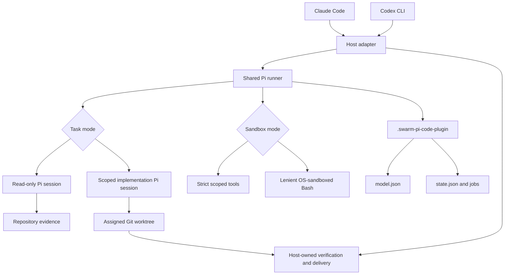

# Architecture

This document describes the stable runtime boundaries of
`swarm-pi-code-plugin`. Product onboarding and troubleshooting live in the
[README](../README.md); provider discovery and browser setup details live in
the [configuration reference](configuration.md). Documentation maintenance and
validation practices live in the [documentation update SOP](documentation-sop.md).

## System Boundary



Claude Code and Codex are two host surfaces for the same implementation. They
do not run separate worker engines and they do not maintain separate model or
project profiles.

## Host Adapters

Claude Code exposes commands for setup and agents for delegation:

- `/swarm-pi-code-plugin:init` opens full setup.
- `/swarm-pi-code-plugin:project` opens repeatable project-only setup.
- `pi-worker` handles ask, review, and plan requests without mutation.
- `pi-builder` handles explicit implementation requests only.

Codex exposes the equivalent skills under the
`swarm-pi-code-plugin-` prefix. The `configure` skill opens full setup and the
`project` skill opens project-only setup. Ask, review, plan, implement, and
orchestrate skills all invoke the shared runner with an explicit host value.

Host adapters write user-controlled prompts to temporary files outside the
repository. They validate the runner result, inspect implementation diffs, and
remain responsible for verification, commits, pushes, and delivery decisions.

## Shared Runner

The runner accepts these public command surfaces:

```text
node scripts/pi-runner.mjs init --host <claude|codex> --json
node scripts/pi-runner.mjs models --json
node scripts/pi-runner.mjs providers --json
node scripts/pi-runner.mjs configure --host <host> [--section project] [--no-open]
node scripts/pi-runner.mjs ask --host <host> --prompt-file <file> --json
node scripts/pi-runner.mjs review --host <host> [--base <ref>] [--scope <scope>] --json
node scripts/pi-runner.mjs plan --host <host> --prompt-file <file> --json
node scripts/pi-runner.mjs implement --host <host> --prompt-file <file> --json
node scripts/pi-runner.mjs orchestrate --host <host> --prompt-file <file> --json
node scripts/pi-runner.mjs jobs <list|status|wait|cancel|acknowledge> [options] --json
```

Every worker result includes the task kind, status, success flag, selected
model, output, changed files, diff summary, and verification status.

Task commands accept `--execution-mode supervised|background` and
`--timeout-ms`. Supervised is the default. Background is read-only and returns
an accepted job ID after durable artifacts and a detached worker both exist;
`implement` rejects background mode.

The runner creates one in-memory Pi session per delegated model attempt.
Strict jobs use scoped repository tools only. Lenient jobs share one job-level
sandbox manager and add Bash; orchestration perspectives share that manager so
parallel sessions cannot reset each other's process boundary. Pi provider failures are read
from the terminal assistant message rather than inferred from whether
`prompt()` rejected; only a terminal `stop` is successful.

Each job moves through `queued`, `running`, and one terminal state:
`succeeded`, `failed`, `cancelled`, `timed-out`, or `orphaned`. Workers maintain
a heartbeat and process lease. Queries reconcile result artifacts, stale
leases, and cancellation requests before returning state.

## Safety and Mutation Policy

- `ask`, `review`, `plan`, and orchestration perspectives are read-only.
- `implement` requires explicit user mutation intent.
- `implement` requires a clean assigned worktree before a Pi session starts.
- `implement` holds an exclusive lease for the assigned worktree until
  postflight capture completes.
- Scoped write and edit operations reject traversal and symlinks that resolve
  outside the assigned worktree.
- Once an implementation session writes files, the runner does not start a
  second fallback model in the same job.
- The host captures tracked, untracked, and newly created ignored side effects
  after the session, then validates HEAD and changed path types.
- Lenient Bash writes directly to the assigned worktree under the same user ID;
  there is no staging copy or automatic patch application.
- Git metadata and shared plugin state are denied paths. The host remains the
  only owner of commits, pushes, branch changes, verification, and delivery.
- Cancellation and failure preserve partial worktree changes for host review;
  the runner never performs an automatic rollback.

## State Ownership

The shared data directory is resolved through Git's common directory so linked
worktrees normally observe the same setup:

```text
.swarm-pi-code-plugin/
├── model.json                  # provider, custom endpoint, primary, fallbacks
├── state.json                  # project profile, migration data, job index
└── jobs/<job-id>/
    ├── request.json            # durable execution request and worker token
    ├── prompt.md               # copied prompt, safe after host temp cleanup
    ├── heartbeat.json          # PID lease updated while running
    ├── result.json             # terminal WorkerResult
    ├── changes.patch           # optional implementation diff
    └── worker.*.log            # detached worker stdout and stderr
```

`model.json` is the canonical provider and model file. `state.json` stores the
project goal, directory scope, delegated task types, sandbox mode, migration
metadata, and job index. State updates use an inter-process lock, a
same-directory temporary file, and an atomic rename.

`SWARM_PI_CODE_PLUGIN_DATA_DIR` can override the resolved data directory. The
current worktree remains the Pi session working directory even when its shared
configuration is resolved from the primary checkout.

Terminal results are written before the state index is updated. Reconciliation
repairs a crash between those writes. Every terminal job starts with a pending
notification; a host watcher waits for the result, presents it, and then
acknowledges it. If the watcher disappears, the next plugin delegation replays
the pending result once.

## Credentials

Pi `AuthStorage` owns provider credentials in the user scope. The browser may
accept an API key for a connection test and write it to Pi's credential store,
but the key is never stored in `model.json`, `state.json`, job artifacts,
stdout, logs, URLs, or browser responses.

The plugin does not scan `.env` files or copy private credentials from Claude
Code, Codex, or another application's credential store. Provider discovery is
limited to Pi-supported credentials, documented environment variables, and
explicit user-requested local endpoint scans.

## Configuration Server

The setup server is a temporary loopback service. It binds to `127.0.0.1` on an
ephemeral port, uses a random per-session token, rejects non-loopback and
cross-origin writes, applies a restrictive CSP, limits request and response
sizes, and shuts down after save, close, or timeout.

Full setup saves model configuration, project profile, and sandbox mode
together. Project-only setup starts at **Project setup**, pre-populates the
existing project settings, and writes `state.config.profile` plus
`state.config.sandboxMode`. Neither flow deletes jobs or global Pi credentials.

## Migration

The first read migrates current `.swarm-pi-code/` state and jobs. It can also
copy the older project profile and recognized model preferences from
`.swarm-code/`. Older provider-specific settings, caches, sessions, logs, and
jobs are not copied from that predecessor format.
