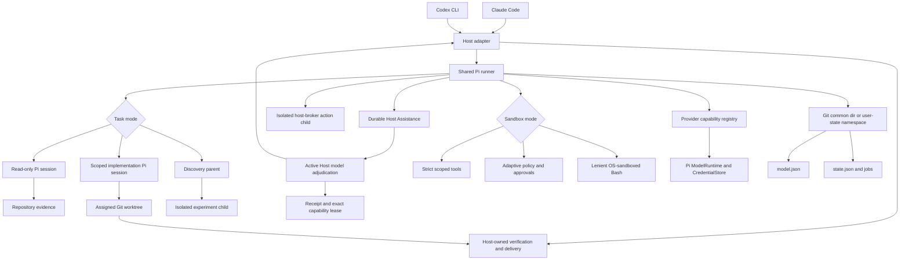

# Architecture

This document describes the stable runtime boundaries of
`swarm-pi-code-plugin`. Product onboarding and troubleshooting live in the
[README](../README.md); provider discovery and browser setup details live in
the [configuration reference](configuration.md). Documentation maintenance and
validation practices live in the [documentation update SOP](documentation-sop.md).
Role routing, adaptive policy, and durable approval are specified in
[Orchestration and Adaptive Policy](orchestration-and-policy.md). Security
assumptions and immutable denials are specified in the
[delegated worker threat model](threat-model.md).
Readiness, state placement, workspace assessment, and project creation are
specified in [Bootstrap, Onboarding, and Workspace Hygiene](bootstrap-and-onboarding.md).

## System Boundary



Claude Code and Codex are two host surfaces for the same implementation. They
do not run separate worker engines and they do not maintain separate model or
project profiles.

## Host Adapters

Claude Code exposes one command per workflow: `init`, `project`, `ask`,
`review`, `plan`, `implement`, `orchestrate`, `discover`, `scaffold`, and `setup` under
the `/swarm-pi-code-plugin:` prefix. Its `pi-worker` and `pi-builder` agents
classify natural-language requests and route them to the matching workflow.

Codex exposes the equivalent skills under the `swarm-pi-code-plugin-` prefix.
Every Codex skill has `agents/openai.yaml` UI metadata. Both hosts share the
same task-specific workflow content and cross-host protocol: readiness and
pending notifications first, supervised execution by default, durable
continuations, active Host-first adjudication within the immutable policy,
user fallback outside that ceiling, and host-owned verification/delivery.

Host adapters write user-controlled prompts to temporary files outside the
repository. They validate the runner result, inspect implementation diffs, and
remain responsible for verification, commits, pushes, and delivery decisions.

## Shared Runner

The runner accepts these public command surfaces:

```text
mise exec -- node scripts/pi-runner.mjs init --host <claude|codex> --json
mise exec -- node scripts/pi-runner.mjs models --json
mise exec -- node scripts/pi-runner.mjs models --refresh --json
mise exec -- node scripts/pi-runner.mjs providers --json
mise exec -- node scripts/pi-runner.mjs configure --host <host> [--section project] [--no-open]
mise exec -- node scripts/pi-runner.mjs ask --host <host> --prompt-file <file> --json
mise exec -- node scripts/pi-runner.mjs review --host <host> [--base <ref>] [--scope <scope>] --json
mise exec -- node scripts/pi-runner.mjs plan --host <host> --prompt-file <file> [--discovery-from <job-id>] --json
mise exec -- node scripts/pi-runner.mjs implement --host <host> --prompt-file <file> --json
mise exec -- node scripts/pi-runner.mjs orchestrate --host <host> --prompt-file <file> --json
mise exec -- node scripts/pi-runner.mjs discover --host <host> --prompt-file <file> --json
mise exec -- node scripts/pi-runner.mjs roles list --json
mise exec -- node scripts/pi-runner.mjs status|doctor|resume [options] --json
mise exec -- node scripts/pi-runner.mjs scaffold|setup --host <claude|codex> [options] --json
mise exec -- node scripts/pi-runner.mjs jobs <list|status|wait|watch|cancel|acknowledge|approvals|approve|deny|host-requests|host-respond|host-decline|decisions|decide|action-start|cleanup|prune|materialize|export> [options] --json
```

`jobs approve`, `jobs host-respond`, and `jobs decide` accept an optional
`--adjudication-file`. Without it they preserve user-principal/manual behavior.
With it the runner validates an active Host-model receipt against the full
pending record, original intent, policy hash, action fingerprint, Sandbox mode,
and snapshotted automatic ceiling.

Every worker result includes the task kind, status, success flag, selected
model, output, changed files, diff summary, verification status, and any
explicit next action. Discovery results add stage reports and an experiment
conclusion; Host Action children add a receipt. Status reports separate
read-only, mutation, and delivery readiness so an unborn repository cannot be
described as implementation-ready.

Task commands accept role, thinking, execution, approval, timeout, and optional
delegation-spec arguments. Background readonly work returns an accepted job ID
after durable artifacts and a detached worker exist. Opt-in mechanical
implementation first creates an isolated job worktree.

The live `request_host_assistance` tool uses dedicated admission instead of the
generic tool classifier. It persists the full request and WorkerAssessment,
projects safe required/resolved events, correlates
Job/generation/session/attempt/perspective, enforces request and fan-out
budgets, and consumes the structured response once in the same live session.
The Host adapter chooses the actual Web, documentation, paper, connector,
skill, or workspace mechanism. `jobs host-requests`, `jobs decisions`, and
`jobs approvals` add an adjudication context containing the original intent and
immutable policy snapshot; this context is never emitted by the watcher.
Discovery creates an isolated
experiment child; Host Actions create a separate host-broker child only after
an explicitly recorded recommendation and explicit confirmation.

The runner creates one in-memory Pi session per delegated model attempt.
Strict jobs use scoped repository tools only. Adaptive, Lenient, and Autopilot
jobs add OS-sandboxed Bash. Ordinary orchestration perspectives in a stage share one
manager so parallel sessions cannot reset each other's process boundary.
Discover is stage-scoped: Research disposes before gate waiting, Experiment
owns a separate manager in the isolated child worktree, and Convergence or
Advisor tool use creates fresh read-only managers. At most one process-global
manager is live. Pi provider failures are read
from the terminal assistant message rather than inferred from whether
`prompt()` rejected; only a terminal `stop` is successful.

Each job moves through `queued`, `running`, optional `awaiting-approval`,
`awaiting-host`, or `awaiting-decision`, and one terminal state: `succeeded`,
`failed`, `cancelled`, `timed-out`, or `orphaned`. Workers maintain a heartbeat
and process lease while waiting. Queries reconcile result artifacts, pending
Host Assistance records, stale leases, and cancellation requests before
returning state.
While running, the job also records a durable phase and progress timestamp for
bounded host polling.

When `executionMode=supervised` uses `approvalMode=wait`, or effective Host
Assistance requires a live relay, the runner starts a managed detached worker
but keeps the request and policy semantics supervised.
The initiating command returns within a 15-second relay window with a terminal
result, `approval-required`, or `wait-timed-out`; the host then resumes control
with bounded `jobs wait` calls. `jobs watch --emit ndjson` is an at-least-once
recovery and observability stream, not a replacement for the decision relay.

## Safety and Mutation Policy

- `ask`, `review`, `plan`, and orchestration perspectives are read-only.
- `implement` requires explicit user mutation intent.
- `implement` requires a committed HEAD and a clean assigned worktree before a
  Pi session starts. Unborn repositories fail before model startup.
- `implement` holds an exclusive lease for the assigned worktree until
  postflight capture completes.
- Scoped write and edit operations reject traversal and symlinks that resolve
  outside the assigned worktree.
- Tool authorization independently denies workspace escape, Git metadata,
  runtime state, credentials, local/private networking, and delivery commands.
- Once an implementation session writes files, the runner does not start a
  second fallback model in the same job.
- The host captures tracked, untracked, and newly created ignored side effects
  after the session, then validates HEAD, preserved safe-dirty digests,
  protected paths, and changed path types.
- Clean supervised work may use the assigned worktree directly. Safe-dirty work
  automatically uses an isolated HEAD worktree and returns a verified artifact.
- Explicit `jobs materialize` applies a verified implementation patch through
  the trusted control plane without committing it; failed validation reverses
  the patch.
- Git metadata and shared plugin state are denied paths. The host remains the
  only owner of commits, pushes, branch changes, verification, and delivery.
- Cancellation and failure preserve partial worktree changes for host review;
  the runner never performs an automatic rollback.

## State Ownership

The shared data directory is resolved through Git's common directory so linked
worktrees normally observe the same setup:

```text
.git/swarm-pi-code-plugin/
├── model.json                  # provider, custom endpoint, primary, fallbacks
├── state.json                  # project profile, migration data, job index
└── jobs/<job-id>/
    ├── request.json            # durable request, provider snapshot/hash, worker token
    ├── prompt.md               # copied prompt, safe after host temp cleanup
    ├── heartbeat.json          # PID lease updated while running
    ├── approvals/              # generation-bound approval requests
    ├── host-assistance/        # correlated context/decision/action records
    ├── leases/                 # worker and host-broker capability leases
    ├── policy-events.jsonl     # redacted authorization decisions
    ├── result.json             # terminal WorkerResult and verifier outcome
    ├── changes.patch           # optional implementation diff
    └── worker.*.log            # detached worker stdout and stderr
```

Static Host context is copied into the durable prompt. Live Host context is
stored as typed assistance records with hashes and consumed once. Discovery
persists schema-validated stage artifacts and supports the narrow
`plan --discovery-from` handoff. There is no general cross-Job evidence memory
or cross-Job model-session reuse.

`model.json` is the canonical provider and model file. Provider profiles hold
only non-secret adapter, endpoint, readiness, and controlled-header metadata.
`state.json` stores the
project goal, directory scope, delegated task types, sandbox mode, migration
metadata, and job index. State updates use an inter-process lock, a
same-directory temporary file, and an atomic rename.

Retention cleanup uses `jobs prune --older-than <duration>`. Preview loads the
canonical state with migration disabled and performs only filesystem and Git
inspection. Apply takes a global `prune.lock`, records a per-Job operation ID
and durable phase, removes only a clean uniquely owned disposable workspace,
atomically renames the Job directory to a deterministic quarantine path, then
deletes it and replaces the Job record with a compact tombstone. A later apply
resumes `claimed`, `workspace-cleaned`, `quarantined`, or `artifacts-removed`
operations after interruption. Pending Host work, recent worker leases, dirty
or unintegrated worktrees, and recoverable artifacts fail closed. Unreferenced
Job directories are visible in the report but are not deleted.

Non-Git workspaces use an OS user-state namespace keyed by canonical path.
`SWARM_PI_CODE_PLUGIN_DATA_DIR` can override either location. The current
worktree remains the Pi session working directory while control state remains
outside the checked-out tree.

Configuration-specific storage preparation runs before the loopback server
loads model or runtime state. `status` and `doctor` call the same resolver in
inspection mode, so they report pending migration without moving data. Their
JSON output and Configuration completion include `configurationStorage` with
the effective directory, `model.json`, `state.json`, and migration status.

After a non-Git workspace is initialized as Git, interactive Configuration
resolves the canonical invocation path and Git root as possible user-state
sources. If exactly one source exists and no destination exists, the entire
durable state directory is moved into the Git common directory. Jobs, artifacts,
notifications, continuations, and recovery data move together; credentials in
the Pi-compatible `CredentialStore` do not. Source/destination locks, same-filesystem rename, and
validated staging for cross-filesystem copy preserve the source until success.
Active Jobs, ambiguous sources, and destination conflicts fail closed without
merge, overwrite, or deletion. Migration provenance in `state.json` contains
only a source kind and timestamp, not an absolute path.

Terminal results are written before the state index is updated. Reconciliation
repairs a crash between those writes. Every terminal job starts with a pending
notification; a host presents it and then acknowledges it. `jobs watch
--emit ndjson` replays pending approval and terminal notifications after a
watcher restart, while the bundled SessionStart hook provides recovery context
without approving or acknowledging anything. If the watcher disappears, the
next plugin delegation or watch replay can recover the pending result.

Within one process, bounded waits and live Job watchers share one canonical
`state.json` observer. File events are re-read hints only. Atomic replacement
rearms the file watcher, watcher creation or runtime errors degrade safely, and
the state generation check closes the read-to-subscribe race. Bounded
`jobs wait` retains a 500 ms fallback. A healthy `jobs watch` uses a 5-second
safety reconciliation to reduce idle state loads, then returns to 500 ms when
the watcher is unavailable; transient creation failures are retried.

State mutations for the same canonical state directory enter a process-local
FIFO before acquiring the existing cross-process `state.lock`. This avoids
same-process lock polling while preserving atomic rename, stale-lock recovery,
and cross-process exclusion. CLI argument parsing is also kept lightweight:
runner, configuration-server, pruning, and watch-only modules are imported only
by the command families that need them.

## Credentials

The Pi-compatible `CredentialStore` owns provider credentials in the user scope. Browser input
first enters a token-bound in-memory `CredentialDraftVault`; discovery,
verification, and save refer to an opaque draft ID. Candidate verification uses
an in-memory credential-store clone, and the real store changes only in the final
transaction. The key is never stored in `model.json`, `state.json`, job
artifacts, localStorage, stdout, logs, URLs, or browser responses.

The plugin creates an async Pi `ModelRuntime` with the configured auth and model
files. Startup uses a local model snapshot; `models --refresh` is the explicit
network-enabled catalog refresh path. Worker and classifier sessions receive
the same runtime instance so model authentication and provider environment
overlays remain consistent.

ChatGPT Plus/Pro uses Pi's `openai-codex` browser or device-code OAuth and the
`openai-codex-responses` adapter. It is a separate connection from OpenAI API
keys. OAuth prompts are carried through bounded long polling; cancellation,
timeout, and server shutdown abort the flow.

Provider profiles are converted to provider-scoped environment overlays and
controlled request headers. They never mutate `process.env`. Literal header
values are escaped before Pi configuration resolution, while secret headers
resolve only through CredentialStore references.

The plugin does not scan `.env` files or copy private credentials from Claude
Code, Codex, or another application's credential store. Provider discovery is
limited to Pi-supported credentials, documented environment variables, and
explicit user-requested local endpoint scans.

## Configuration Server

The setup server is a temporary loopback service. It binds to `127.0.0.1` on an
ephemeral port, uses a random per-session token, rejects non-loopback and
cross-origin writes, applies a restrictive CSP, limits request and response
sizes, and shuts down after save, close, or timeout.

Full setup saves model configuration, role policy, execution safety, and project
profile together. Project-only setup starts at **Roles**, pre-populates the
existing settings, and writes only shared state. Neither flow deletes jobs or
global Pi credentials. A save carries the configuration revision that was loaded
by the browser, so a stale setup tab cannot restore a provider another session
removed. Explicit provider/model removal reconciles project routing references;
it removes no credential and never rewrites submitted Job snapshots. Existing
unavailable routes are represented as degraded health, while new or changed
routes remain subject to required availability and smoke verification.

New jobs use request version 5. They embed the submitted non-secret model and
provider configuration plus an integrity hash and PolicySnapshot v3. The
policy snapshot contains the effective project policy, Decision Mode, Host
Assistance, Advisor, doctrine metadata, and context budget. Workers use those
snapshots even when settings change later, while resolving credentials at
execution time so revocation remains effective. Requests v1-v4 remain readable
with their original semantics.

Host Action policy is stored in current workspace configuration and checked
when `jobs action-start` creates a child. The child receives the parent's
snapshotted project policy and a new bounded action-family lease; it does not
inherit the parent's writer lease.

## Migration

The first read migrates current `.swarm-pi-code/` state and jobs. It can also
copy the older project profile and recognized model preferences from
`.swarm-code/`. Older provider-specific settings, caches, sessions, logs, and
jobs are not copied from that predecessor format. This legacy materialization
behavior remains compatible with the newer Git-init migration: the latter is
only attempted while opening Configuration, while ordinary status inspection
never moves a non-Git user-state directory.

## Telemetry boundary (local reports and dashboard)

The repository contains versioned, closed local telemetry contracts for bounded
attempt outcomes, duration, usage counters, safe provider/model labels, pricing
fixtures, cost status, collector health, and migration metadata. Terminal Jobs
append validated `attempt` events to the existing state directory's
`telemetry/events.jsonl`; the file store is local, mode `0600`, and never sends
data over the network. Fixed-precision cost logic preserves
stale/unknown/local-only states and keeps multiple currencies separate.

`telemetry report` aggregates bounded summary, model/role/task buckets, and
newest-first detail records. `dashboard` serves the same report through the
existing loopback, random-token, CSP-protected configuration server boundary.
The dashboard is not a provider dashboard or billing surface. No automatic
pricing refresh, upload, sidecar, IPC, or billing accuracy claim exists.
