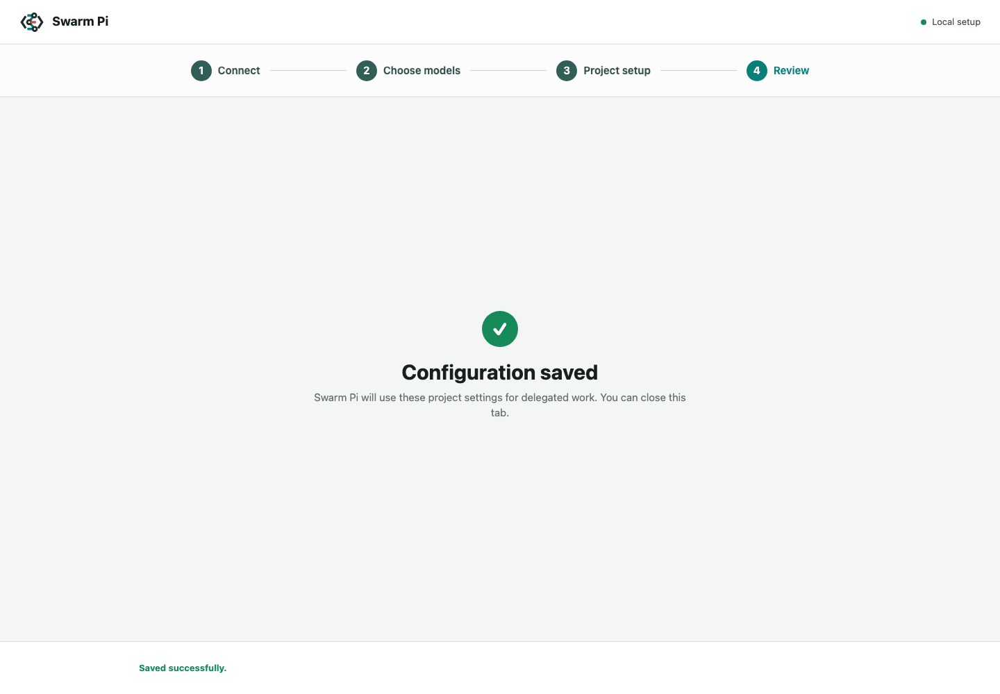
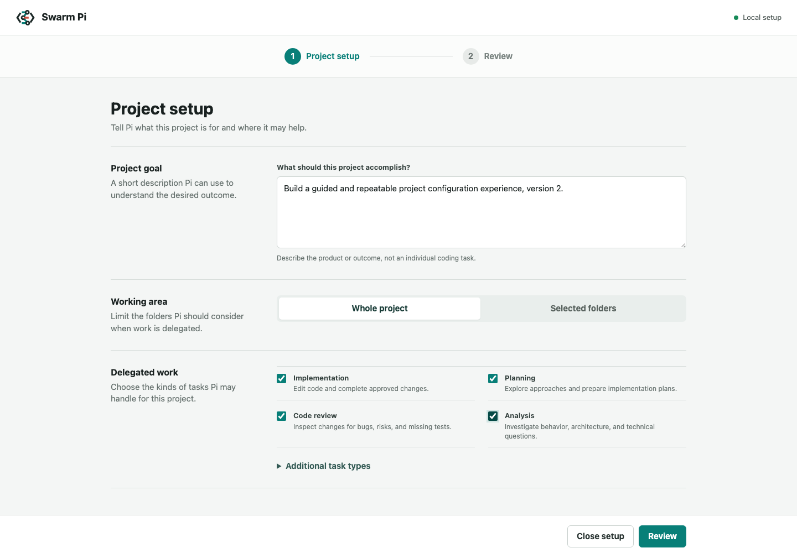

# Configuration Reference

This reference describes the temporary browser setup used by Claude Code and
Codex. For installation, common workflows, and troubleshooting, start with
the [README](../README.md). For runtime ownership and worker safety, see the
[architecture reference](architecture.md). For the process used to keep these
guides current, see the [documentation update SOP](documentation-sop.md).

## Product Model

`swarm-pi-code-plugin` provides a temporary local web application for
provider and model setup. Claude Code and Codex both launch the same shared
configuration server during first-run setup and reconfiguration.

Users are not expected to edit configuration JSON by hand.

The product model has three layers:

1. **Connections** are AI services the user can actually use.
2. **Models** are discovered from those connections.
3. **Routing** selects one primary model and ordered fallbacks.

Pi's complete provider catalog is implementation data, not user configuration.
The interface must never present every provider merely because Pi knows about
it.

## Configuration Ownership

The shared workspace data directory contains two files with distinct roles:

- `model.json` is the canonical provider and model configuration. It contains
  the primary model, ordered fallbacks, and non-secret custom provider
  definitions.
- `state.json` contains the project profile, job index, migration metadata, and
  sandbox mode, plus a compatibility mirror of model priority for older plugin
  releases.

Linked Git worktrees resolve the same shared data directory and therefore read
the same `model.json`.

The provider identifier is encoded by every model reference as
`provider/model`. A separate selected-provider field is not persisted because
it could disagree with the primary model.

## File Format

```json
{
  "version": 1,
  "primary": "anthropic/claude-sonnet-4-5",
  "fallbacks": ["openai/gpt-5.2"],
  "customProviders": [],
  "updatedAt": "2026-07-10T00:00:00.000Z"
}
```

Custom provider definitions contain endpoint and model metadata only. They may
not contain API keys, bearer tokens, cookies, secret headers, shell commands,
or command-backed Pi configuration values.

When `model.json` does not exist, the loader reads the existing
`state.config.modelPriority` value. The next successful configuration write
creates `model.json` without deleting state or job history.

## Credential Boundary

Provider credentials remain user-scoped and use Pi `AuthStorage`, which
defaults to `~/.pi/agent/auth.json`. The web form accepts an optional API key,
but the server sends it directly to `AuthStorage` and never writes it to:

- `model.json`
- `state.json`
- job prompts or output
- stdout, stderr, logs, URLs, or error messages
- HTML returned after the form submission

An existing key or OAuth token is never returned to the browser. Reconfigure
shows only a readiness state and a non-secret source label. A blank API-key
field preserves the current credential. Project reset does not remove global
Pi credentials.

Automatic connection detection is limited to credentials Pi can resolve
through its own `AuthStorage` and documented environment-variable map. This
includes Pi-managed subscription OAuth for ChatGPT Plus/Pro, Claude Pro/Max,
and GitHub Copilot. The plugin does not scan `.env` files or copy tokens from
Claude Code, Codex, or another application's private credential store.

A resolved credential adds the provider to the connection list. An unresolved
provider stays absent instead of appearing as an unfinished setup task.

## Server Lifecycle and Security

The configuration server:

1. listens on `127.0.0.1` with an ephemeral port by default;
2. creates a cryptographically random, single-session URL token;
3. requires that token on document and API requests;
4. rejects non-loopback host headers, cross-origin requests, unsupported
   methods, oversized request bodies, and unexpected content types;
5. sets a restrictive Content Security Policy and no-store cache headers;
6. opens the system browser when permitted and always prints the local URL as a
   fallback;
7. shuts down after save, cancel, or a ten-minute idle timeout.

User-entered endpoint requests accept only HTTP(S), reject embedded URL
credentials and cloud metadata addresses, use bounded timeouts and response
sizes, and do not forward credentials across redirects. Local application port
probing runs only after the user explicitly requests it.

There is no CORS support and no network-listen option. The server is a bounded
setup session, not a daemon.

## User Flow

1. The host starts `pi-runner.mjs configure --host <host>`.
2. The server loads `model.json`, then detects usable Pi OAuth and API-key
   connections without returning secrets to the browser.
3. With no connections, the browser shows a true empty state with actions to
   connect an AI service or explicitly search for a local AI application.
4. A known cloud provider asks only for its supported sign-in method. Provider
   URLs, protocol, headers, and identifiers remain internal defaults.
5. A custom endpoint initially asks only for a server URL and optional API key.
   The user runs **Test and find models** before selecting a model.
6. Discovery identifies the endpoint type, canonical URL, protocol, and model
   inventory. Technical overrides remain under an Advanced disclosure.
7. The user chooses a primary model and optional ordered fallbacks from models
   on usable connections.
8. Project setup asks for one project goal, whole-project or selected-folder
   scope, delegated task types, and strict or lenient execution safety.
9. Review shows the complete model and project profile before save.
10. The server validates the complete draft, writes `model.json` atomically,
    updates the shared project profile and compatibility priority mirror,
    reports success, and exits.

Provider identifiers are internal implementation details. Rediscovering the
same canonical endpoint and protocol refreshes the existing connection instead
of creating a duplicate. For distinct endpoints, discovery reserves identifiers
already present in the current browser draft, and the client performs a second
collision check before adding a connection. Users must never be asked to repair
duplicate provider identifiers manually.

Wizard navigation uses **Back** after the first step. **Close setup** appears
only on the Connections step and confirms that unsaved changes will be lost.
After save or close, the page renders an explicit completion state with the
next action instead of leaving a disabled form on screen.

`/swarm-pi-code-plugin:project` and `$swarm-pi-code-plugin-project` launch the
same page in project-only mode. This mode starts at **Project setup**, shows a
project-only Review, and writes `state.config.profile` plus
`state.config.sandboxMode`. It pre-populates the current goal, directories,
task types, and safety mode and is safe to run repeatedly; Provider, model
priority, credentials, and jobs are not rewritten.

## Sandbox Setting

`state.config.sandboxMode` is `strict` or `lenient`; missing values from older
state files normalize to `strict`. The browser disables lenient mode when the
current platform or required backend dependencies are unavailable.

Strict mode exposes only the existing scoped Pi tools. Lenient mode adds an
OS-sandboxed Bash tool, permits outbound network access, and displays a source
exfiltration warning. Its shell uses an isolated HOME/TMP and does not inherit
provider credentials, SSH agent sockets, or other host secrets. Saving a new
mode affects newly submitted jobs only because each durable job stores its
resolved sandbox mode in `request.json`.

Reconfiguration opens the connection overview instead of the raw provider
form. Existing connections can be refreshed, edited, or removed. Refreshing a
connection preserves explicit user model-metadata overrides.

## Screenshots

The screenshots below use a local mock endpoint and contain no credentials.
They document the current four-step flow and the repeatable project-only flow:

### Empty connections


### Endpoint discovery


### Project setup


### Full review


### Saved completion



### Project-only setup



## Endpoint Discovery

Endpoint testing is adapter-based. The first implementation supports:

- OpenAI-compatible `GET /v1/models`;
- Anthropic `GET /v1/models`;
- Google Generative AI `GET /v1beta/models`;
- Ollama `GET /api/tags` plus `POST /api/show` model details;
- LM Studio `GET /api/v1/models`.

Known response shapes determine the provider label, Pi API type, authentication
header behavior, model identifiers, capabilities, and any limits the endpoint
actually reports. A successful OpenAI-compatible list is not treated as proof
that context or output limits are known.

The metadata precedence is:

1. explicit user override;
2. native endpoint metadata;
3. Pi's bundled model catalog;
4. an optional cached models.dev record;
5. Pi's runtime compatibility default.

Unknown values remain unknown in the normal UI. Runtime defaults may still be
materialized when registering a model with Pi, but the interface must label
them as compatibility defaults instead of presenting them as provider facts.

Connection testing only reads discovery endpoints and should not consume model
quota. A future optional generation test must be a separate explicit action,
warn that it may use quota, and never run automatically.

`/swarm-pi-code-plugin:init --reconfigure` and
`$swarm-pi-code-plugin-configure` always load the current `model.json`, so users
edit rather than recreate their setup.

## Compatibility

The existing non-interactive `init --set-model-priority[-file]` contract stays
available for automation. It writes the canonical `model.json` and the legacy
state mirror through the same validation path.

`models --json` and worker execution load custom provider definitions before
model discovery. Discovery and execution must use the same Pi environment so a
provider visible in setup cannot disappear when a job starts.

## Acceptance Criteria

- First-run and reconfigure work without hand-editing JSON.
- With no usable credentials and no custom connections, the connection list is
  empty; there is no catalog of unfinished providers.
- Pi-resolvable OAuth and documented environment credentials appear as detected
  connections without exposing their secret value.
- A custom endpoint can be tested and its models selected without entering a
  provider ID, API type, context window, or maximum output value.
- Discovery errors distinguish unreachable server, rejected authentication,
  unsupported model-list endpoint, malformed response, and timeout states.
- Model metadata displays its source, and a manual override survives refresh.
- Reconfigure pre-populates provider, primary model, fallbacks, and custom
  endpoint fields from `model.json`.
- A submitted API key is usable but absent from every project artifact and
  response body.
- Built-in and custom providers can execute through the same model registry.
- Desktop and mobile layouts expose the complete setup flow without overlap or
  clipped controls.
- Claude Code and Codex invoke the same implementation.
