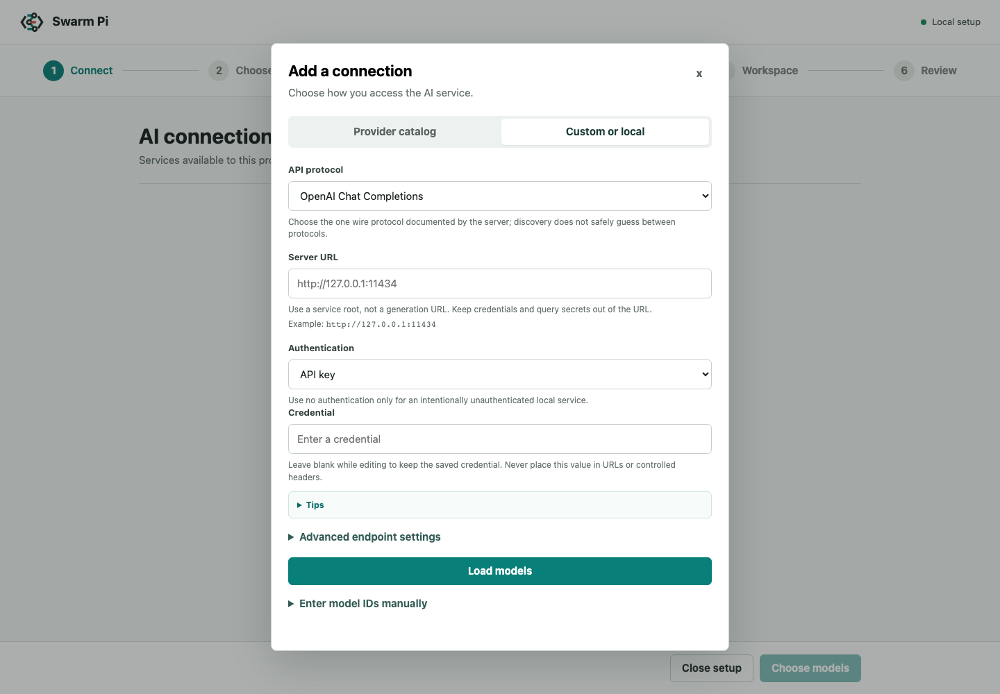
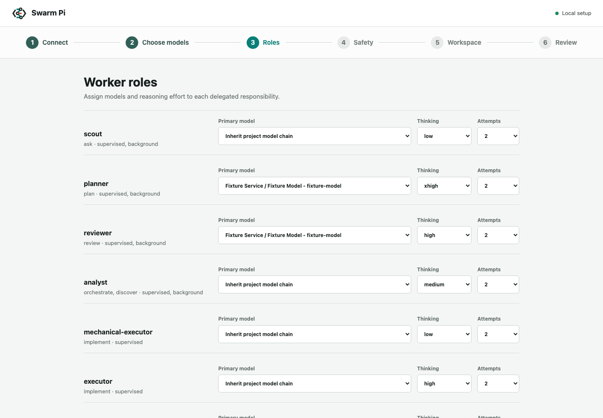
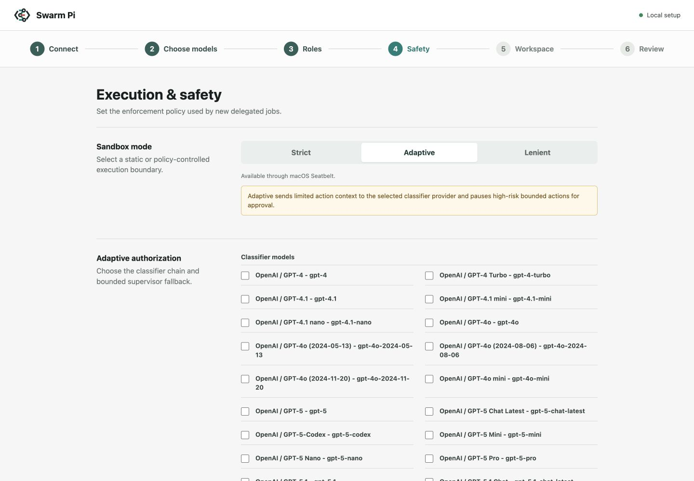
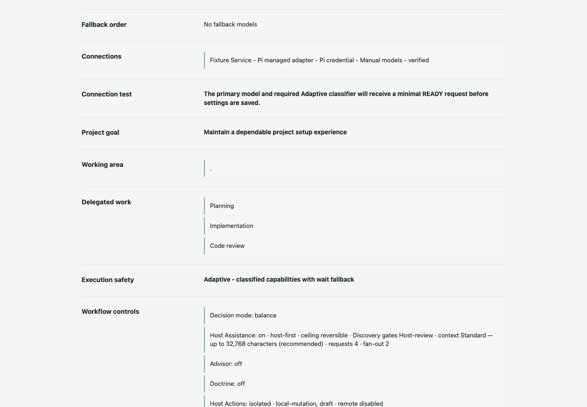

# Configuration Reference

This reference describes the temporary browser setup shared by Claude Code and
Codex. For installation and common workflows, start with the
[README](../README.md). Runtime boundaries are documented in
[architecture.md](architecture.md), and immutable security constraints are in
[threat-model.md](threat-model.md). The Host Assistance and Discovery contract
is in [host-assistance-discovery.md](host-assistance-discovery.md).

For detailed field-by-field behavior, see the
[configuration field guide](configuration-field-guide.md) and
[繁體中文指南](configuration-field-guide.zh-TW.md).

## Product Model

The setup flow creates executable Pi connections, not generic provider cards.
Every connection must map to a Pi runtime adapter, a supported authentication
method, a model source, and a verification state.

The six full-setup steps are:

1. Connect a built-in provider, subscription, cloud identity, or custom endpoint.
2. Choose the primary model and ordered fallbacks.
3. Assign model chains and thinking levels to worker roles.
4. Configure sandbox, classifier, approval, background behavior, Decision Mode,
   Host Assistance, Advisor, doctrine, and isolated Host Actions.
5. Review the workspace and project delegation profile.
6. Review, smoke-test required models, and save transactionally.

Project-only setup retains Roles, Execution & Safety, Workspace, and Review. It
does not rewrite provider credentials or model configuration.

New workspace defaults use Adaptive Sandbox mode, Balance Decision Mode,
Host Assistance on with Host-first review, a Reversible automatic ceiling,
Discovery gate auto-review, Advisor off, and doctrine off. `full-access` is a
fourth, opt-in Sandbox mode that removes the plugin's own OS sandbox; it is never
a default and normalization never selects it. Autopilot is a fifth, opt-in
Sandbox mode that keeps Lenient's OS-sandbox isolation (it needs the same
sandbox backend) but runs routine shell unattended; it also exposes the outward
`autoGitWrites` and `autoDelivery` autonomy and an `outwardApprovalGranularity`
choice, and stays off unless a project explicitly selects it. Cost, Balance, and
Power currently select one, two, or three
base `orchestrate` perspectives and bound some decision attempts. Context
budget, Host Assistance request/fan-out limits, and Advisor quotas remain
separate explicit settings; changing Decision Mode does not rewrite them.
None of these controls can lower project scope, private-data approval,
experiment schema gates, or delivery policy.

The same screen configures Host context classes, User-only versus Host-first
review, Context-only/Read-only/Reversible automatic scope, Discovery gate
review, private-connector policy, Advisor targets/limits, doctrine metadata,
and Host Action classes plus cost/use/expiry bounds. Selecting the Autopilot
mode makes routine supervised shell auto-run without stopping, still inside the
OS sandbox; under Autopilot and Full-access it also exposes the outward autonomy
controls: `autoGitWrites` and `autoDelivery` (allow the worker shell to run `git
commit`/`push`/`merge` and `kubectl`/`helm`/`terraform` behind a mandatory human
approval gate), and `outwardApprovalGranularity` (`each-time` versus
`first-then-auto`) for those git/deploy approvals. Remote Host Actions are
off by default. The doctrine
toggle is persisted in PolicySnapshot v3, but the runtime does not yet run an
automatic Question/Delete/Simplify convergence pass. It must not be treated as
an active review or safety control.

## Field Validation and Compatibility

The browser renders concise inline guidance and native **Tips** disclosures from
the same provider metadata used by validation. The detailed field guide is the
canonical user-facing explanation of defaults, examples, safety boundaries, and
tradeoffs. Examples are non-secret display text; they are never submitted as
configuration values.

Adaptive structured policy rules use one strict schema for browser saves and
new Job snapshots. Rule IDs are unique lowercase identifiers; capabilities,
roles, and task kinds are closed sets; path prefixes are canonical relative
POSIX paths; network domains are exact lowercase hosts or `*.` wildcards. The
form rejects unknown properties, path traversal, URLs, ports, localhost/IP
targets, selector/capability mismatches, mixed path/domain selectors, and more
than 128 rules. Legacy invalid rules are dropped during tolerant load so they
cannot grant access.

Repository deny rules use an internal `repo:` ID namespace for compatibility.
New and child snapshots preserve such an ID only when the complete rule exactly
matches a deny rule in the immutable effective project policy. Browser and
ordinary configuration submissions cannot claim the reserved namespace.

Workflow numeric fields are required when their section is submitted. Blank is
not silently converted to zero or a default. Context allowance is presented as
named choices while retaining the numeric snapshot field for compatibility:

| Setting | User-facing choices / range | New-project default |
| --- | --- | --- |
| Host context allowance | Off (`0`), Compact (`1`), Standard (`4`), Extended (`8`) | Standard |
| Host Assistance requests per Job | `0–6` | 4 |
| Host Assistance concurrent fan-out | `0–3` and no greater than requests | 2 |
| Advisor consultations per Job | `0–3` | 2 |
| Maximum Advisor perspectives | `0–4` | 3 |

One stored context-budget unit permits up to 8,192 returned text characters,
with a hard 64,000-character cap. The Worker requests the smallest sufficient
amount up to the Job snapshot's allowance. Existing `0–64` numeric values stay
readable; a value outside the named choices appears as a preserved legacy
custom allowance until the user chooses a preset.

Project setup requires an explicit Host Assistance On or Off choice. CLI Job
overrides retain `inherit` compatibility; a stored legacy `inherit` value is
displayed as its effective explicit state without mutating durable storage on
load. If a partial legacy record omits fan-out, its default is clamped to the
normalized request limit. Advisor may use zero quotas only while disabled. An
enabled Advisor needs at least one supported target and positive quotas. Remote Host Actions require
both the remote toggle and at least one remote action class; recommendation
cost is non-negative opaque lease metadata, not currency or an enforced budget.

Delegated-work selections accept canonical Job kinds or the documented UI
aliases. Input is normalized by trimming, lowercasing, and replacing spaces or
underscores with hyphens. Every unsupported token causes a deterministic save
error, including a mixed valid/invalid list. Unsupported legacy labels remain
visible but confer no capability until a successful resave removes them.

## Current setup screens

The screenshots below are generated from the pinned local fixture with a fixed
desktop viewport. They are documentation evidence for the current flow, not a
provider or credential tutorial.








Screenshot note: the Execution & safety screen now offers the Full-access and
Autopilot sandbox modes and the outward autonomy controls (`autoGitWrites`,
`autoDelivery`, and outward approval granularity), so
`05-execution-safety.png` (and, if the review summary shifts, `06-review.png`)
should be regenerated with `mise run docs-screenshots` before release.

## Local telemetry and dashboard

The runner records privacy-validated terminal Job attempts in the existing
workspace state directory. The persisted JSONL contains bounded labels,
provider/model classifications, role and task kind, outcome, duration, and
provider-reported token counters. Prompts, completions, reasoning, paths,
credentials, endpoints, Git metadata, and arbitrary text are excluded. Events
are local-only and are not used for billing; reports show cost as explicitly
unknown when authoritative pricing is unavailable.

Use the CLI for a bounded JSON report:

```text
mise exec -- node scripts/pi-runner.mjs telemetry report --json
```

`--from`, `--to`, `--job`, and `--limit` narrow the report; timestamps are UTC
ISO 8601 and the limit is capped at 500. Use
`mise exec -- node scripts/pi-runner.mjs dashboard` to start the loopback,
token-protected dashboard. It displays summary totals, model and role
breakdowns, recent attempts, and the explicit unavailable-cost state. The
dashboard does not expose a network listener beyond loopback or accept raw
telemetry input.

| Setting | New-project default | Runtime effect |
| --- | --- | --- |
| Sandbox | `adaptive` | OS Sandbox plus policy-classified shell/network; Strict, `lenient`, opt-in `autopilot`, and opt-in `full-access` remain selectable |
| Full-access sandbox | off (opt-in) | Removes the plugin's own OS sandbox; never a default, and worker reach then depends on the host's own sandbox |
| Autopilot sandbox | off (opt-in) | Fifth mode: keeps Lenient's OS-sandbox isolation (needs the sandbox backend) and auto-runs routine shell unattended; git/deploy stay behind a mandatory human approval gate governed by `outwardApprovalGranularity` |
| Decision Mode | `balance` | 1/2/3 base orchestration perspectives for Cost/Balance/Power; bounded decision attempts |
| Host Assistance | on | Enables correlated context, decision, and recommendation requests |
| Host review | `host-first` | Active Host model independently reviews complete requests; hooks/watchers only notify |
| Automatic scope | `reversible` | Allows public/read-only context and exact reversible actions already within original intent |
| Discovery gate review | on | Allows complete, in-scope gates to be auto-reviewed with an exact receipt |
| Context allowance | Standard | Up to 32,768 returned characters from one Host context request |
| Advisor | off | Adds bounded read-only consultations for selected tasks when enabled |
| Doctrine | off | Snapshotted metadata only; no automatic convergence pass yet |
| Host Actions | local mutation and draft | Allows an explicitly confirmed isolated child; remote classes remain off |

## Provider Capability Registry

`ProviderCapabilityRegistry` is the single source for:

- provider name and Common, Subscription, Cloud, Local, or Custom category;
- fixed, managed-per-model, or selectable protocol behavior;
- supported authentication methods;
- required, optional, advanced, and conditional form fields;
- field destinations in CredentialStore, provider-scoped environment, controlled
  headers, or non-secret profiles;
- model source and runtime adapter support.

Coverage tests compare the Registry with every provider exposed by the Pi
v0.81.1 model catalog. A newly added Pi provider fails CI until it is classified; the
UI never guesses that an unknown provider uses a simple API-key form.

The plugin initializes `ModelRuntime` from the configured auth and model files
without implicit network refresh. Use `models --refresh` to explicitly update
the live catalog; worker and classifier startup remain snapshot-based.

Built-in examples include:

| Connection | Protocol/runtime | Authentication | Additional fields |
| --- | --- | --- | --- |
| OpenAI API | OpenAI Responses | API key | organization and project IDs |
| ChatGPT Plus/Pro | OpenAI Codex Responses | Pi device/browser OAuth | none |
| Anthropic | Anthropic Messages | API key or Pi OAuth | optional beta header |
| GitHub Copilot | managed per model | Pi OAuth | none |
| Radius | Pi dynamic messages | Pi OAuth or API key | gateway catalog refreshed explicitly |
| Qwen Token Plan | OpenAI Chat Completions | API key | regional token-plan endpoint |
| Qwen Token Plan China | OpenAI Chat Completions | API key | China token-plan endpoint |
| Azure OpenAI | Azure Responses | API key | endpoint/resource, API version, deployment map |
| Amazon Bedrock | Bedrock Converse | ambient identity | AWS profile and region |
| Google Vertex AI | Vertex runtime | ambient identity or API key | project and location |
| Cloudflare | managed or Chat-compatible | API key | account and optional gateway IDs |

Azure Microsoft Entra identity is shown only as a capability notice because the
Pi v0.81.1 runtime cannot execute it. It is never marked ready.

## Wire Protocols

Custom connections select exactly one upstream protocol before discovery:

- `openai-chat-completions`
- `openai-responses`
- `anthropic-messages`

One connection cannot change protocol per model. OpenAI Chat and Responses have
different request, tool-call, and state semantics, so the runtime does not
probe both and guess. Pi-specific APIs such as Google, Azure, Bedrock, Vertex,
Mistral, and OpenAI Codex remain fixed runtime adapters and are not presented in
the generic three-way selector.

OpenAI-compatible roots are stored as versioned API roots, normally ending in
`/v1`. Anthropic stores a service root; Pi appends `/v1/messages`. A legacy
Anthropic root ending in one `/v1` is normalized in memory and written back only
after a successful save.

Full generation URLs such as `/chat/completions`, `/responses`, or
`/v1/messages` are rejected. A non-standard model-list URL is stored separately
as `modelsEndpoint` and must use the same origin as the generation root.

## Configuration Ownership

Git workspaces store shared state in the Git common directory. Non-Git folders
use a user-state namespace keyed by canonical workspace path. The relevant
files are:

```text
swarm-pi-code-plugin/
├── model.json
├── state.json
└── jobs/<job-id>/request.json
```

Configuration prepares this storage before the loopback server reads
`model.json` or `state.json`. Its completion result and `status --json` expose
the additive `configurationStorage` object: `directory`,
`modelConfigurationFile`, `stateFile`, and `migrationStatus` (`none`, `pending`,
`migrated`, `conflict`, or `blocked`). A completed migration also reports
`migratedFrom`; the existing top-level `modelConfigurationFile` remains for
compatibility.

When a non-Git folder later becomes a Git repository, the next interactive
Configuration resolves both the canonical invocation directory and Git root,
then moves the complete durable state directory into the Git common directory.
This includes model/project state, Jobs, artifacts, notifications,
continuations, and recovery data; Pi-compatible `CredentialStore` credentials remain separate.
Status only reports a pending migration and does not move data. A non-terminal
Job, multiple source candidates, or data at both source and destination blocks
the operation without merging, overwriting, or deleting either side. An
explicit `SWARM_PI_CODE_PLUGIN_DATA_DIR` is an ownership override and disables
this migration.

`model.json.version` remains `1`. Additive optional fields preserve old files:

```json
{
  "version": 1,
  "primary": "openai/gpt-5.4",
  "fallbacks": ["anthropic/claude-sonnet-4-5"],
  "customProviders": [],
  "providerProfiles": [
    {
      "id": "openai",
      "provider": "openai",
      "name": "OpenAI",
      "connectionKind": "builtin",
      "auth": { "method": "api-key", "secretRef": "auth:openai" },
      "protocol": "openai-responses",
      "runtimeApi": "openai-responses",
      "readiness": "verified",
      "settings": {},
      "headers": [],
      "verifiedModel": "openai/gpt-5.4",
      "verifiedAt": "2026-07-11T00:00:00.000Z"
    }
  ],
  "updatedAt": "2026-07-11T00:00:00.000Z"
}
```

Profiles contain only non-secret settings, controlled literal headers, and
opaque `secretRef` values. Custom definitions contain protocol roots, model
metadata, structured auth policy, and optional controlled headers. They reject
embedded API keys, OAuth tokens, raw header JSON, command-backed values, and
credential-bearing URLs.

New custom provider IDs are a stable hash of canonical endpoint and protocol.
Existing IDs remain unchanged when their endpoint and protocol match exactly.

## Credential Boundary

Secrets remain in the Pi-compatible `CredentialStore`. A browser secret first enters the
session-local `CredentialDraftVault`; the response contains only an opaque draft
ID, provider, auth method, masked flag, and expiry. Draft IDs are bound to the
loopback setup session and are removed after save, cancel, timeout, or expiry.

Secrets never enter:

- `model.json`, `state.json`, or job artifacts;
- browser localStorage or returned HTML;
- model discovery, verification, or save payloads after draft creation;
- stdout, worker logs, URLs, stack traces, or recovery journals.

Blank secret fields retain an existing credential. **Replace credential**,
**Sign out**, and **Remove from project** are distinct operations.

ChatGPT Plus/Pro is the `openai-codex` subscription connection. It is not an
OpenAI API-key option. The browser drives Pi's browser or device-code OAuth with
bounded long polling, explicit prompt responses, cancellation, and timeout.
Anthropic and GitHub Copilot use the same generic OAuth session machinery.
OAuth completes in an in-memory credential store and becomes a credential
draft; the real CredentialStore changes only during final save.

AWS and Google ambient identities are detected without importing host secret
files. Project, region, and location values are non-secret profile data passed
as a provider-scoped environment overlay. The plugin never mutates
`process.env`.

## Controlled Headers

Raw header JSON is not accepted. Literal headers use a fixed allowlist such as
`HTTP-Referer`, `X-Title`, and `Anthropic-Beta`. Secret headers use `secretRef`
and provider-scoped CredentialStore environment values.

Pi configuration values interpret `$ENV` and `!command`. The runtime escapes
all literal header values before registering them, so a literal cannot read an
environment variable or execute a command. Secret references are the only
values intentionally passed as Pi environment templates.

Custom `API key + secret header` authentication uses the same secret for the
protocol-standard credential and the selected additional controlled header.
This keeps the native Pi adapter executable without a translation proxy.

## Discovery and Verification

Model discovery and API verification are separate states:

- `configured`: schema and authentication settings are valid;
- `discovered`: a protocol-specific model endpoint returned a valid inventory;
- `verified`: a selected model completed a minimal generation request;
- `blocked`: the connection cannot currently execute.

Custom discovery performs one request determined by the selected protocol.
OpenAI Chat and Responses use `<root>/models`; Anthropic uses
`<service-root>/v1/models`. Ollama and LM Studio are recognized only when the
user explicitly runs **Find local AI apps**. When a model endpoint is missing,
the user can enter model IDs manually; this remains `configured`, not
`verified`.

**Verify API** is explicit and warns through its action text that it sends a
minimal request. Final save always verifies the primary model and every
required Adaptive classifier. Fallbacks may remain discovered, and Review shows
their actual readiness.
When a new Adaptive configuration has a primary model but no explicit
classifier selection, the primary becomes its initial classifier. Provider and
project drafts may still be saved before a primary exists, but Job readiness
remains fail-closed until the required model is authenticated and available.

Endpoint requests use bounded timeouts and response sizes, reject redirects,
URL credentials, cloud metadata addresses, and cross-origin model endpoints.
Credentials may use HTTP only for loopback endpoints.

## Transaction and Background Jobs

Save builds a candidate Pi environment from the proposed profiles and an
in-memory clone of CredentialStore. It validates every selected model, runs required
smoke tests, then commits credentials, `model.json`, and `state.json`. A failure
restores prior values. An incomplete rollback writes a redacted recovery journal
and returns `configuration-recovery-required`.

New durable jobs use `requestVersion: 5`. `request.json` contains the complete
non-secret `ModelConfiguration` snapshot, its SHA-256 integrity hash, and the
version-3 enforced project-policy snapshot, Decision Mode, Host Assistance, and
Advisor controls. A background worker uses those
submitted snapshots even if the settings page changes later, while resolving
current credentials at execution time. Credential revocation therefore fails
explicitly instead of falling back to unauthenticated execution.

Requests v1–v4 remain readable for recovery with their legacy execution
semantics. Version 4 preserves its submitted v2 enforced-policy snapshot.
Version 5 adds the v3 Decision Mode, Host Assistance, Advisor, doctrine, and
context-budget controls. Host Action policy is checked from workspace
configuration when a recommendation is explicitly started; the child keeps
the parent's snapshotted effective project policy and receives a new bounded
action-family lease.

Existing configuration is not rewritten on load. An explicitly stored Sandbox
mode remains unchanged; legacy state with no mode normalizes to Strict, and
`full-access` is never produced by normalization or used as a migration default.
A legacy Host Assistance object missing `reviewMode`, `autoApprovalScope`, or
`autoApproveDiscoveryGates` normalizes to User-only, Context-only, and gate
auto-review off until the user saves the updated form. Active Jobs always keep
their submitted snapshot.

## Server Lifecycle

The setup server binds to `127.0.0.1` on an ephemeral port, requires a random
session token, rejects cross-origin writes, limits request sizes, sends a
restrictive CSP and `no-store`, and closes after save, cancel, or idle timeout.
OAuth sessions and credential drafts are aborted and cleared with the server.

The server is not a daemon, does not support CORS, and has no network-listen
mode. If browser launch fails, it stays active and returns the one-time URL.

## Compatibility

- Missing `providerProfiles` load as an empty list.
- Legacy custom providers infer auth and wire protocol from existing fields.
- Existing custom IDs are not rewritten.
- Existing explicit Sandbox modes are preserved; missing legacy modes remain
  Strict, and normalization never selects `full-access`.
- Missing Host-first policy fields remain User-only until a user saves the
  updated configuration.
- Legacy jobs with request versions 1–4 retain their original semantics and
  are not retroactively given v5 controls. Version 3 jobs continue to use
  their submitted provider snapshot; version 4 jobs additionally use their
  submitted project-policy snapshot.
- `init --set-model-priority[-file]`, `models --json`, `models --refresh --json`,
  and `providers --json`
  remain available for automation.

## Acceptance Criteria

- Every Pi v0.81.1 provider is explicitly classified by the Registry.
- ChatGPT subscription and OpenAI API-key connections remain separate.
- Browser responses, localStorage, state, model config, and jobs contain no
  credential values.
- Discovery never guesses among Chat, Responses, and Anthropic protocols.
- `discovered` never implies `verified`.
- Unsupported model-list endpoints permit manual IDs without claiming an API
  verification.
- Runtime and browser use the same provider definitions and policy validation.
- Background jobs use the submitted non-secret snapshot and current credential.
- Desktop and mobile setup remain usable without clipped or overlapping fields.
